# 🏛️ numbers.lk Icons (`@numberslk/icons`)

> **An open-source civic and organizational vector icon library for Sri Lanka by [numbers.lk](https://numbers.lk)**. Featuring 182 Sri Lanka election symbols based on public Government Gazette publications, with subpath export support (`@numberslk/icons/election-symbols`) and expanding collections for Sri Lankan banks and public institutions.

> ⚠️ **LEGAL DISCLAIMER: INDEPENDENT COMMUNITY PROJECT — NOT AN OFFICIAL GOVERNMENT PROJECT**  
> This is an **independent, community open-source project** created and maintained by [numbers.lk](https://numbers.lk). It is **NOT** an official project, publication, or service of the **Election Commission of Sri Lanka (ECSL)**, the Department of Elections, or the Government of Sri Lanka. It is **NOT** affiliated with, authorized, certified, or endorsed by any government entity, statutory body, or political party.  
> All icons, graphics, and metadata are provided strictly **"AS IS"** for informational, journalistic, educational, and civic-tech software development purposes. **numbers.lk, its founders, authors, and contributors expressly disclaim all warranties and accept NO legal responsibility or liability** for any electoral disputes, ballot reproduction inaccuracies, or claims arising from the use of this library. Please review our full **[Terms of Use & Legal Disclaimer](TERMS.md)**.

[](https://www.npmjs.com/package/@numberslk/icons)
[](LICENSE)
[](https://github.com/numberslk/icons)
[](https://github.com/numberslk/icons)
[](TERMS.md)
[](http://localhost:3456)

---

## ⭐ Prominent Political Party Symbols

A quick reference for widely recognized party election symbols in Sri Lanka:

<table>
  <tr>
    <td align="center" width="16.6%"><a href="src/icons/elephant.svg" title="Elephant (අලියා / யானை)">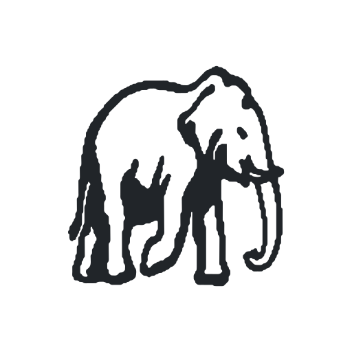</a><br><b>Elephant</b><br><sub>අලියා</sub><br><sub><code>UNP</code></sub><br><sub><a href="dist/png/elephant.png">PNG 512px</a></sub></td>
    <td align="center" width="16.6%"><a href="src/icons/telephone.svg" title="Telephone (දුරකථනය / தொலைபேசி)"></a><br><b>Telephone</b><br><sub>දුරකථනය</sub><br><sub><code>SJB</code></sub><br><sub><a href="dist/png/telephone.png">PNG 512px</a></sub></td>
    <td align="center" width="16.6%"><a href="src/icons/compass.svg" title="Compass (මාලිමාව / திசைகாட்டி)">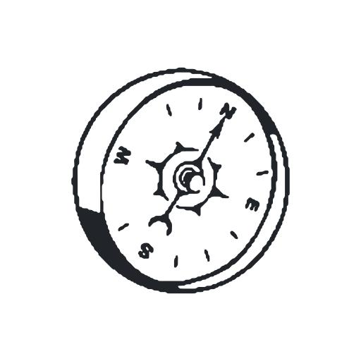</a><br><b>Compass</b><br><sub>මාලිමාව</sub><br><sub><code>NPP</code></sub><br><sub><a href="dist/png/compass.png">PNG 512px</a></sub></td>
    <td align="center" width="16.6%"><a href="src/icons/flower-bud.svg" title="Flower Bud (නෙළුම් පොහොට්ටුව / தாமரை மொட்டு)">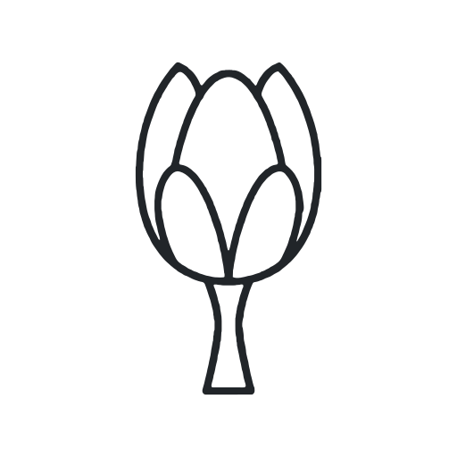</a><br><b>Flower Bud</b><br><sub>නෙළුම් පොහොට්ටුව</sub><br><sub><code>SLPP</code></sub><br><sub><a href="dist/png/flower-bud.png">PNG 512px</a></sub></td>
    <td align="center" width="16.6%"><a href="src/icons/hand.svg" title="Hand (අත / கை)">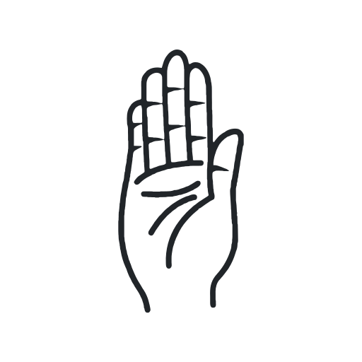</a><br><b>Hand</b><br><sub>අත</sub><br><sub><code>SLFP</code></sub><br><sub><a href="dist/png/hand.png">PNG 512px</a></sub></td>
    <td align="center" width="16.6%"><a href="src/icons/house.svg" title="House (නිවස / வீடு)">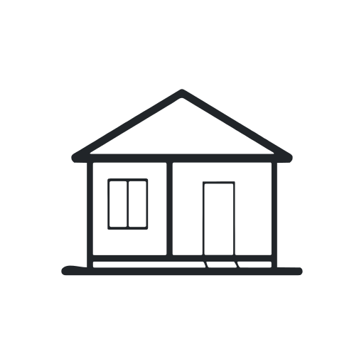</a><br><b>House</b><br><sub>නිවස</sub><br><sub><code>ITAK</code></sub><br><sub><a href="dist/png/house.png">PNG 512px</a></sub></td>
  </tr>
  <tr>
    <td align="center" width="16.6%"><a href="src/icons/betel-leaf.svg" title="Betel Leaf (බුලත් කොළය / வெற்றிலை)">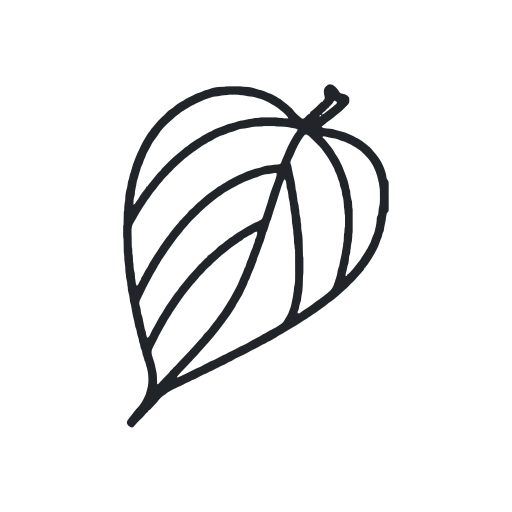</a><br><b>Betel Leaf</b><br><sub>බුලත් කොළය</sub><br><sub><code>UPFA</code></sub><br><sub><a href="dist/png/betel-leaf.png">PNG 512px</a></sub></td>
    <td align="center" width="16.6%"><a href="src/icons/bell.svg" title="Bell (ඝණ්ඨාරය / மணி)">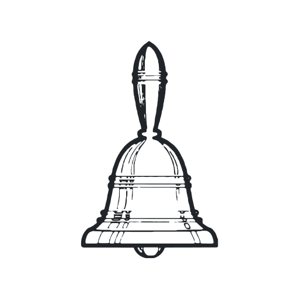</a><br><b>Bell</b><br><sub>ඝණ්ඨාරය</sub><br><sub><code>JVP</code></sub><br><sub><a href="dist/png/bell.png">PNG 512px</a></sub></td>
    <td align="center" width="16.6%"><a href="src/icons/sun.svg" title="Sun (හිරු / ඉර / சூரியன்)">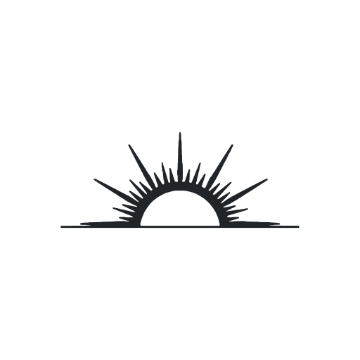</a><br><b>Sun</b><br><sub>හිරු / ඉර</sub><br><sub><code>TULF</code></sub><br><sub><a href="dist/png/sun.png">PNG 512px</a></sub></td>
    <td align="center" width="16.6%"><a href="src/icons/tree.svg" title="Tree (ගස / மரம்)">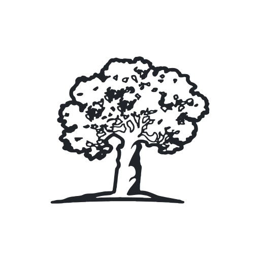</a><br><b>Tree</b><br><sub>ගස</sub><br><sub><code>SLMC</code></sub><br><sub><a href="dist/png/tree.png">PNG 512px</a></sub></td>
    <td align="center" width="16.6%"><a href="src/icons/peacock.svg" title="Peacock (මොනරා / மயில்)">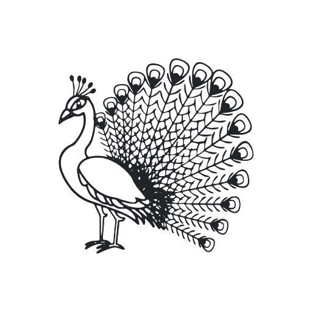</a><br><b>Peacock</b><br><sub>මොනරා</sub><br><sub><code>ACMC</code></sub><br><sub><a href="dist/png/peacock.png">PNG 512px</a></sub></td>
    <td align="center" width="16.6%"><a href="src/icons/veena.svg" title="Veena (වීණාව / வீணை)">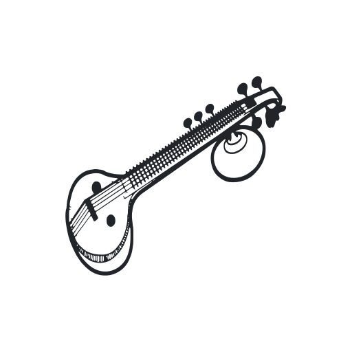</a><br><b>Veena</b><br><sub>වීණාව</sub><br><sub><code>EPDP</code></sub><br><sub><a href="dist/png/veena.png">PNG 512px</a></sub></td>
  </tr>
  <tr>
    <td align="center" width="16.6%"><a href="src/icons/pair-of-scales.svg" title="Pair of Scales (තරාදිය / தராசு)">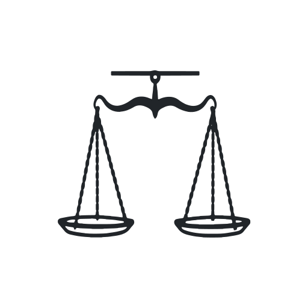</a><br><b>Pair of Scales</b><br><sub>තරාදිය</sub><br><sub><code>NDF</code></sub><br><sub><a href="dist/png/pair-of-scales.png">PNG 512px</a></sub></td>
    <td align="center" width="16.6%"><a href="src/icons/swan.svg" title="Swan (හංසයා / அன்னப்பறவை)">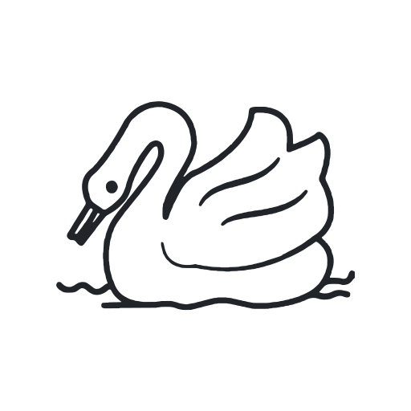</a><br><b>Swan</b><br><sub>හංසයා</sub><br><sub><code>NDF</code></sub><br><sub><a href="dist/png/swan.png">PNG 512px</a></sub></td>
    <td align="center" width="16.6%"><a href="src/icons/tractor.svg" title="Tractor (ට්‍රැක්ටරය / உழவு இயந்திரம்)">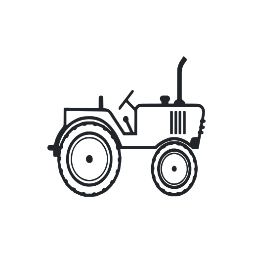</a><br><b>Tractor</b><br><sub>ට්‍රැක්ටරය</sub><br><sub><code>Jana</code></sub><br><sub><a href="dist/png/tractor.png">PNG 512px</a></sub></td>
    <td align="center" width="16.6%"><a href="src/icons/cockerel.svg" title="Cockerel (කුකුළා / சேவல்)">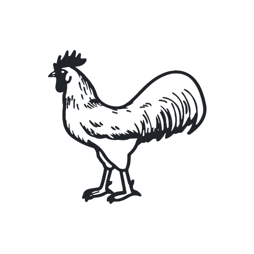</a><br><b>Cockerel</b><br><sub>කුකුළා</sub><br><sub><code>CWC</code></sub><br><sub><a href="dist/png/cockerel.png">PNG 512px</a></sub></td>
    <td align="center" width="16.6%"><a href="src/icons/chair.svg" title="Chair (පුටුව / நாற்காலி)">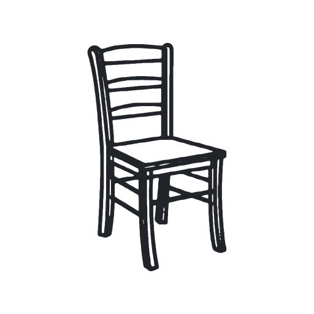</a><br><b>Chair</b><br><sub>පුටුව</sub><br><sub><code>PA</code></sub><br><sub><a href="dist/png/chair.png">PNG 512px</a></sub></td>
    <td align="center" width="16.6%"><a href="src/icons/cart-wheel.svg" title="Cart Wheel (කරත්ත රෝදය / வண்டிச் சக்கரம்)">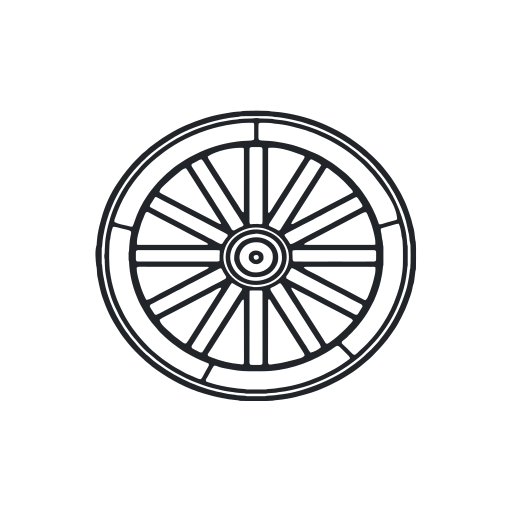</a><br><b>Cart Wheel</b><br><sub>කරත්ත රෝදය</sub><br><sub><code>NFF</code></sub><br><sub><a href="dist/png/cart-wheel.png">PNG 512px</a></sub></td>
  </tr>
</table>

---

## 🖼️ Complete Visual Icon Gallery (All 182 Symbols)

Every symbol below is vectorized and normalized to a standard **`512×512 viewBox`** with smooth cubic bezier splines, **`fill="currentColor"`**, and responsive Light/Dark mode styling. Click any icon to view its raw 512px SVG or download its 512px PNG.

<table>
  <tr>
    <td align="center" width="20%"><a href="src/icons/aeroplane.svg" title="Click for 512px SVG: Aeroplane"></a><br><b><sub>Aeroplane</sub></b><br><sub>ගුවන් යානය</sub><br><sub><a href="src/icons/aeroplane.svg">SVG</a> • <a href="dist/png/aeroplane.png">PNG</a></sub></td>
    <td align="center" width="20%"><a href="src/icons/almirah.svg" title="Click for 512px SVG: Almirah">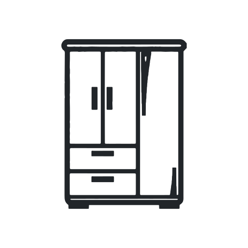</a><br><b><sub>Almirah</sub></b><br><sub>අල්මාරිය</sub><br><sub><a href="src/icons/almirah.svg">SVG</a> • <a href="dist/png/almirah.png">PNG</a></sub></td>
    <td align="center" width="20%"><a href="src/icons/anchor.svg" title="Click for 512px SVG: Anchor">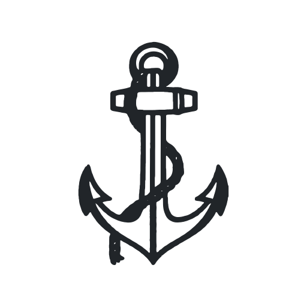</a><br><b><sub>Anchor</sub></b><br><sub>නැංගුරම</sub><br><sub><a href="src/icons/anchor.svg">SVG</a> • <a href="dist/png/anchor.png">PNG</a></sub></td>
    <td align="center" width="20%"><a href="src/icons/ant.svg" title="Click for 512px SVG: Ant">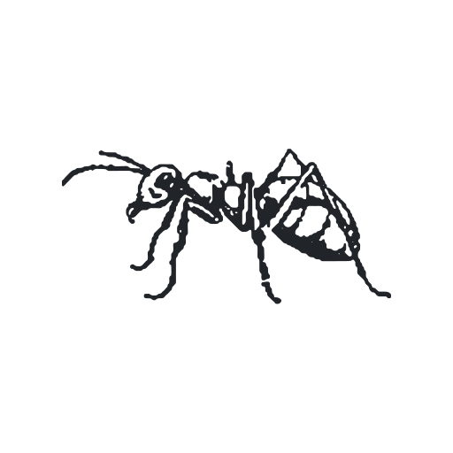</a><br><b><sub>Ant</sub></b><br><sub>කූඹියා</sub><br><sub><a href="src/icons/ant.svg">SVG</a> • <a href="dist/png/ant.png">PNG</a></sub></td>
    <td align="center" width="20%"><a href="src/icons/apple.svg" title="Click for 512px SVG: Apple">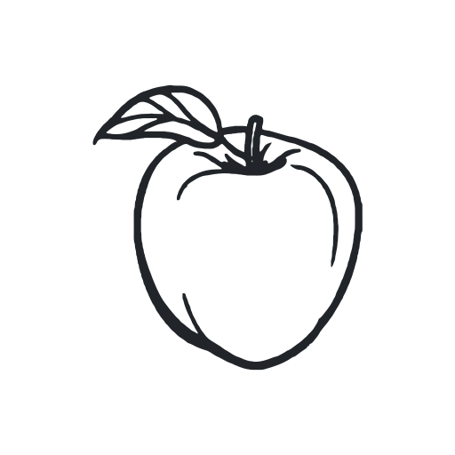</a><br><b><sub>Apple</sub></b><br><sub>ඇපල්</sub><br><sub><a href="src/icons/apple.svg">SVG</a> • <a href="dist/png/apple.png">PNG</a></sub></td>
  </tr>
  <tr>
    <td align="center" width="20%"><a href="src/icons/balloon.svg" title="Click for 512px SVG: Balloon">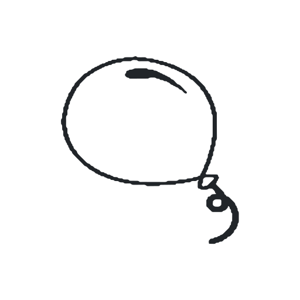</a><br><b><sub>Balloon</sub></b><br><sub>බැලුනය</sub><br><sub><a href="src/icons/balloon.svg">SVG</a> • <a href="dist/png/balloon.png">PNG</a></sub></td>
    <td align="center" width="20%"><a href="src/icons/bat.svg" title="Click for 512px SVG: Bat">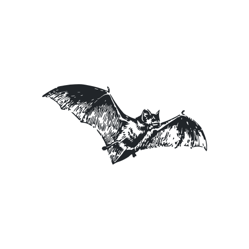</a><br><b><sub>Bat</sub></b><br><sub>වවුලා</sub><br><sub><a href="src/icons/bat.svg">SVG</a> • <a href="dist/png/bat.png">PNG</a></sub></td>
    <td align="center" width="20%"><a href="src/icons/battery.svg" title="Click for 512px SVG: Battery">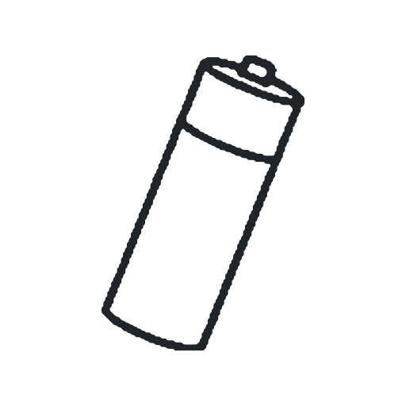</a><br><b><sub>Battery</sub></b><br><sub>බැටරිය</sub><br><sub><a href="src/icons/battery.svg">SVG</a> • <a href="dist/png/battery.png">PNG</a></sub></td>
    <td align="center" width="20%"><a href="src/icons/bed.svg" title="Click for 512px SVG: Bed">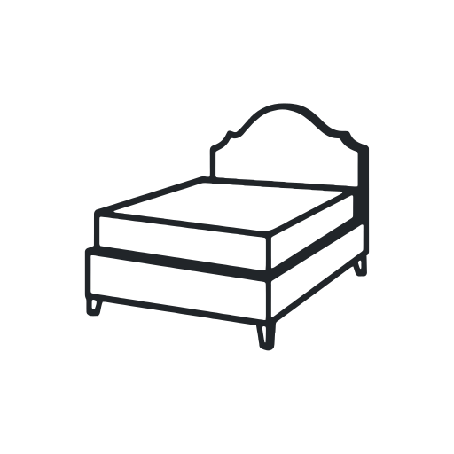</a><br><b><sub>Bed</sub></b><br><sub>ඇඳ</sub><br><sub><a href="src/icons/bed.svg">SVG</a> • <a href="dist/png/bed.png">PNG</a></sub></td>
    <td align="center" width="20%"><a href="src/icons/bell.svg" title="Click for 512px SVG: Bell"></a><br><b><sub>Bell</sub></b><br><sub>ඝණ්ඨාරය</sub><br><sub><a href="src/icons/bell.svg">SVG</a> • <a href="dist/png/bell.png">PNG</a></sub></td>
  </tr>
  <tr>
    <td align="center" width="20%"><a href="src/icons/belt.svg" title="Click for 512px SVG: Belt">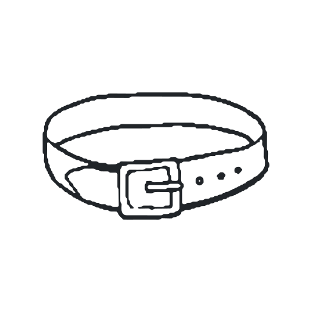</a><br><b><sub>Belt</sub></b><br><sub>පටිය</sub><br><sub><a href="src/icons/belt.svg">SVG</a> • <a href="dist/png/belt.png">PNG</a></sub></td>
    <td align="center" width="20%"><a href="src/icons/betel-leaf.svg" title="Click for 512px SVG: Betel Leaf"></a><br><b><sub>Betel Leaf</sub></b><br><sub>බුලත් කොළය</sub><br><sub><a href="src/icons/betel-leaf.svg">SVG</a> • <a href="dist/png/betel-leaf.png">PNG</a></sub></td>
    <td align="center" width="20%"><a href="src/icons/bicycle.svg" title="Click for 512px SVG: Bicycle">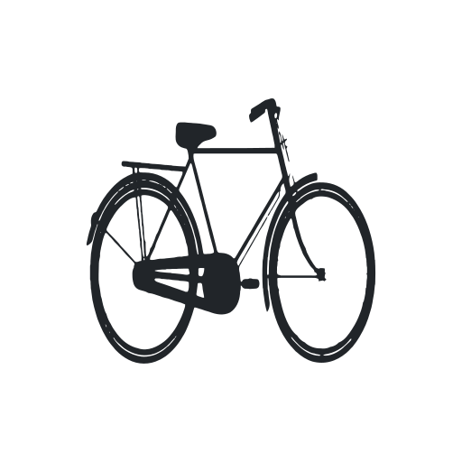</a><br><b><sub>Bicycle</sub></b><br><sub>බයිසිකලය</sub><br><sub><a href="src/icons/bicycle.svg">SVG</a> • <a href="dist/png/bicycle.png">PNG</a></sub></td>
    <td align="center" width="20%"><a href="src/icons/black-board.svg" title="Click for 512px SVG: Black Board">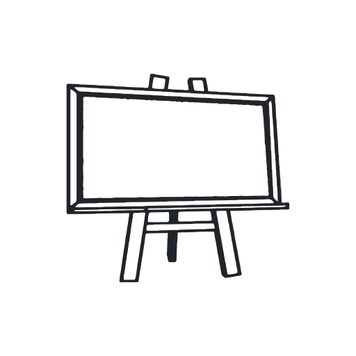</a><br><b><sub>Black Board</sub></b><br><sub>කළු ලෑල්ල</sub><br><sub><a href="src/icons/black-board.svg">SVG</a> • <a href="dist/png/black-board.png">PNG</a></sub></td>
    <td align="center" width="20%"><a href="src/icons/boat.svg" title="Click for 512px SVG: Boat">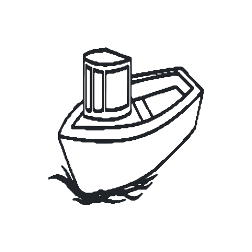</a><br><b><sub>Boat</sub></b><br><sub>බෝට්ටුව</sub><br><sub><a href="src/icons/boat.svg">SVG</a> • <a href="dist/png/boat.png">PNG</a></sub></td>
  </tr>
  <tr>
    <td align="center" width="20%"><a href="src/icons/book.svg" title="Click for 512px SVG: Book"></a><br><b><sub>Book</sub></b><br><sub>පොත</sub><br><sub><a href="src/icons/book.svg">SVG</a> • <a href="dist/png/book.png">PNG</a></sub></td>
    <td align="center" width="20%"><a href="src/icons/bottle.svg" title="Click for 512px SVG: Bottle">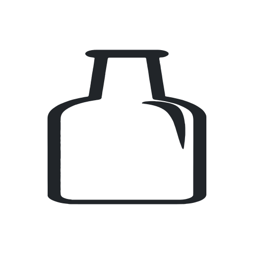</a><br><b><sub>Bottle</sub></b><br><sub>බෝතලය</sub><br><sub><a href="src/icons/bottle.svg">SVG</a> • <a href="dist/png/bottle.png">PNG</a></sub></td>
    <td align="center" width="20%"><a href="src/icons/bow-and-arrow.svg" title="Click for 512px SVG: Bow and Arrow">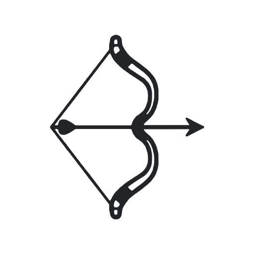</a><br><b><sub>Bow and Arrow</sub></b><br><sub>දුන්න සහ ඊතලය</sub><br><sub><a href="src/icons/bow-and-arrow.svg">SVG</a> • <a href="dist/png/bow-and-arrow.png">PNG</a></sub></td>
    <td align="center" width="20%"><a href="src/icons/brass-lamp.svg" title="Click for 512px SVG: Brass Lamp">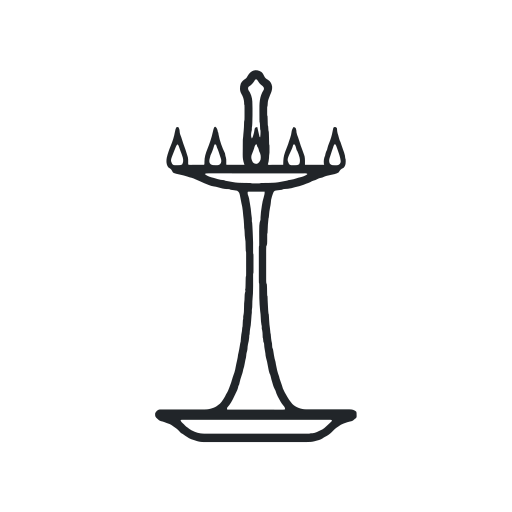</a><br><b><sub>Brass Lamp</sub></b><br><sub>පිත්තල පහන</sub><br><sub><a href="src/icons/brass-lamp.svg">SVG</a> • <a href="dist/png/brass-lamp.png">PNG</a></sub></td>
    <td align="center" width="20%"><a href="src/icons/brush.svg" title="Click for 512px SVG: Brush">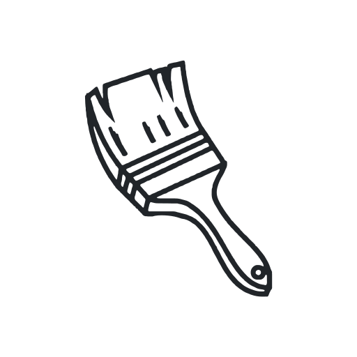</a><br><b><sub>Brush</sub></b><br><sub>බුරුසුව</sub><br><sub><a href="src/icons/brush.svg">SVG</a> • <a href="dist/png/brush.png">PNG</a></sub></td>
  </tr>
  <tr>
    <td align="center" width="20%"><a href="src/icons/bucket.svg" title="Click for 512px SVG: Bucket">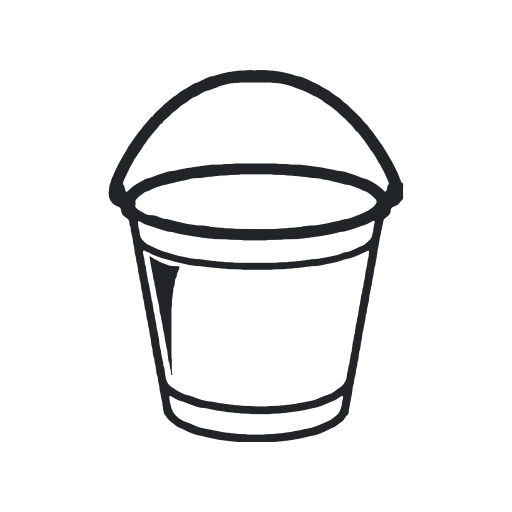</a><br><b><sub>Bucket</sub></b><br><sub>බාල්දිය</sub><br><sub><a href="src/icons/bucket.svg">SVG</a> • <a href="dist/png/bucket.png">PNG</a></sub></td>
    <td align="center" width="20%"><a href="src/icons/bunch-of-grapes.svg" title="Click for 512px SVG: Bunch of Grapes">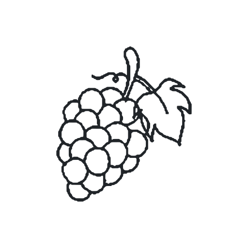</a><br><b><sub>Bunch of Grapes</sub></b><br><sub>මිදි පොකුර</sub><br><sub><a href="src/icons/bunch-of-grapes.svg">SVG</a> • <a href="dist/png/bunch-of-grapes.png">PNG</a></sub></td>
    <td align="center" width="20%"><a href="src/icons/butterfly.svg" title="Click for 512px SVG: Butterfly">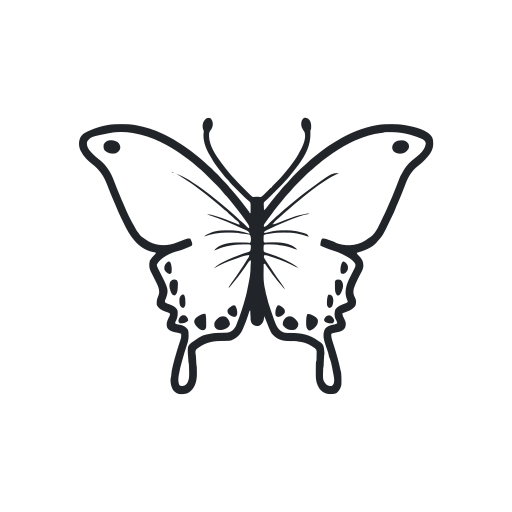</a><br><b><sub>Butterfly</sub></b><br><sub>සමනලයා</sub><br><sub><a href="src/icons/butterfly.svg">SVG</a> • <a href="dist/png/butterfly.png">PNG</a></sub></td>
    <td align="center" width="20%"><a href="src/icons/camel.svg" title="Click for 512px SVG: Camel">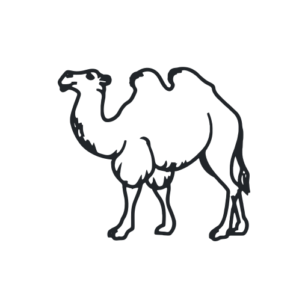</a><br><b><sub>Camel</sub></b><br><sub>ඔටුවා</sub><br><sub><a href="src/icons/camel.svg">SVG</a> • <a href="dist/png/camel.png">PNG</a></sub></td>
    <td align="center" width="20%"><a href="src/icons/camera.svg" title="Click for 512px SVG: Camera"></a><br><b><sub>Camera</sub></b><br><sub>කැමරාව</sub><br><sub><a href="src/icons/camera.svg">SVG</a> • <a href="dist/png/camera.png">PNG</a></sub></td>
  </tr>
  <tr>
    <td align="center" width="20%"><a href="src/icons/candle.svg" title="Click for 512px SVG: Candle"></a><br><b><sub>Candle</sub></b><br><sub>ඉටිපන්දම</sub><br><sub><a href="src/icons/candle.svg">SVG</a> • <a href="dist/png/candle.png">PNG</a></sub></td>
    <td align="center" width="20%"><a href="src/icons/canoe.svg" title="Click for 512px SVG: Canoe">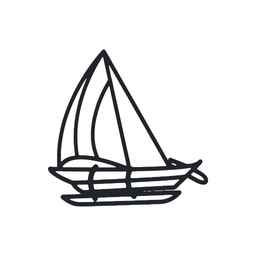</a><br><b><sub>Canoe</sub></b><br><sub>ඔරුව</sub><br><sub><a href="src/icons/canoe.svg">SVG</a> • <a href="dist/png/canoe.png">PNG</a></sub></td>
    <td align="center" width="20%"><a href="src/icons/carrot.svg" title="Click for 512px SVG: Carrot">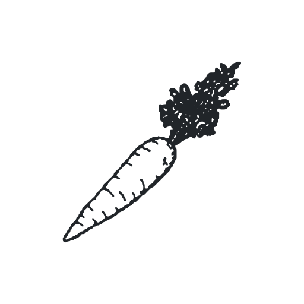</a><br><b><sub>Carrot</sub></b><br><sub>කැරට්</sub><br><sub><a href="src/icons/carrot.svg">SVG</a> • <a href="dist/png/carrot.png">PNG</a></sub></td>
    <td align="center" width="20%"><a href="src/icons/cart.svg" title="Click for 512px SVG: Cart">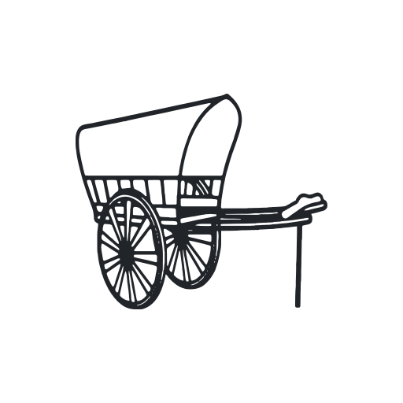</a><br><b><sub>Cart</sub></b><br><sub>කරත්තය</sub><br><sub><a href="src/icons/cart.svg">SVG</a> • <a href="dist/png/cart.png">PNG</a></sub></td>
    <td align="center" width="20%"><a href="src/icons/cart-wheel.svg" title="Click for 512px SVG: Cart Wheel"></a><br><b><sub>Cart Wheel</sub></b><br><sub>කරත්ත රෝදය</sub><br><sub><a href="src/icons/cart-wheel.svg">SVG</a> • <a href="dist/png/cart-wheel.png">PNG</a></sub></td>
  </tr>
  <tr>
    <td align="center" width="20%"><a href="src/icons/cashew-apple.svg" title="Click for 512px SVG: Cashew Apple">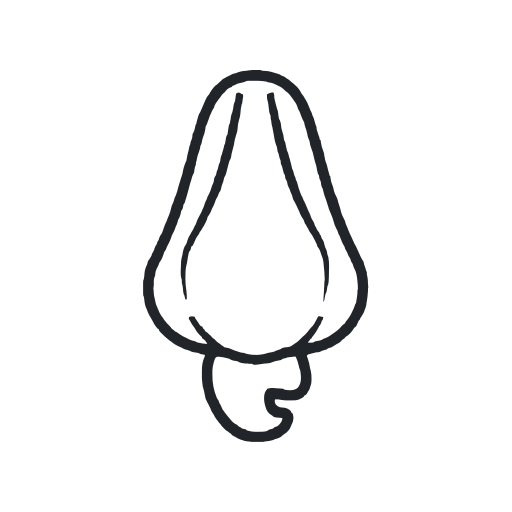</a><br><b><sub>Cashew Apple</sub></b><br><sub>කජු පුහුලම</sub><br><sub><a href="src/icons/cashew-apple.svg">SVG</a> • <a href="dist/png/cashew-apple.png">PNG</a></sub></td>
    <td align="center" width="20%"><a href="src/icons/ceiling-fan.svg" title="Click for 512px SVG: Ceiling Fan">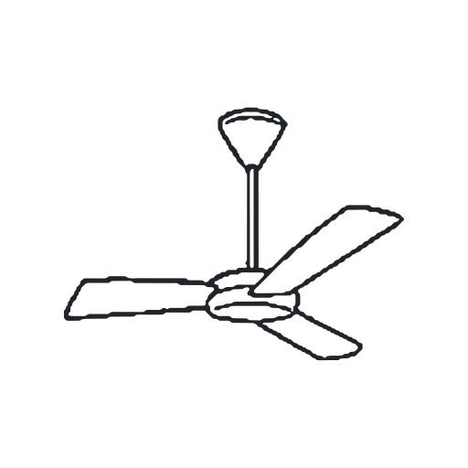</a><br><b><sub>Ceiling Fan</sub></b><br><sub>සිවිලිම් පංකාව</sub><br><sub><a href="src/icons/ceiling-fan.svg">SVG</a> • <a href="dist/png/ceiling-fan.png">PNG</a></sub></td>
    <td align="center" width="20%"><a href="src/icons/chair.svg" title="Click for 512px SVG: Chair"></a><br><b><sub>Chair</sub></b><br><sub>පුටුව</sub><br><sub><a href="src/icons/chair.svg">SVG</a> • <a href="dist/png/chair.png">PNG</a></sub></td>
    <td align="center" width="20%"><a href="src/icons/clay-lamp.svg" title="Click for 512px SVG: Clay Lamp">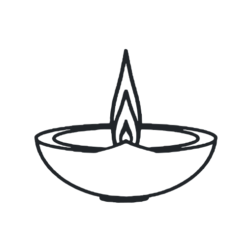</a><br><b><sub>Clay Lamp</sub></b><br><sub>මැටි පහන</sub><br><sub><a href="src/icons/clay-lamp.svg">SVG</a> • <a href="dist/png/clay-lamp.png">PNG</a></sub></td>
    <td align="center" width="20%"><a href="src/icons/clock.svg" title="Click for 512px SVG: Clock">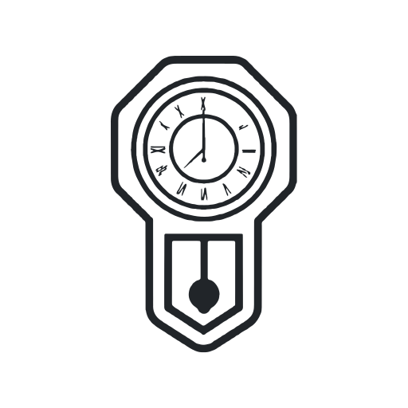</a><br><b><sub>Clock</sub></b><br><sub>ඔරලෝසුව</sub><br><sub><a href="src/icons/clock.svg">SVG</a> • <a href="dist/png/clock.png">PNG</a></sub></td>
  </tr>
  <tr>
    <td align="center" width="20%"><a href="src/icons/cobra.svg" title="Click for 512px SVG: Cobra">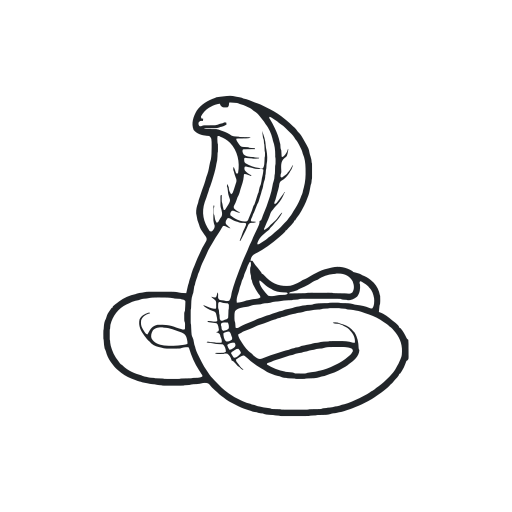</a><br><b><sub>Cobra</sub></b><br><sub>නයා</sub><br><sub><a href="src/icons/cobra.svg">SVG</a> • <a href="dist/png/cobra.png">PNG</a></sub></td>
    <td align="center" width="20%"><a href="src/icons/cockerel.svg" title="Click for 512px SVG: Cockerel"></a><br><b><sub>Cockerel</sub></b><br><sub>කුකුළා</sub><br><sub><a href="src/icons/cockerel.svg">SVG</a> • <a href="dist/png/cockerel.png">PNG</a></sub></td>
    <td align="center" width="20%"><a href="src/icons/coconut.svg" title="Click for 512px SVG: Coconut">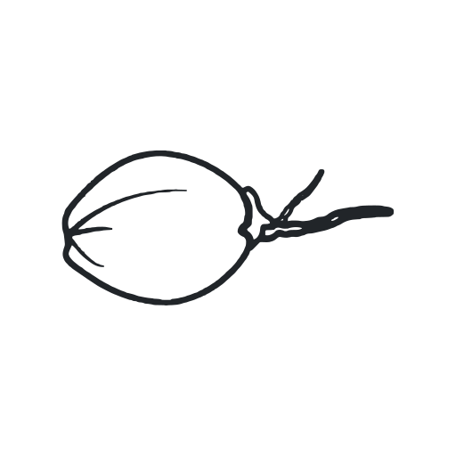</a><br><b><sub>Coconut</sub></b><br><sub>පොල් ගෙඩිය</sub><br><sub><a href="src/icons/coconut.svg">SVG</a> • <a href="dist/png/coconut.png">PNG</a></sub></td>
    <td align="center" width="20%"><a href="src/icons/coconut-scraper.svg" title="Click for 512px SVG: Coconut Scraper">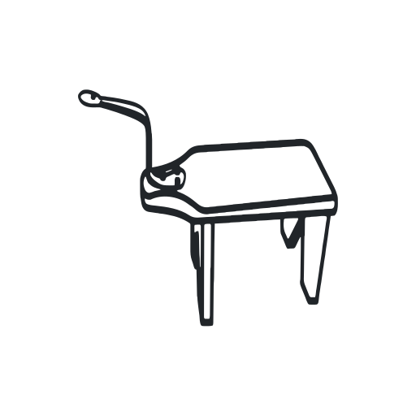</a><br><b><sub>Coconut Scraper</sub></b><br><sub>හිරමනය</sub><br><sub><a href="src/icons/coconut-scraper.svg">SVG</a> • <a href="dist/png/coconut-scraper.png">PNG</a></sub></td>
    <td align="center" width="20%"><a href="src/icons/comb.svg" title="Click for 512px SVG: Comb">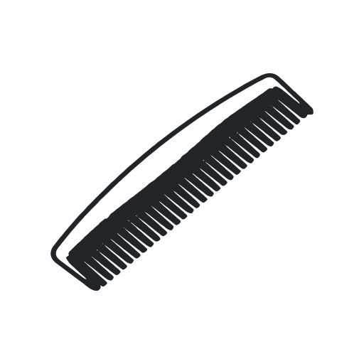</a><br><b><sub>Comb</sub></b><br><sub>පනාව</sub><br><sub><a href="src/icons/comb.svg">SVG</a> • <a href="dist/png/comb.png">PNG</a></sub></td>
  </tr>
  <tr>
    <td align="center" width="20%"><a href="src/icons/comb-of-plantains.svg" title="Click for 512px SVG: Comb of Plantains">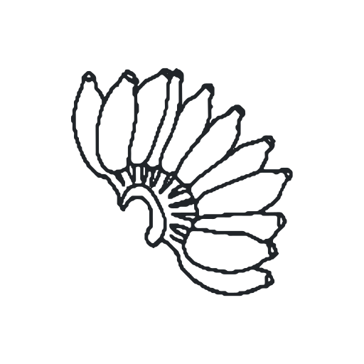</a><br><b><sub>Comb of Plantains</sub></b><br><sub>කෙසෙල් ඇවරිය</sub><br><sub><a href="src/icons/comb-of-plantains.svg">SVG</a> • <a href="dist/png/comb-of-plantains.png">PNG</a></sub></td>
    <td align="center" width="20%"><a href="src/icons/compass.svg" title="Click for 512px SVG: Compass"></a><br><b><sub>Compass</sub></b><br><sub>මාලිමාව</sub><br><sub><a href="src/icons/compass.svg">SVG</a> • <a href="dist/png/compass.png">PNG</a></sub></td>
    <td align="center" width="20%"><a href="src/icons/conch-shell.svg" title="Click for 512px SVG: Conch Shell">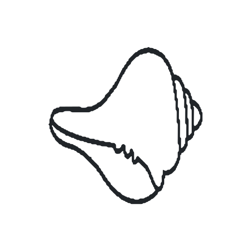</a><br><b><sub>Conch Shell</sub></b><br><sub>හක්ගෙඩිය</sub><br><sub><a href="src/icons/conch-shell.svg">SVG</a> • <a href="dist/png/conch-shell.png">PNG</a></sub></td>
    <td align="center" width="20%"><a href="src/icons/corn.svg" title="Click for 512px SVG: Corn">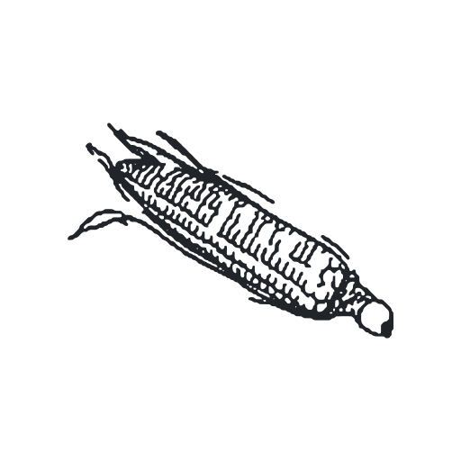</a><br><b><sub>Corn</sub></b><br><sub>ඉරිඟු</sub><br><sub><a href="src/icons/corn.svg">SVG</a> • <a href="dist/png/corn.png">PNG</a></sub></td>
    <td align="center" width="20%"><a href="src/icons/crane.svg" title="Click for 512px SVG: Crane">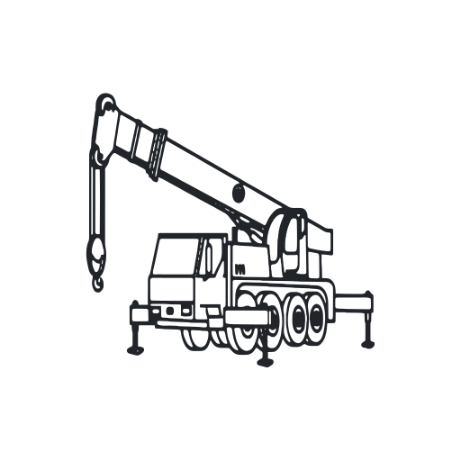</a><br><b><sub>Crane</sub></b><br><sub>ක්‍රේන් රථය</sub><br><sub><a href="src/icons/crane.svg">SVG</a> • <a href="dist/png/crane.png">PNG</a></sub></td>
  </tr>
  <tr>
    <td align="center" width="20%"><a href="src/icons/cricket-bat.svg" title="Click for 512px SVG: Cricket Bat">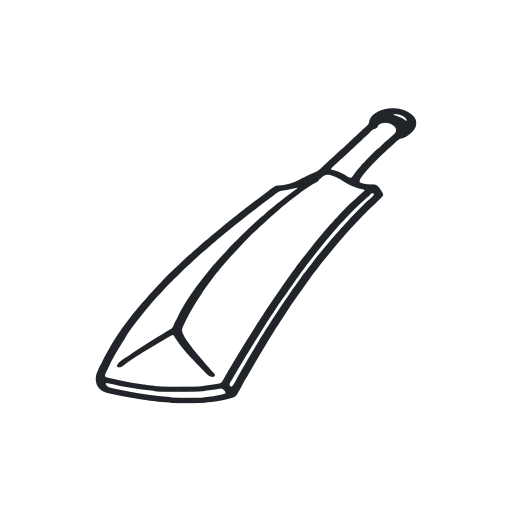</a><br><b><sub>Cricket Bat</sub></b><br><sub>ක්‍රිකට් පිත්ත</sub><br><sub><a href="src/icons/cricket-bat.svg">SVG</a> • <a href="dist/png/cricket-bat.png">PNG</a></sub></td>
    <td align="center" width="20%"><a href="src/icons/crocodile.svg" title="Click for 512px SVG: Crocodile">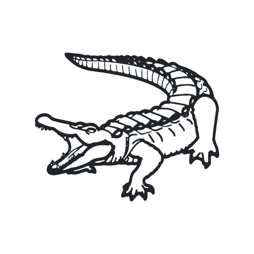</a><br><b><sub>Crocodile</sub></b><br><sub>කිඹුලා</sub><br><sub><a href="src/icons/crocodile.svg">SVG</a> • <a href="dist/png/crocodile.png">PNG</a></sub></td>
    <td align="center" width="20%"><a href="src/icons/crown.svg" title="Click for 512px SVG: Crown">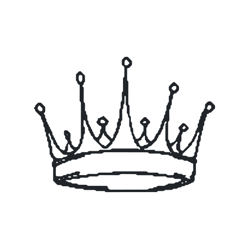</a><br><b><sub>Crown</sub></b><br><sub>ඔටුන්න</sub><br><sub><a href="src/icons/crown.svg">SVG</a> • <a href="dist/png/crown.png">PNG</a></sub></td>
    <td align="center" width="20%"><a href="src/icons/cup.svg" title="Click for 512px SVG: Cup">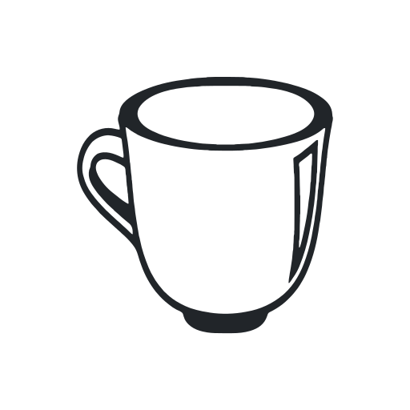</a><br><b><sub>Cup</sub></b><br><sub>කෝප්පය</sub><br><sub><a href="src/icons/cup.svg">SVG</a> • <a href="dist/png/cup.png">PNG</a></sub></td>
    <td align="center" width="20%"><a href="src/icons/deer.svg" title="Click for 512px SVG: Deer">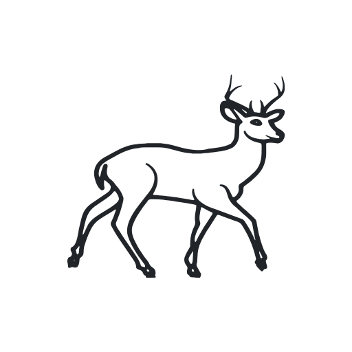</a><br><b><sub>Deer</sub></b><br><sub>මුවා</sub><br><sub><a href="src/icons/deer.svg">SVG</a> • <a href="dist/png/deer.png">PNG</a></sub></td>
  </tr>
  <tr>
    <td align="center" width="20%"><a href="src/icons/diamond.svg" title="Click for 512px SVG: Diamond">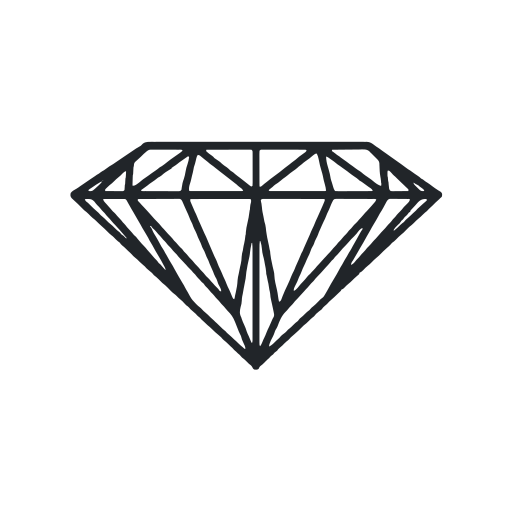</a><br><b><sub>Diamond</sub></b><br><sub>දියමන්තිය</sub><br><sub><a href="src/icons/diamond.svg">SVG</a> • <a href="dist/png/diamond.png">PNG</a></sub></td>
    <td align="center" width="20%"><a href="src/icons/dog.svg" title="Click for 512px SVG: Dog">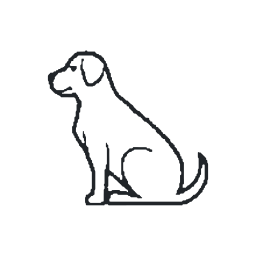</a><br><b><sub>Dog</sub></b><br><sub>බල්ලා</sub><br><sub><a href="src/icons/dog.svg">SVG</a> • <a href="dist/png/dog.png">PNG</a></sub></td>
    <td align="center" width="20%"><a href="src/icons/double-flags.svg" title="Click for 512px SVG: Double Flags">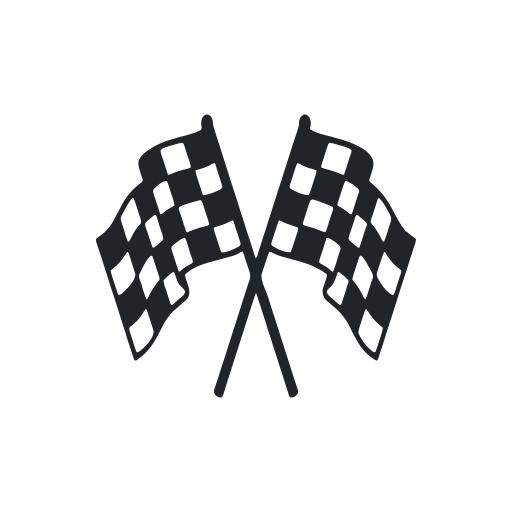</a><br><b><sub>Double Flags</sub></b><br><sub>ද්විත්ව කොඩි</sub><br><sub><a href="src/icons/double-flags.svg">SVG</a> • <a href="dist/png/double-flags.png">PNG</a></sub></td>
    <td align="center" width="20%"><a href="src/icons/drum.svg" title="Click for 512px SVG: Drum">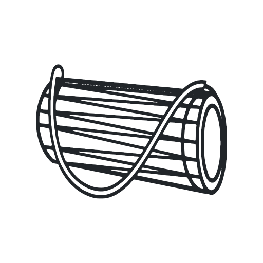</a><br><b><sub>Drum</sub></b><br><sub>බෙරය</sub><br><sub><a href="src/icons/drum.svg">SVG</a> • <a href="dist/png/drum.png">PNG</a></sub></td>
    <td align="center" width="20%"><a href="src/icons/eagle.svg" title="Click for 512px SVG: Eagle">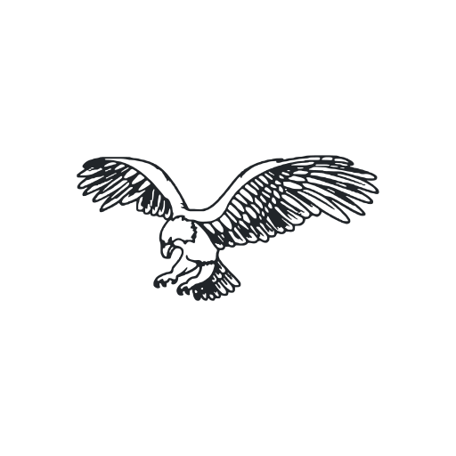</a><br><b><sub>Eagle</sub></b><br><sub>රාජාලියා</sub><br><sub><a href="src/icons/eagle.svg">SVG</a> • <a href="dist/png/eagle.png">PNG</a></sub></td>
  </tr>
  <tr>
    <td align="center" width="20%"><a href="src/icons/ear.svg" title="Click for 512px SVG: Ear">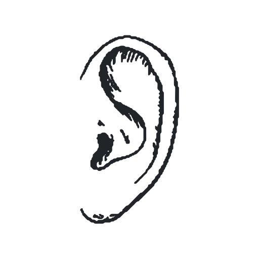</a><br><b><sub>Ear</sub></b><br><sub>කන</sub><br><sub><a href="src/icons/ear.svg">SVG</a> • <a href="dist/png/ear.png">PNG</a></sub></td>
    <td align="center" width="20%"><a href="src/icons/ear-of-paddy.svg" title="Click for 512px SVG: Ear of Paddy">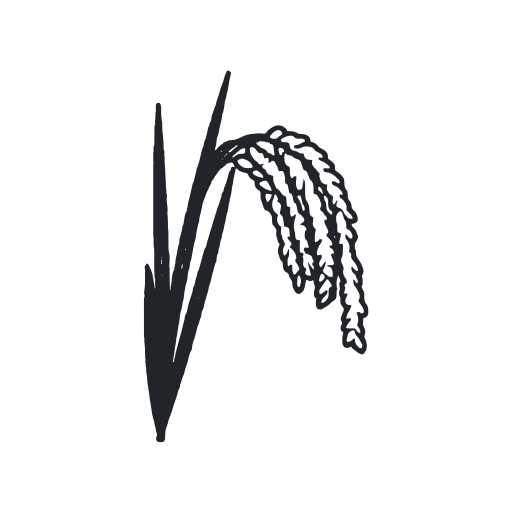</a><br><b><sub>Ear of Paddy</sub></b><br><sub>වී කරල</sub><br><sub><a href="src/icons/ear-of-paddy.svg">SVG</a> • <a href="dist/png/ear-of-paddy.png">PNG</a></sub></td>
    <td align="center" width="20%"><a href="src/icons/electric-bulb.svg" title="Click for 512px SVG: Electric Bulb">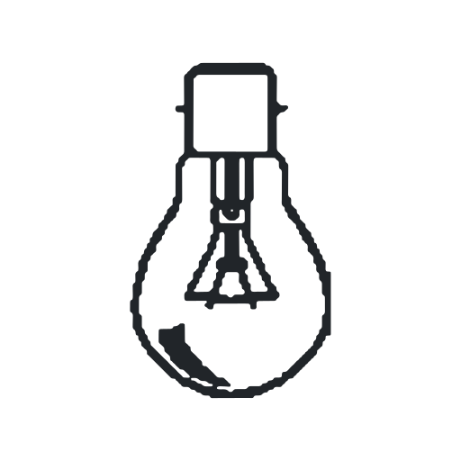</a><br><b><sub>Electric Bulb</sub></b><br><sub>විදුලි බුබුල</sub><br><sub><a href="src/icons/electric-bulb.svg">SVG</a> • <a href="dist/png/electric-bulb.png">PNG</a></sub></td>
    <td align="center" width="20%"><a href="src/icons/elephant.svg" title="Click for 512px SVG: Elephant"></a><br><b><sub>Elephant</sub></b><br><sub>අලියා</sub><br><sub><a href="src/icons/elephant.svg">SVG</a> • <a href="dist/png/elephant.png">PNG</a></sub></td>
    <td align="center" width="20%"><a href="src/icons/envelope.svg" title="Click for 512px SVG: Envelope"></a><br><b><sub>Envelope</sub></b><br><sub>ලියුම් කවරය</sub><br><sub><a href="src/icons/envelope.svg">SVG</a> • <a href="dist/png/envelope.png">PNG</a></sub></td>
  </tr>
  <tr>
    <td align="center" width="20%"><a href="src/icons/eye.svg" title="Click for 512px SVG: Eye">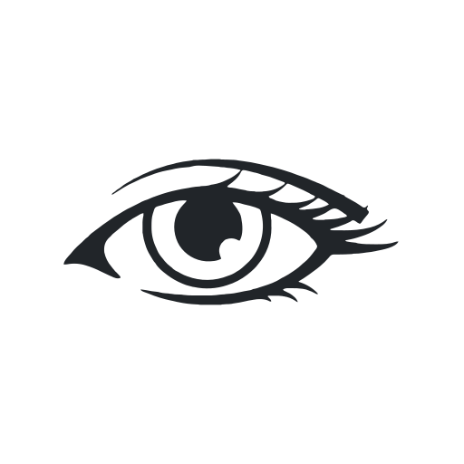</a><br><b><sub>Eye</sub></b><br><sub>ඇස</sub><br><sub><a href="src/icons/eye.svg">SVG</a> • <a href="dist/png/eye.png">PNG</a></sub></td>
    <td align="center" width="20%"><a href="src/icons/farmer.svg" title="Click for 512px SVG: Farmer">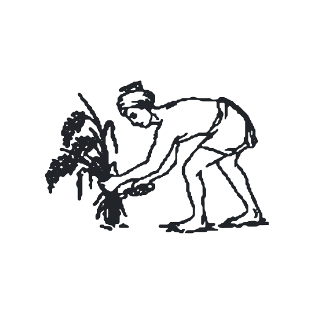</a><br><b><sub>Farmer</sub></b><br><sub>ගොවියා</sub><br><sub><a href="src/icons/farmer.svg">SVG</a> • <a href="dist/png/farmer.png">PNG</a></sub></td>
    <td align="center" width="20%"><a href="src/icons/fish.svg" title="Click for 512px SVG: Fish">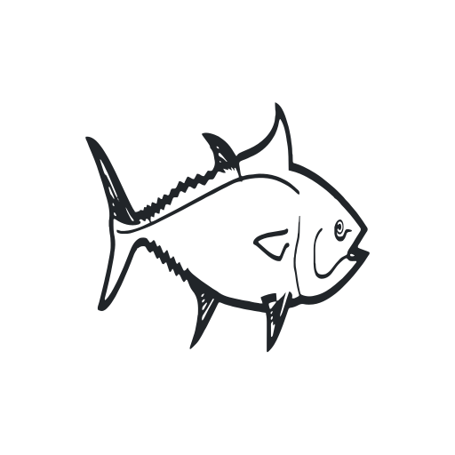</a><br><b><sub>Fish</sub></b><br><sub>මළුවා</sub><br><sub><a href="src/icons/fish.svg">SVG</a> • <a href="dist/png/fish.png">PNG</a></sub></td>
    <td align="center" width="20%"><a href="src/icons/flag.svg" title="Click for 512px SVG: Flag">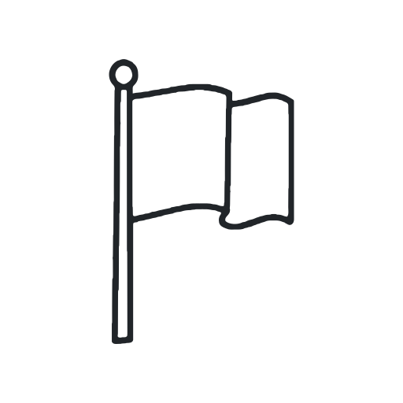</a><br><b><sub>Flag</sub></b><br><sub>කොඩිය</sub><br><sub><a href="src/icons/flag.svg">SVG</a> • <a href="dist/png/flag.png">PNG</a></sub></td>
    <td align="center" width="20%"><a href="src/icons/flaming-torch.svg" title="Click for 512px SVG: Flaming Torch">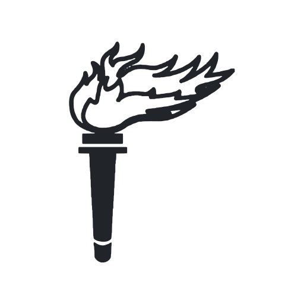</a><br><b><sub>Flaming Torch</sub></b><br><sub>පන්දම</sub><br><sub><a href="src/icons/flaming-torch.svg">SVG</a> • <a href="dist/png/flaming-torch.png">PNG</a></sub></td>
  </tr>
  <tr>
    <td align="center" width="20%"><a href="src/icons/flower.svg" title="Click for 512px SVG: Flower">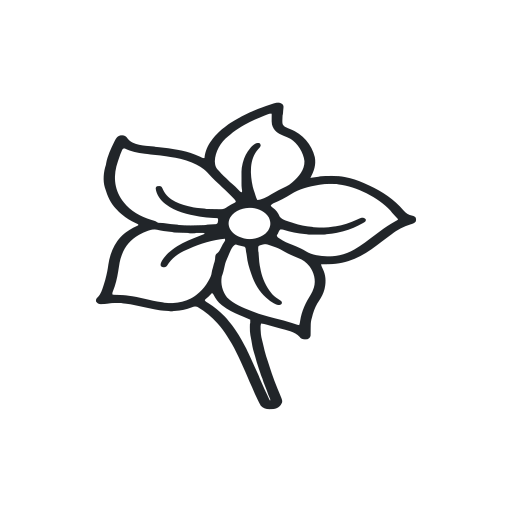</a><br><b><sub>Flower</sub></b><br><sub>මල</sub><br><sub><a href="src/icons/flower.svg">SVG</a> • <a href="dist/png/flower.png">PNG</a></sub></td>
    <td align="center" width="20%"><a href="src/icons/flower-bud.svg" title="Click for 512px SVG: Flower Bud"></a><br><b><sub>Flower Bud</sub></b><br><sub>නෙළුම් පොහොට්ටුව</sub><br><sub><a href="src/icons/flower-bud.svg">SVG</a> • <a href="dist/png/flower-bud.png">PNG</a></sub></td>
    <td align="center" width="20%"><a href="src/icons/flower-vase.svg" title="Click for 512px SVG: Flower Vase">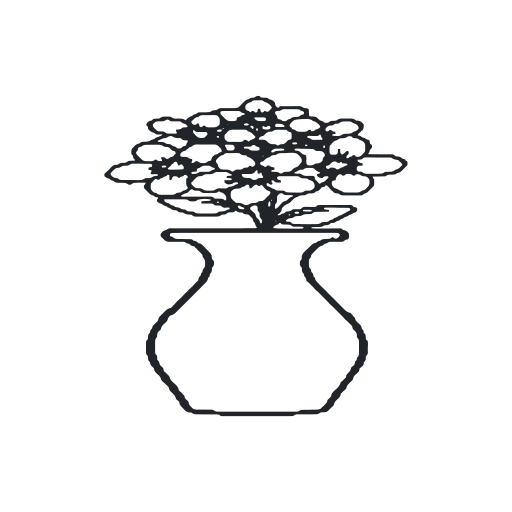</a><br><b><sub>Flower Vase</sub></b><br><sub>මල් බඳුන</sub><br><sub><a href="src/icons/flower-vase.svg">SVG</a> • <a href="dist/png/flower-vase.png">PNG</a></sub></td>
    <td align="center" width="20%"><a href="src/icons/fly.svg" title="Click for 512px SVG: Fly">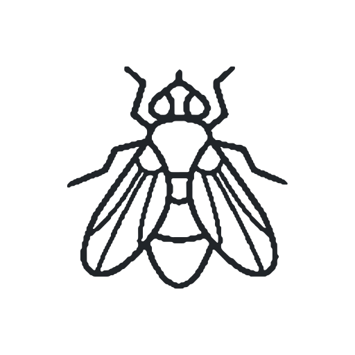</a><br><b><sub>Fly</sub></b><br><sub>මැස්සා</sub><br><sub><a href="src/icons/fly.svg">SVG</a> • <a href="dist/png/fly.png">PNG</a></sub></td>
    <td align="center" width="20%"><a href="src/icons/foot-ball.svg" title="Click for 512px SVG: Foot Ball"></a><br><b><sub>Foot Ball</sub></b><br><sub>පාපන්දුව</sub><br><sub><a href="src/icons/foot-ball.svg">SVG</a> • <a href="dist/png/foot-ball.png">PNG</a></sub></td>
  </tr>
  <tr>
    <td align="center" width="20%"><a href="src/icons/fork.svg" title="Click for 512px SVG: Fork">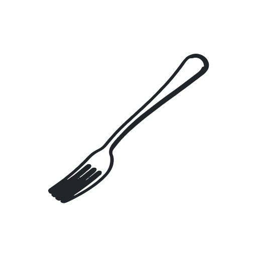</a><br><b><sub>Fork</sub></b><br><sub>ගෑරුප්පුව</sub><br><sub><a href="src/icons/fork.svg">SVG</a> • <a href="dist/png/fork.png">PNG</a></sub></td>
    <td align="center" width="20%"><a href="src/icons/fruit-basket.svg" title="Click for 512px SVG: Fruit Basket">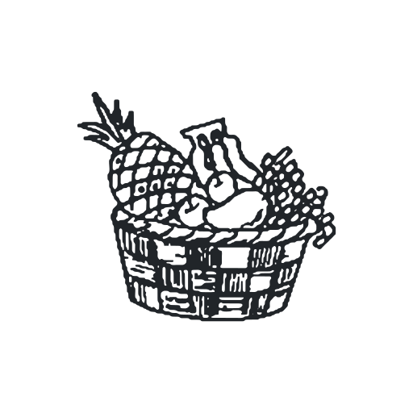</a><br><b><sub>Fruit Basket</sub></b><br><sub>පළතුරු කූඩය</sub><br><sub><a href="src/icons/fruit-basket.svg">SVG</a> • <a href="dist/png/fruit-basket.png">PNG</a></sub></td>
    <td align="center" width="20%"><a href="src/icons/gas-cylinder.svg" title="Click for 512px SVG: Gas Cylinder">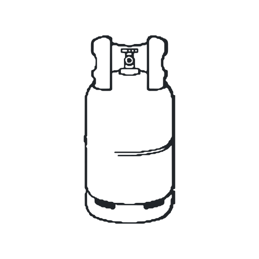</a><br><b><sub>Gas Cylinder</sub></b><br><sub>ගෑස් සිලින්ඩරය</sub><br><sub><a href="src/icons/gas-cylinder.svg">SVG</a> • <a href="dist/png/gas-cylinder.png">PNG</a></sub></td>
    <td align="center" width="20%"><a href="src/icons/giraffe.svg" title="Click for 512px SVG: Giraffe">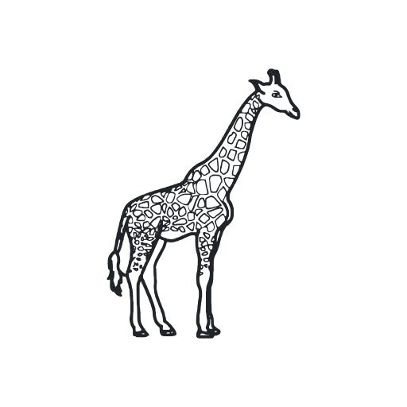</a><br><b><sub>Giraffe</sub></b><br><sub>සිරාෆ්</sub><br><sub><a href="src/icons/giraffe.svg">SVG</a> • <a href="dist/png/giraffe.png">PNG</a></sub></td>
    <td align="center" width="20%"><a href="src/icons/goblet.svg" title="Click for 512px SVG: Goblet">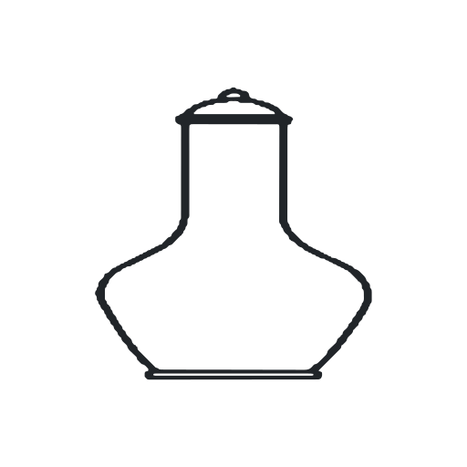</a><br><b><sub>Goblet</sub></b><br><sub>කූජාව</sub><br><sub><a href="src/icons/goblet.svg">SVG</a> • <a href="dist/png/goblet.png">PNG</a></sub></td>
  </tr>
  <tr>
    <td align="center" width="20%"><a href="src/icons/guitar.svg" title="Click for 512px SVG: Guitar">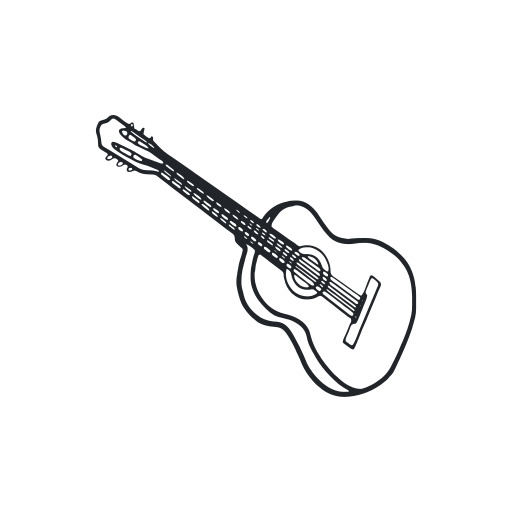</a><br><b><sub>Guitar</sub></b><br><sub>ගිටාරය</sub><br><sub><a href="src/icons/guitar.svg">SVG</a> • <a href="dist/png/guitar.png">PNG</a></sub></td>
    <td align="center" width="20%"><a href="src/icons/hand.svg" title="Click for 512px SVG: Hand"></a><br><b><sub>Hand</sub></b><br><sub>අත</sub><br><sub><a href="src/icons/hand.svg">SVG</a> • <a href="dist/png/hand.png">PNG</a></sub></td>
    <td align="center" width="20%"><a href="src/icons/hand-axe.svg" title="Click for 512px SVG: Hand Axe">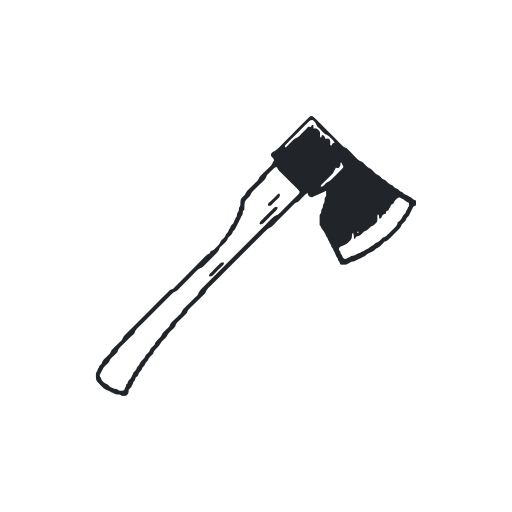</a><br><b><sub>Hand Axe</sub></b><br><sub>පොරව</sub><br><sub><a href="src/icons/hand-axe.svg">SVG</a> • <a href="dist/png/hand-axe.png">PNG</a></sub></td>
    <td align="center" width="20%"><a href="src/icons/hand-bag.svg" title="Click for 512px SVG: Hand Bag">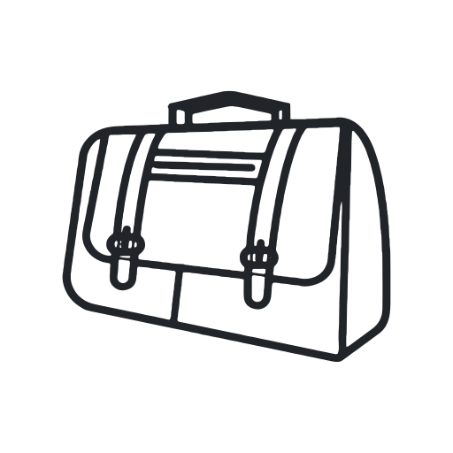</a><br><b><sub>Hand Bag</sub></b><br><sub>අත්බෑගය</sub><br><sub><a href="src/icons/hand-bag.svg">SVG</a> • <a href="dist/png/hand-bag.png">PNG</a></sub></td>
    <td align="center" width="20%"><a href="src/icons/hand-lens.svg" title="Click for 512px SVG: Hand Lens"></a><br><b><sub>Hand Lens</sub></b><br><sub>විශාලක වීදුරුව</sub><br><sub><a href="src/icons/hand-lens.svg">SVG</a> • <a href="dist/png/hand-lens.png">PNG</a></sub></td>
  </tr>
  <tr>
    <td align="center" width="20%"><a href="src/icons/hand-tractor.svg" title="Click for 512px SVG: Hand Tractor">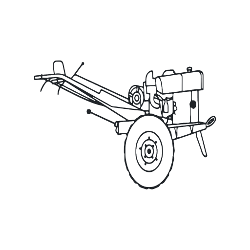</a><br><b><sub>Hand Tractor</sub></b><br><sub>අත් ට්‍රැක්ටරය</sub><br><sub><a href="src/icons/hand-tractor.svg">SVG</a> • <a href="dist/png/hand-tractor.png">PNG</a></sub></td>
    <td align="center" width="20%"><a href="src/icons/hat.svg" title="Click for 512px SVG: Hat">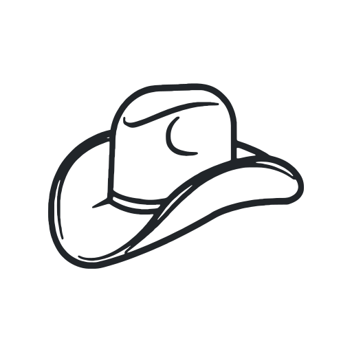</a><br><b><sub>Hat</sub></b><br><sub>තොප්පිය</sub><br><sub><a href="src/icons/hat.svg">SVG</a> • <a href="dist/png/hat.png">PNG</a></sub></td>
    <td align="center" width="20%"><a href="src/icons/helicopter.svg" title="Click for 512px SVG: Helicopter">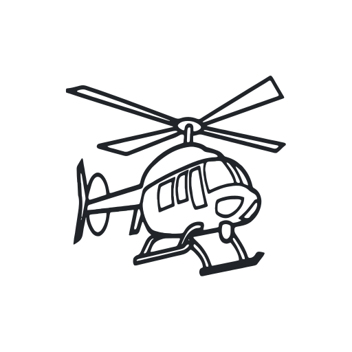</a><br><b><sub>Helicopter</sub></b><br><sub>හෙලිකොප්ටරය</sub><br><sub><a href="src/icons/helicopter.svg">SVG</a> • <a href="dist/png/helicopter.png">PNG</a></sub></td>
    <td align="center" width="20%"><a href="src/icons/horn.svg" title="Click for 512px SVG: Horn">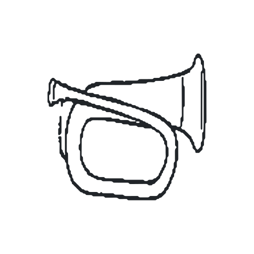</a><br><b><sub>Horn</sub></b><br><sub>නලාව</sub><br><sub><a href="src/icons/horn.svg">SVG</a> • <a href="dist/png/horn.png">PNG</a></sub></td>
    <td align="center" width="20%"><a href="src/icons/horse.svg" title="Click for 512px SVG: Horse">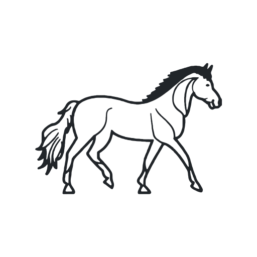</a><br><b><sub>Horse</sub></b><br><sub>අශ්වයා</sub><br><sub><a href="src/icons/horse.svg">SVG</a> • <a href="dist/png/horse.png">PNG</a></sub></td>
  </tr>
  <tr>
    <td align="center" width="20%"><a href="src/icons/horse-shoe.svg" title="Click for 512px SVG: Horse Shoe">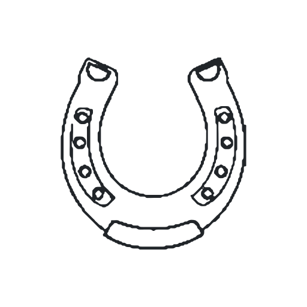</a><br><b><sub>Horse Shoe</sub></b><br><sub>ලාඩම</sub><br><sub><a href="src/icons/horse-shoe.svg">SVG</a> • <a href="dist/png/horse-shoe.png">PNG</a></sub></td>
    <td align="center" width="20%"><a href="src/icons/house.svg" title="Click for 512px SVG: House"></a><br><b><sub>House</sub></b><br><sub>නිවස</sub><br><sub><a href="src/icons/house.svg">SVG</a> • <a href="dist/png/house.png">PNG</a></sub></td>
    <td align="center" width="20%"><a href="src/icons/ice-cream.svg" title="Click for 512px SVG: Ice Cream">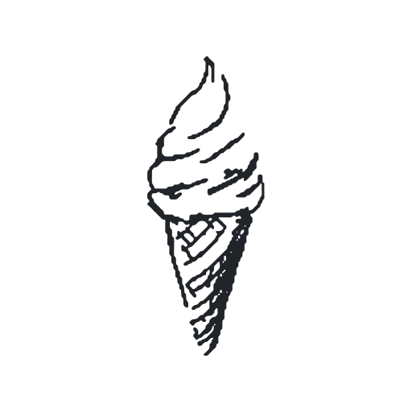</a><br><b><sub>Ice Cream</sub></b><br><sub>අයිස්ක්‍රීම්</sub><br><sub><a href="src/icons/ice-cream.svg">SVG</a> • <a href="dist/png/ice-cream.png">PNG</a></sub></td>
    <td align="center" width="20%"><a href="src/icons/immersion-heater.svg" title="Click for 512px SVG: Immersion Heater">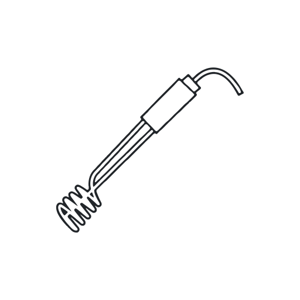</a><br><b><sub>Immersion Heater</sub></b><br><sub>හීටරය</sub><br><sub><a href="src/icons/immersion-heater.svg">SVG</a> • <a href="dist/png/immersion-heater.png">PNG</a></sub></td>
    <td align="center" width="20%"><a href="src/icons/iron.svg" title="Click for 512px SVG: Iron">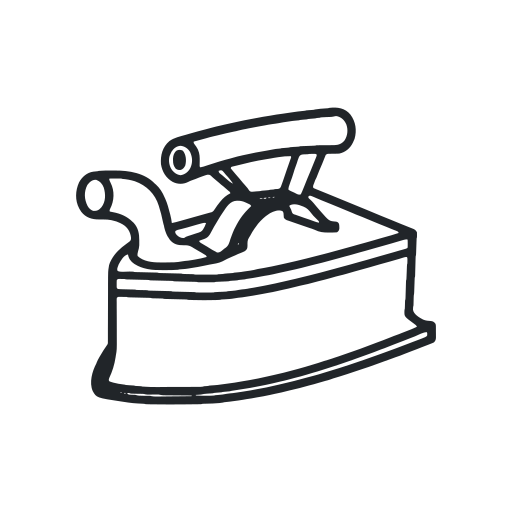</a><br><b><sub>Iron</sub></b><br><sub>ඉස්ත්‍රික්කය</sub><br><sub><a href="src/icons/iron.svg">SVG</a> • <a href="dist/png/iron.png">PNG</a></sub></td>
  </tr>
  <tr>
    <td align="center" width="20%"><a href="src/icons/jak-fruit.svg" title="Click for 512px SVG: Jak Fruit">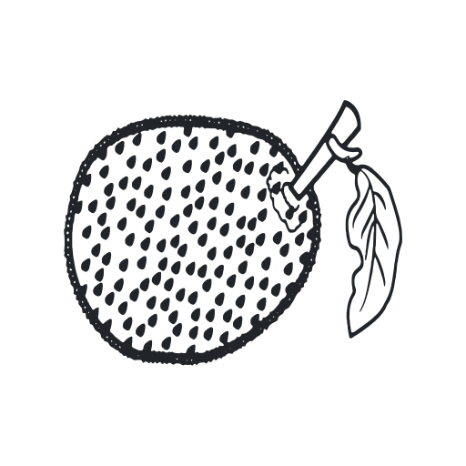</a><br><b><sub>Jak Fruit</sub></b><br><sub>කොස් ගෙඩිය</sub><br><sub><a href="src/icons/jak-fruit.svg">SVG</a> • <a href="dist/png/jak-fruit.png">PNG</a></sub></td>
    <td align="center" width="20%"><a href="src/icons/jeep.svg" title="Click for 512px SVG: Jeep">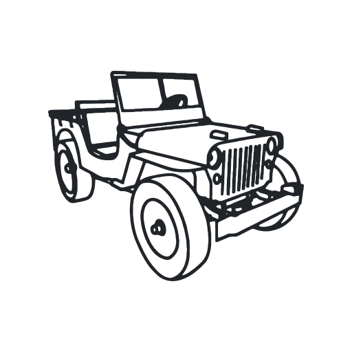</a><br><b><sub>Jeep</sub></b><br><sub>ජීප් රථය</sub><br><sub><a href="src/icons/jeep.svg">SVG</a> • <a href="dist/png/jeep.png">PNG</a></sub></td>
    <td align="center" width="20%"><a href="src/icons/jug.svg" title="Click for 512px SVG: Jug">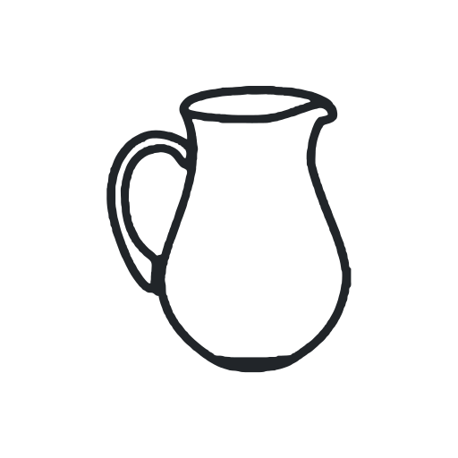</a><br><b><sub>Jug</sub></b><br><sub>ජෝගුව</sub><br><sub><a href="src/icons/jug.svg">SVG</a> • <a href="dist/png/jug.png">PNG</a></sub></td>
    <td align="center" width="20%"><a href="src/icons/kangaroo.svg" title="Click for 512px SVG: Kangaroo">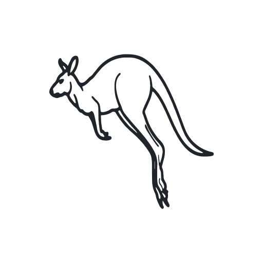</a><br><b><sub>Kangaroo</sub></b><br><sub>කැන්ගරුවා</sub><br><sub><a href="src/icons/kangaroo.svg">SVG</a> • <a href="dist/png/kangaroo.png">PNG</a></sub></td>
    <td align="center" width="20%"><a href="src/icons/kettle.svg" title="Click for 512px SVG: Kettle">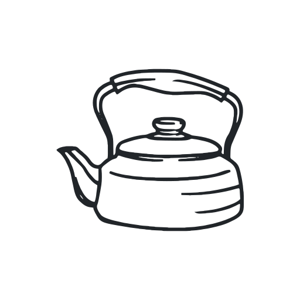</a><br><b><sub>Kettle</sub></b><br><sub>කේතලය</sub><br><sub><a href="src/icons/kettle.svg">SVG</a> • <a href="dist/png/kettle.png">PNG</a></sub></td>
  </tr>
  <tr>
    <td align="center" width="20%"><a href="src/icons/key.svg" title="Click for 512px SVG: Key">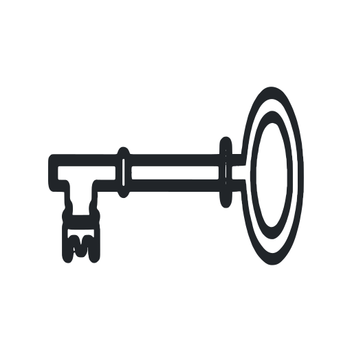</a><br><b><sub>Key</sub></b><br><sub>යතුර</sub><br><sub><a href="src/icons/key.svg">SVG</a> • <a href="dist/png/key.png">PNG</a></sub></td>
    <td align="center" width="20%"><a href="src/icons/kite.svg" title="Click for 512px SVG: Kite">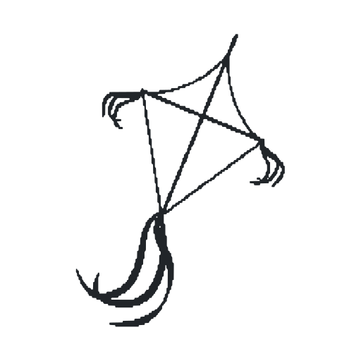</a><br><b><sub>Kite</sub></b><br><sub>සරුංගලය</sub><br><sub><a href="src/icons/kite.svg">SVG</a> • <a href="dist/png/kite.png">PNG</a></sub></td>
    <td align="center" width="20%"><a href="src/icons/ladder.svg" title="Click for 512px SVG: Ladder">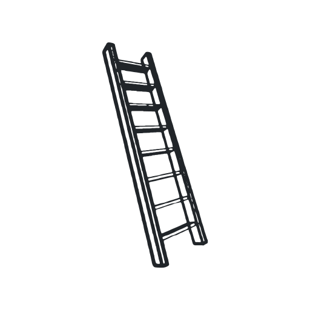</a><br><b><sub>Ladder</sub></b><br><sub>ඉණිමඟ</sub><br><sub><a href="src/icons/ladder.svg">SVG</a> • <a href="dist/png/ladder.png">PNG</a></sub></td>
    <td align="center" width="20%"><a href="src/icons/light-house.svg" title="Click for 512px SVG: Light House"></a><br><b><sub>Light House</sub></b><br><sub>ප්‍රදීපාගාරය</sub><br><sub><a href="src/icons/light-house.svg">SVG</a> • <a href="dist/png/light-house.png">PNG</a></sub></td>
    <td align="center" width="20%"><a href="src/icons/light-pole.svg" title="Click for 512px SVG: Light Pole">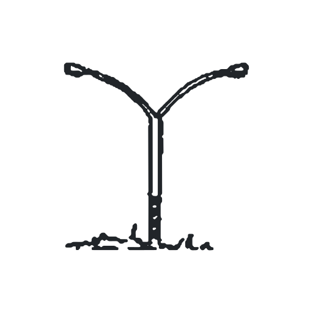</a><br><b><sub>Light Pole</sub></b><br><sub>විදුලි කණුව</sub><br><sub><a href="src/icons/light-pole.svg">SVG</a> • <a href="dist/png/light-pole.png">PNG</a></sub></td>
  </tr>
  <tr>
    <td align="center" width="20%"><a href="src/icons/locomotive-engine.svg" title="Click for 512px SVG: Locomotive Engine">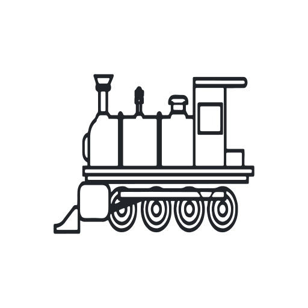</a><br><b><sub>Locomotive Engine</sub></b><br><sub>දුම්රිය එන්ජිම</sub><br><sub><a href="src/icons/locomotive-engine.svg">SVG</a> • <a href="dist/png/locomotive-engine.png">PNG</a></sub></td>
    <td align="center" width="20%"><a href="src/icons/mammoty.svg" title="Click for 512px SVG: Mammoty">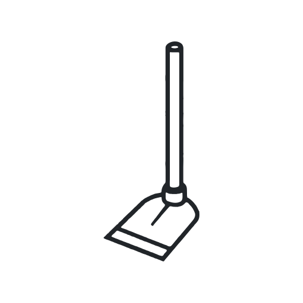</a><br><b><sub>Mammoty</sub></b><br><sub>උදැල්ල</sub><br><sub><a href="src/icons/mammoty.svg">SVG</a> • <a href="dist/png/mammoty.png">PNG</a></sub></td>
    <td align="center" width="20%"><a href="src/icons/mango.svg" title="Click for 512px SVG: Mango">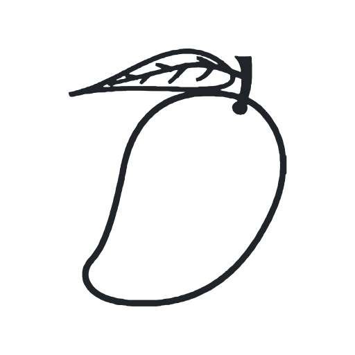</a><br><b><sub>Mango</sub></b><br><sub>අඹ</sub><br><sub><a href="src/icons/mango.svg">SVG</a> • <a href="dist/png/mango.png">PNG</a></sub></td>
    <td align="center" width="20%"><a href="src/icons/mega-phone.svg" title="Click for 512px SVG: Mega Phone"></a><br><b><sub>Mega Phone</sub></b><br><sub>ශබ්ද විකාශන යන්ත්‍රය</sub><br><sub><a href="src/icons/mega-phone.svg">SVG</a> • <a href="dist/png/mega-phone.png">PNG</a></sub></td>
    <td align="center" width="20%"><a href="src/icons/microphone.svg" title="Click for 512px SVG: Microphone"></a><br><b><sub>Microphone</sub></b><br><sub>මයික්‍රෆෝනය</sub><br><sub><a href="src/icons/microphone.svg">SVG</a> • <a href="dist/png/microphone.png">PNG</a></sub></td>
  </tr>
  <tr>
    <td align="center" width="20%"><a href="src/icons/mobile-phone.svg" title="Click for 512px SVG: Mobile Phone">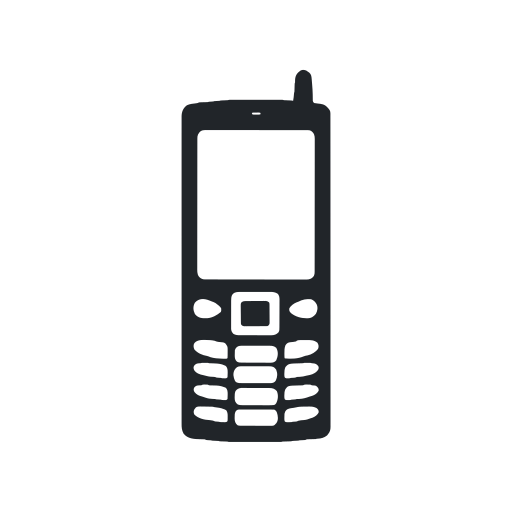</a><br><b><sub>Mobile Phone</sub></b><br><sub>ජංගම දුරකථනය</sub><br><sub><a href="src/icons/mobile-phone.svg">SVG</a> • <a href="dist/png/mobile-phone.png">PNG</a></sub></td>
    <td align="center" width="20%"><a href="src/icons/mortar.svg" title="Click for 512px SVG: Mortar">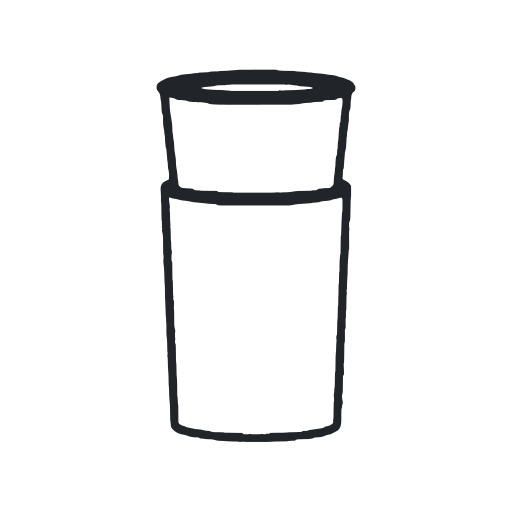</a><br><b><sub>Mortar</sub></b><br><sub>වංගෙඩිය</sub><br><sub><a href="src/icons/mortar.svg">SVG</a> • <a href="dist/png/mortar.png">PNG</a></sub></td>
    <td align="center" width="20%"><a href="src/icons/motor-bicycle.svg" title="Click for 512px SVG: Motor Bicycle">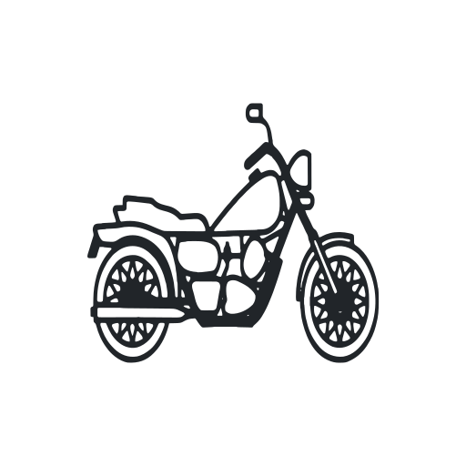</a><br><b><sub>Motor Bicycle</sub></b><br><sub>යතුරුපැදිය</sub><br><sub><a href="src/icons/motor-bicycle.svg">SVG</a> • <a href="dist/png/motor-bicycle.png">PNG</a></sub></td>
    <td align="center" width="20%"><a href="src/icons/motor-car.svg" title="Click for 512px SVG: Motor Car">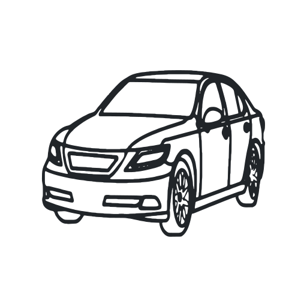</a><br><b><sub>Motor Car</sub></b><br><sub>මෝටර් රථය</sub><br><sub><a href="src/icons/motor-car.svg">SVG</a> • <a href="dist/png/motor-car.png">PNG</a></sub></td>
    <td align="center" width="20%"><a href="src/icons/mouse.svg" title="Click for 512px SVG: Mouse">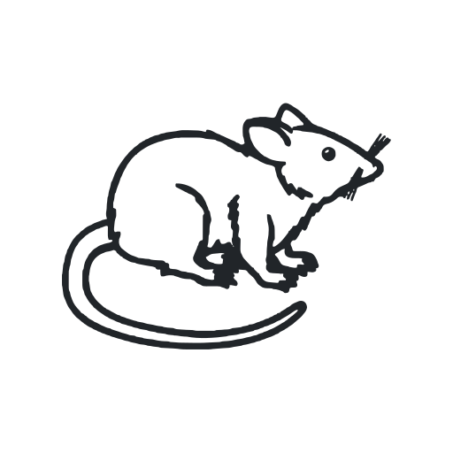</a><br><b><sub>Mouse</sub></b><br><sub>මීයා</sub><br><sub><a href="src/icons/mouse.svg">SVG</a> • <a href="dist/png/mouse.png">PNG</a></sub></td>
  </tr>
  <tr>
    <td align="center" width="20%"><a href="src/icons/nut-cracker.svg" title="Click for 512px SVG: Nut Cracker">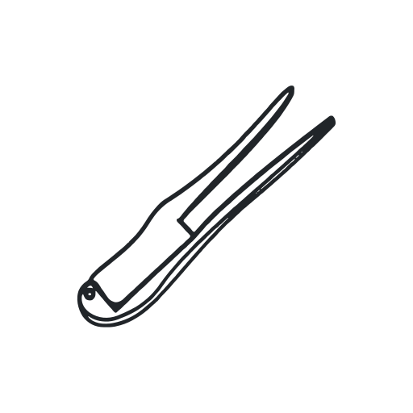</a><br><b><sub>Nut Cracker</sub></b><br><sub>ගිරය</sub><br><sub><a href="src/icons/nut-cracker.svg">SVG</a> • <a href="dist/png/nut-cracker.png">PNG</a></sub></td>
    <td align="center" width="20%"><a href="src/icons/omnibus.svg" title="Click for 512px SVG: Omnibus">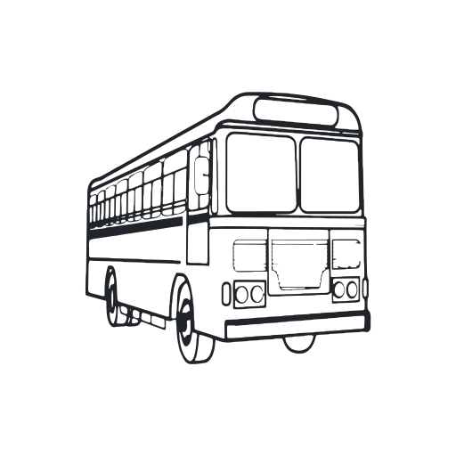</a><br><b><sub>Omnibus</sub></b><br><sub>බස් රථය</sub><br><sub><a href="src/icons/omnibus.svg">SVG</a> • <a href="dist/png/omnibus.png">PNG</a></sub></td>
    <td align="center" width="20%"><a href="src/icons/orange.svg" title="Click for 512px SVG: Orange">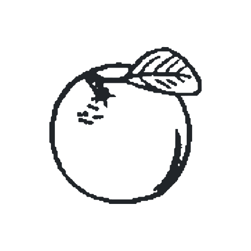</a><br><b><sub>Orange</sub></b><br><sub>දොඩම්</sub><br><sub><a href="src/icons/orange.svg">SVG</a> • <a href="dist/png/orange.png">PNG</a></sub></td>
    <td align="center" width="20%"><a href="src/icons/owl.svg" title="Click for 512px SVG: Owl">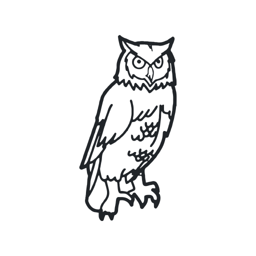</a><br><b><sub>Owl</sub></b><br><sub>බකමූණා</sub><br><sub><a href="src/icons/owl.svg">SVG</a> • <a href="dist/png/owl.png">PNG</a></sub></td>
    <td align="center" width="20%"><a href="src/icons/padlock.svg" title="Click for 512px SVG: Padlock"></a><br><b><sub>Padlock</sub></b><br><sub>ඉබ්බා (අගුල)</sub><br><sub><a href="src/icons/padlock.svg">SVG</a> • <a href="dist/png/padlock.png">PNG</a></sub></td>
  </tr>
  <tr>
    <td align="center" width="20%"><a href="src/icons/pair-of-scales.svg" title="Click for 512px SVG: Pair of Scales"></a><br><b><sub>Pair of Scales</sub></b><br><sub>තරාදිය</sub><br><sub><a href="src/icons/pair-of-scales.svg">SVG</a> • <a href="dist/png/pair-of-scales.png">PNG</a></sub></td>
    <td align="center" width="20%"><a href="src/icons/pair-of-scissors.svg" title="Click for 512px SVG: Pair of Scissors">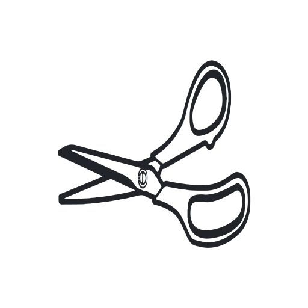</a><br><b><sub>Pair of Scissors</sub></b><br><sub>කතුර</sub><br><sub><a href="src/icons/pair-of-scissors.svg">SVG</a> • <a href="dist/png/pair-of-scissors.png">PNG</a></sub></td>
    <td align="center" width="20%"><a href="src/icons/pair-of-slippers.svg" title="Click for 512px SVG: Pair of Slippers">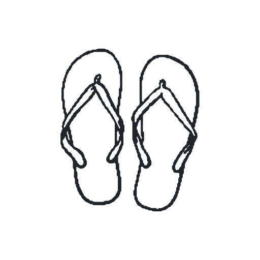</a><br><b><sub>Pair of Slippers</sub></b><br><sub>සෙරෙප්පු යුගල</sub><br><sub><a href="src/icons/pair-of-slippers.svg">SVG</a> • <a href="dist/png/pair-of-slippers.png">PNG</a></sub></td>
    <td align="center" width="20%"><a href="src/icons/pair-of-spectacles.svg" title="Click for 512px SVG: Pair of Spectacles">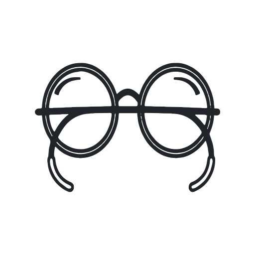</a><br><b><sub>Pair of Spectacles</sub></b><br><sub>ඇස් කණ්ණාඩි</sub><br><sub><a href="src/icons/pair-of-spectacles.svg">SVG</a> • <a href="dist/png/pair-of-spectacles.png">PNG</a></sub></td>
    <td align="center" width="20%"><a href="src/icons/panchaudaya.svg" title="Click for 512px SVG: Panchaudaya">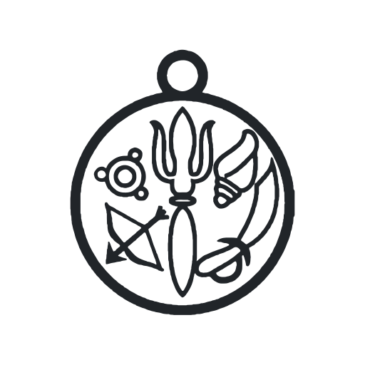</a><br><b><sub>Panchaudaya</sub></b><br><sub>පංචායුධය</sub><br><sub><a href="src/icons/panchaudaya.svg">SVG</a> • <a href="dist/png/panchaudaya.png">PNG</a></sub></td>
  </tr>
  <tr>
    <td align="center" width="20%"><a href="src/icons/peacock.svg" title="Click for 512px SVG: Peacock"></a><br><b><sub>Peacock</sub></b><br><sub>මොනරා</sub><br><sub><a href="src/icons/peacock.svg">SVG</a> • <a href="dist/png/peacock.png">PNG</a></sub></td>
    <td align="center" width="20%"><a href="src/icons/pen.svg" title="Click for 512px SVG: Pen">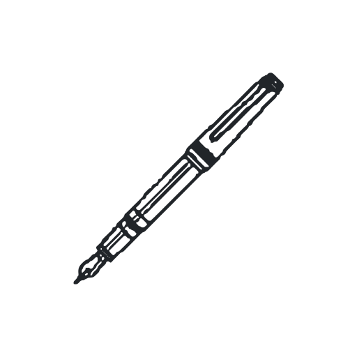</a><br><b><sub>Pen</sub></b><br><sub>පෑන</sub><br><sub><a href="src/icons/pen.svg">SVG</a> • <a href="dist/png/pen.png">PNG</a></sub></td>
    <td align="center" width="20%"><a href="src/icons/pencil.svg" title="Click for 512px SVG: Pencil">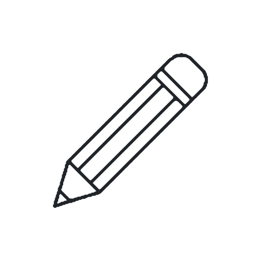</a><br><b><sub>Pencil</sub></b><br><sub>පැන්සල</sub><br><sub><a href="src/icons/pencil.svg">SVG</a> • <a href="dist/png/pencil.png">PNG</a></sub></td>
    <td align="center" width="20%"><a href="src/icons/pigeon.svg" title="Click for 512px SVG: Pigeon">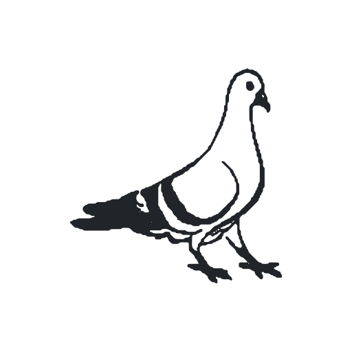</a><br><b><sub>Pigeon</sub></b><br><sub>පරවියා</sub><br><sub><a href="src/icons/pigeon.svg">SVG</a> • <a href="dist/png/pigeon.png">PNG</a></sub></td>
    <td align="center" width="20%"><a href="src/icons/pillar-box.svg" title="Click for 512px SVG: Pillar Box">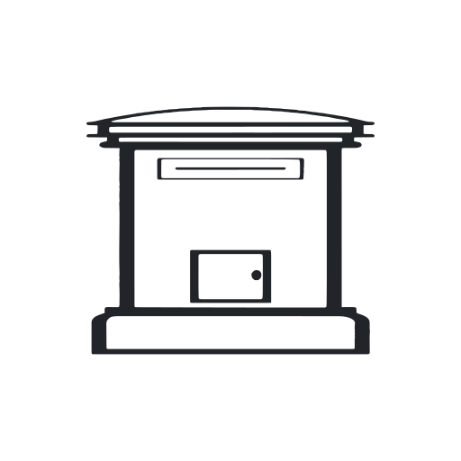</a><br><b><sub>Pillar Box</sub></b><br><sub>තැපැල් පෙට්ටිය</sub><br><sub><a href="src/icons/pillar-box.svg">SVG</a> • <a href="dist/png/pillar-box.png">PNG</a></sub></td>
  </tr>
  <tr>
    <td align="center" width="20%"><a href="src/icons/pineapple.svg" title="Click for 512px SVG: Pineapple">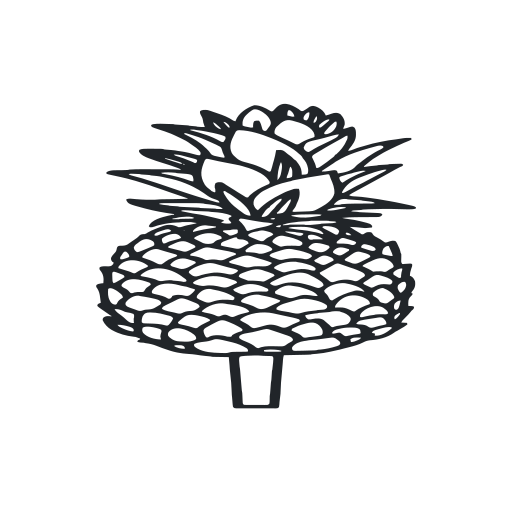</a><br><b><sub>Pineapple</sub></b><br><sub>අන්නාසි</sub><br><sub><a href="src/icons/pineapple.svg">SVG</a> • <a href="dist/png/pineapple.png">PNG</a></sub></td>
    <td align="center" width="20%"><a href="src/icons/plough.svg" title="Click for 512px SVG: Plough">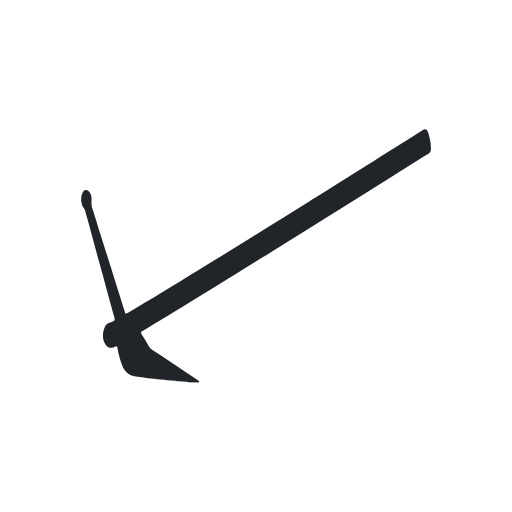</a><br><b><sub>Plough</sub></b><br><sub>නගුල</sub><br><sub><a href="src/icons/plough.svg">SVG</a> • <a href="dist/png/plough.png">PNG</a></sub></td>
    <td align="center" width="20%"><a href="src/icons/plug-top.svg" title="Click for 512px SVG: Plug Top">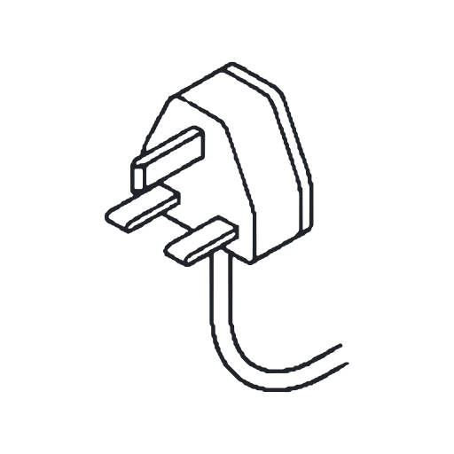</a><br><b><sub>Plug Top</sub></b><br><sub>ප්ලග් ටොප් එක</sub><br><sub><a href="src/icons/plug-top.svg">SVG</a> • <a href="dist/png/plug-top.png">PNG</a></sub></td>
    <td align="center" width="20%"><a href="src/icons/pumpkin.svg" title="Click for 512px SVG: Pumpkin">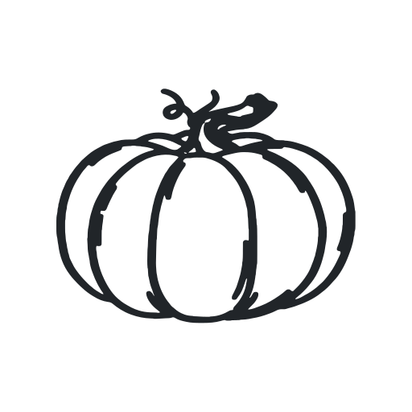</a><br><b><sub>Pumpkin</sub></b><br><sub>වට්ටක්කා</sub><br><sub><a href="src/icons/pumpkin.svg">SVG</a> • <a href="dist/png/pumpkin.png">PNG</a></sub></td>
    <td align="center" width="20%"><a href="src/icons/rabbit.svg" title="Click for 512px SVG: Rabbit">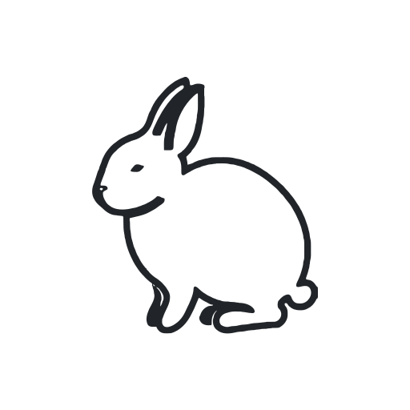</a><br><b><sub>Rabbit</sub></b><br><sub>හාාවා</sub><br><sub><a href="src/icons/rabbit.svg">SVG</a> • <a href="dist/png/rabbit.png">PNG</a></sub></td>
  </tr>
  <tr>
    <td align="center" width="20%"><a href="src/icons/radio-set.svg" title="Click for 512px SVG: Radio Set">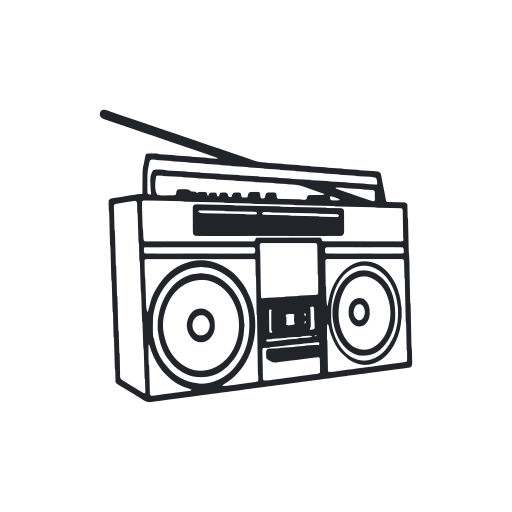</a><br><b><sub>Radio Set</sub></b><br><sub>ගුවන් විදුලි යන්ත්‍රය</sub><br><sub><a href="src/icons/radio-set.svg">SVG</a> • <a href="dist/png/radio-set.png">PNG</a></sub></td>
    <td align="center" width="20%"><a href="src/icons/rhinoceros.svg" title="Click for 512px SVG: Rhinoceros">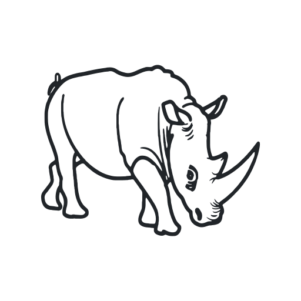</a><br><b><sub>Rhinoceros</sub></b><br><sub>කණ්ඩDisplayStyle</sub><br><sub><a href="src/icons/rhinoceros.svg">SVG</a> • <a href="dist/png/rhinoceros.png">PNG</a></sub></td>
    <td align="center" width="20%"><a href="src/icons/rick-shaw.svg" title="Click for 512px SVG: Rick Shaw">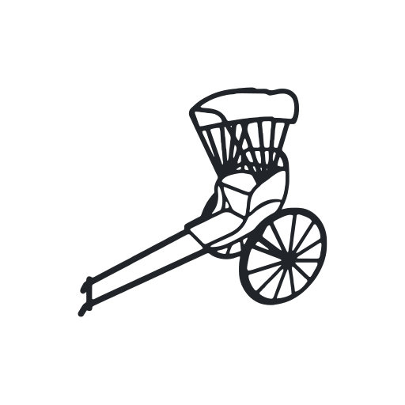</a><br><b><sub>Rick Shaw</sub></b><br><sub>රික්ෂෝව</sub><br><sub><a href="src/icons/rick-shaw.svg">SVG</a> • <a href="dist/png/rick-shaw.png">PNG</a></sub></td>
    <td align="center" width="20%"><a href="src/icons/rocket.svg" title="Click for 512px SVG: Rocket">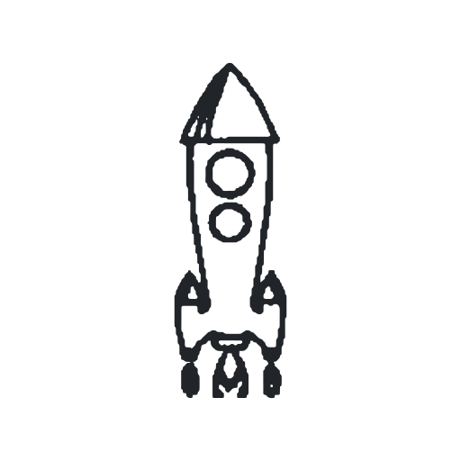</a><br><b><sub>Rocket</sub></b><br><sub>රොකට්ටුව</sub><br><sub><a href="src/icons/rocket.svg">SVG</a> • <a href="dist/png/rocket.png">PNG</a></sub></td>
    <td align="center" width="20%"><a href="src/icons/rose-apple.svg" title="Click for 512px SVG: Rose Apple">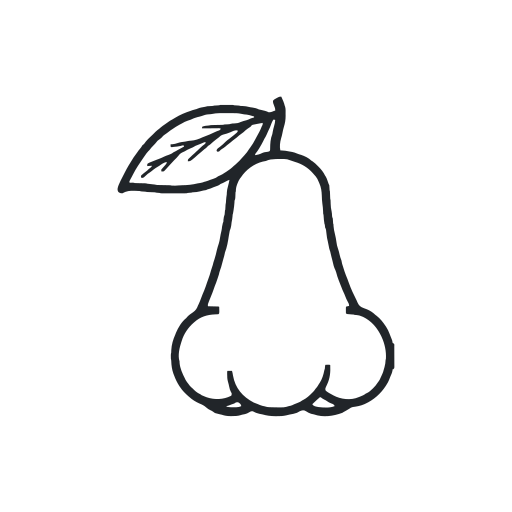</a><br><b><sub>Rose Apple</sub></b><br><sub>ජම්බු</sub><br><sub><a href="src/icons/rose-apple.svg">SVG</a> • <a href="dist/png/rose-apple.png">PNG</a></sub></td>
  </tr>
  <tr>
    <td align="center" width="20%"><a href="src/icons/safety-pin.svg" title="Click for 512px SVG: Safety Pin">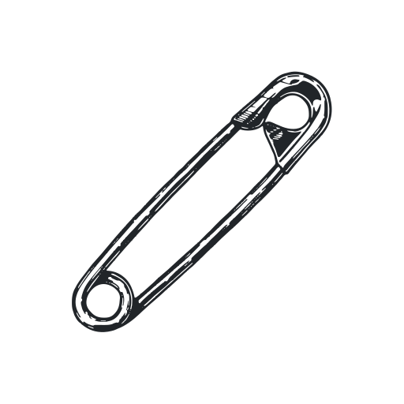</a><br><b><sub>Safety Pin</sub></b><br><sub>අල්පෙනෙත්ත / ආරක්ෂක කටුව</sub><br><sub><a href="src/icons/safety-pin.svg">SVG</a> • <a href="dist/png/safety-pin.png">PNG</a></sub></td>
    <td align="center" width="20%"><a href="src/icons/saw.svg" title="Click for 512px SVG: Saw">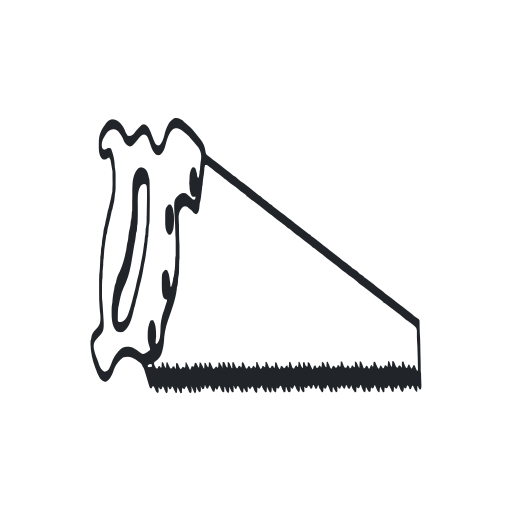</a><br><b><sub>Saw</sub></b><br><sub>කියත</sub><br><sub><a href="src/icons/saw.svg">SVG</a> • <a href="dist/png/saw.png">PNG</a></sub></td>
    <td align="center" width="20%"><a href="src/icons/see-saw.svg" title="Click for 512px SVG: See Saw">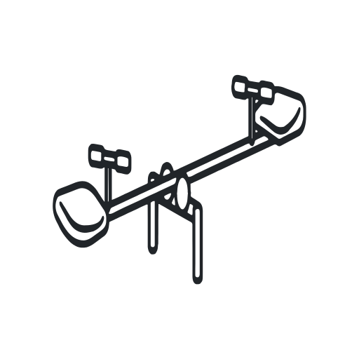</a><br><b><sub>See Saw</sub></b><br><sub>ඔන්චිල්ලා ලෑල්ල</sub><br><sub><a href="src/icons/see-saw.svg">SVG</a> • <a href="dist/png/see-saw.png">PNG</a></sub></td>
    <td align="center" width="20%"><a href="src/icons/sewing-machine.svg" title="Click for 512px SVG: Sewing Machine">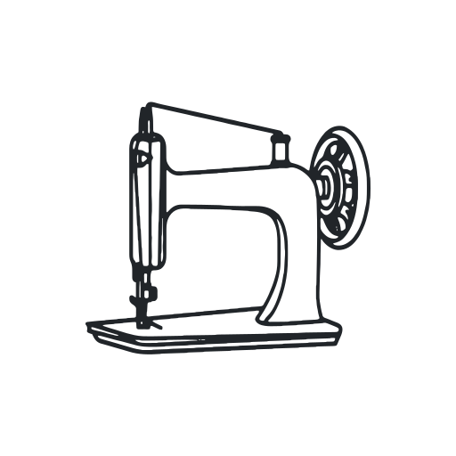</a><br><b><sub>Sewing Machine</sub></b><br><sub>මහන මැෂිම</sub><br><sub><a href="src/icons/sewing-machine.svg">SVG</a> • <a href="dist/png/sewing-machine.png">PNG</a></sub></td>
    <td align="center" width="20%"><a href="src/icons/shield.svg" title="Click for 512px SVG: Shield"></a><br><b><sub>Shield</sub></b><br><sub>පලිහ</sub><br><sub><a href="src/icons/shield.svg">SVG</a> • <a href="dist/png/shield.png">PNG</a></sub></td>
  </tr>
  <tr>
    <td align="center" width="20%"><a href="src/icons/ship.svg" title="Click for 512px SVG: Ship">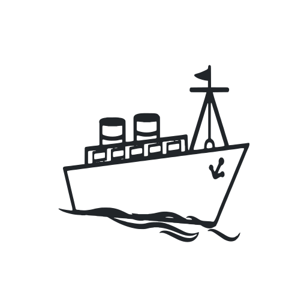</a><br><b><sub>Ship</sub></b><br><sub>නැව</sub><br><sub><a href="src/icons/ship.svg">SVG</a> • <a href="dist/png/ship.png">PNG</a></sub></td>
    <td align="center" width="20%"><a href="src/icons/shirt.svg" title="Click for 512px SVG: Shirt">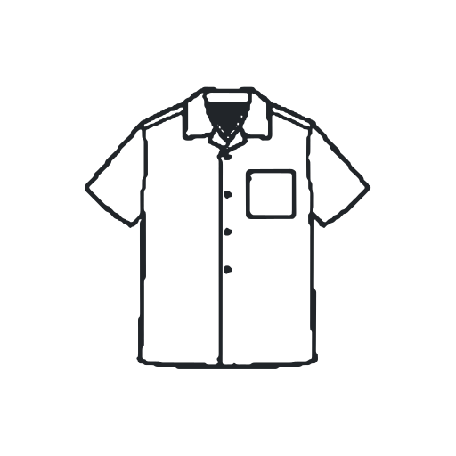</a><br><b><sub>Shirt</sub></b><br><sub>කමිසය</sub><br><sub><a href="src/icons/shirt.svg">SVG</a> • <a href="dist/png/shirt.png">PNG</a></sub></td>
    <td align="center" width="20%"><a href="src/icons/shoe.svg" title="Click for 512px SVG: Shoe">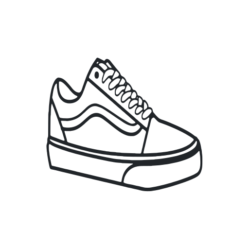</a><br><b><sub>Shoe</sub></b><br><sub>සපත්තුව</sub><br><sub><a href="src/icons/shoe.svg">SVG</a> • <a href="dist/png/shoe.png">PNG</a></sub></td>
    <td align="center" width="20%"><a href="src/icons/sickle.svg" title="Click for 512px SVG: Sickle">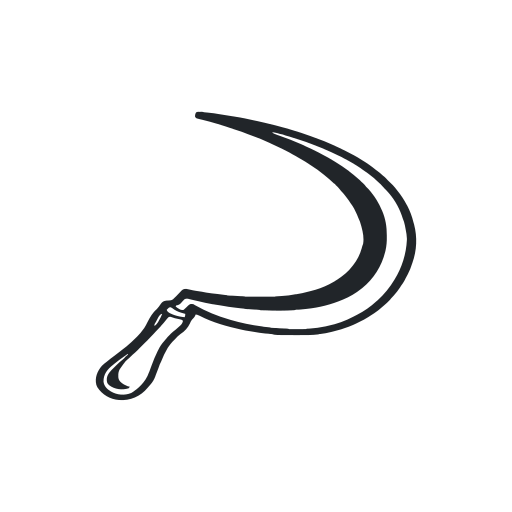</a><br><b><sub>Sickle</sub></b><br><sub>දැකැත්ත</sub><br><sub><a href="src/icons/sickle.svg">SVG</a> • <a href="dist/png/sickle.png">PNG</a></sub></td>
    <td align="center" width="20%"><a href="src/icons/sledge-hammer.svg" title="Click for 512px SVG: Sledge Hammer">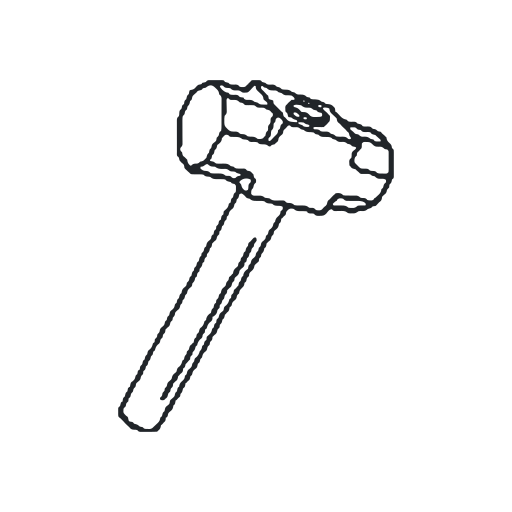</a><br><b><sub>Sledge Hammer</sub></b><br><sub>කුළුගෙඩිය</sub><br><sub><a href="src/icons/sledge-hammer.svg">SVG</a> • <a href="dist/png/sledge-hammer.png">PNG</a></sub></td>
  </tr>
  <tr>
    <td align="center" width="20%"><a href="src/icons/slingshot.svg" title="Click for 512px SVG: Slingshot">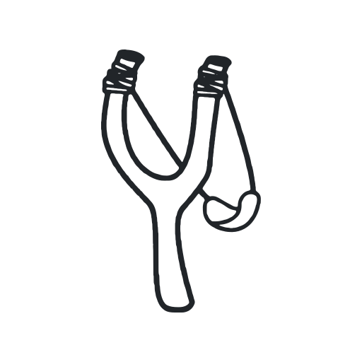</a><br><b><sub>Slingshot</sub></b><br><sub>කැටපෝලය</sub><br><sub><a href="src/icons/slingshot.svg">SVG</a> • <a href="dist/png/slingshot.png">PNG</a></sub></td>
    <td align="center" width="20%"><a href="src/icons/snail.svg" title="Click for 512px SVG: Snail">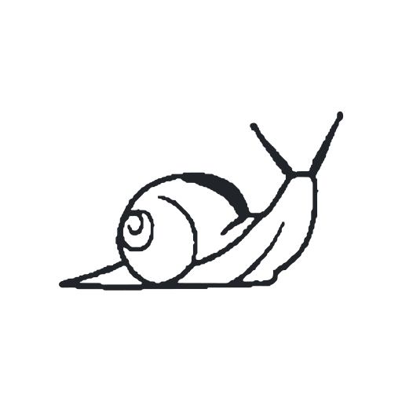</a><br><b><sub>Snail</sub></b><br><sub>ගොළුබෙල්ලා</sub><br><sub><a href="src/icons/snail.svg">SVG</a> • <a href="dist/png/snail.png">PNG</a></sub></td>
    <td align="center" width="20%"><a href="src/icons/spider.svg" title="Click for 512px SVG: Spider">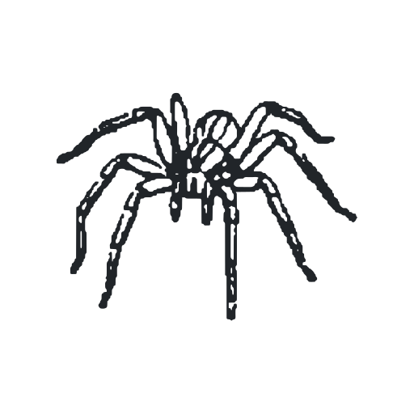</a><br><b><sub>Spider</sub></b><br><sub>මකුළුවා</sub><br><sub><a href="src/icons/spider.svg">SVG</a> • <a href="dist/png/spider.png">PNG</a></sub></td>
    <td align="center" width="20%"><a href="src/icons/spiral.svg" title="Click for 512px SVG: Spiral">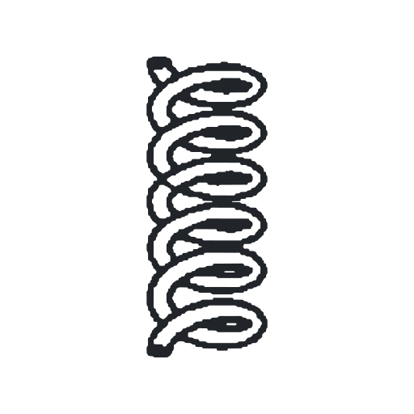</a><br><b><sub>Spiral</sub></b><br><sub>දුන්න / ස්පයිරල්</sub><br><sub><a href="src/icons/spiral.svg">SVG</a> • <a href="dist/png/spiral.png">PNG</a></sub></td>
    <td align="center" width="20%"><a href="src/icons/spoon.svg" title="Click for 512px SVG: Spoon">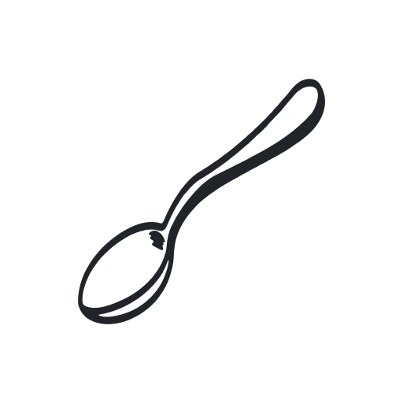</a><br><b><sub>Spoon</sub></b><br><sub>හැන්ද</sub><br><sub><a href="src/icons/spoon.svg">SVG</a> • <a href="dist/png/spoon.png">PNG</a></sub></td>
  </tr>
  <tr>
    <td align="center" width="20%"><a href="src/icons/squirrel.svg" title="Click for 512px SVG: Squirrel">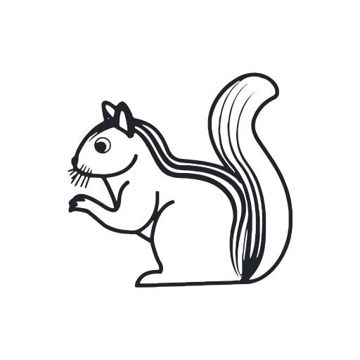</a><br><b><sub>Squirrel</sub></b><br><sub>ලේනා</sub><br><sub><a href="src/icons/squirrel.svg">SVG</a> • <a href="dist/png/squirrel.png">PNG</a></sub></td>
    <td align="center" width="20%"><a href="src/icons/star.svg" title="Click for 512px SVG: Star">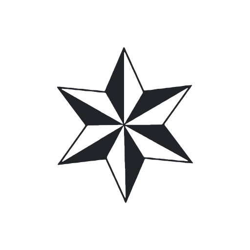</a><br><b><sub>Star</sub></b><br><sub>තරුව</sub><br><sub><a href="src/icons/star.svg">SVG</a> • <a href="dist/png/star.png">PNG</a></sub></td>
    <td align="center" width="20%"><a href="src/icons/sun.svg" title="Click for 512px SVG: Sun"></a><br><b><sub>Sun</sub></b><br><sub>හිරු / ඉර</sub><br><sub><a href="src/icons/sun.svg">SVG</a> • <a href="dist/png/sun.png">PNG</a></sub></td>
    <td align="center" width="20%"><a href="src/icons/swan.svg" title="Click for 512px SVG: Swan"></a><br><b><sub>Swan</sub></b><br><sub>හංසයා</sub><br><sub><a href="src/icons/swan.svg">SVG</a> • <a href="dist/png/swan.png">PNG</a></sub></td>
    <td align="center" width="20%"><a href="src/icons/swing.svg" title="Click for 512px SVG: Swing">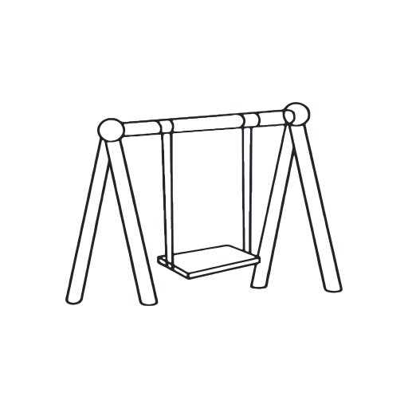</a><br><b><sub>Swing</sub></b><br><sub>ඔන්චිල්ලාව</sub><br><sub><a href="src/icons/swing.svg">SVG</a> • <a href="dist/png/swing.png">PNG</a></sub></td>
  </tr>
  <tr>
    <td align="center" width="20%"><a href="src/icons/sword.svg" title="Click for 512px SVG: Sword">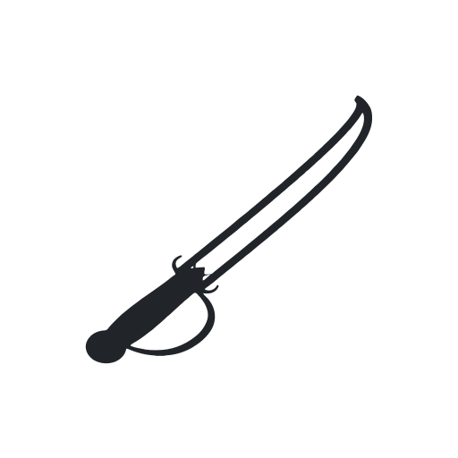</a><br><b><sub>Sword</sub></b><br><sub>කඩුව</sub><br><sub><a href="src/icons/sword.svg">SVG</a> • <a href="dist/png/sword.png">PNG</a></sub></td>
    <td align="center" width="20%"><a href="src/icons/tabla.svg" title="Click for 512px SVG: Tabla">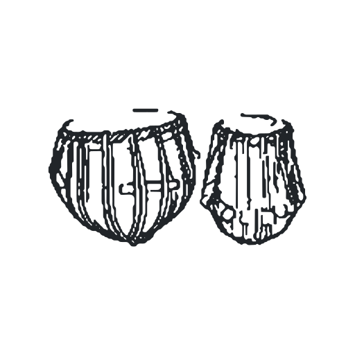</a><br><b><sub>Tabla</sub></b><br><sub>තබ්ලාව</sub><br><sub><a href="src/icons/tabla.svg">SVG</a> • <a href="dist/png/tabla.png">PNG</a></sub></td>
    <td align="center" width="20%"><a href="src/icons/table.svg" title="Click for 512px SVG: Table">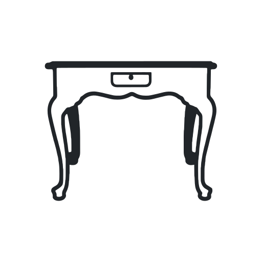</a><br><b><sub>Table</sub></b><br><sub>මේසය</sub><br><sub><a href="src/icons/table.svg">SVG</a> • <a href="dist/png/table.png">PNG</a></sub></td>
    <td align="center" width="20%"><a href="src/icons/table-fan.svg" title="Click for 512px SVG: Table Fan">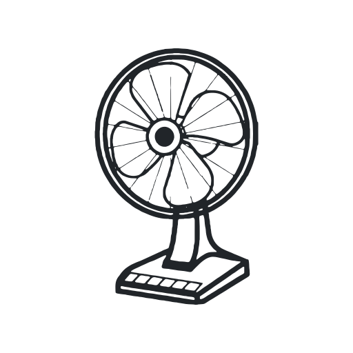</a><br><b><sub>Table Fan</sub></b><br><sub>මේස පංකාව</sub><br><sub><a href="src/icons/table-fan.svg">SVG</a> • <a href="dist/png/table-fan.png">PNG</a></sub></td>
    <td align="center" width="20%"><a href="src/icons/teapoy.svg" title="Click for 512px SVG: Teapoy">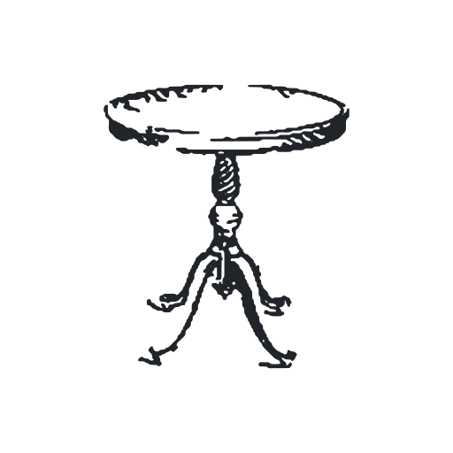</a><br><b><sub>Teapoy</sub></b><br><sub>ටීපෝව</sub><br><sub><a href="src/icons/teapoy.svg">SVG</a> • <a href="dist/png/teapoy.png">PNG</a></sub></td>
  </tr>
  <tr>
    <td align="center" width="20%"><a href="src/icons/telephone.svg" title="Click for 512px SVG: Telephone"></a><br><b><sub>Telephone</sub></b><br><sub>දුරකථනය</sub><br><sub><a href="src/icons/telephone.svg">SVG</a> • <a href="dist/png/telephone.png">PNG</a></sub></td>
    <td align="center" width="20%"><a href="src/icons/television.svg" title="Click for 512px SVG: Television"></a><br><b><sub>Television</sub></b><br><sub>රූපවාහිනිය</sub><br><sub><a href="src/icons/television.svg">SVG</a> • <a href="dist/png/television.png">PNG</a></sub></td>
    <td align="center" width="20%"><a href="src/icons/till.svg" title="Click for 512px SVG: Till">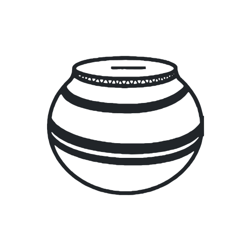</a><br><b><sub>Till</sub></b><br><sub>කැටය</sub><br><sub><a href="src/icons/till.svg">SVG</a> • <a href="dist/png/till.png">PNG</a></sub></td>
    <td align="center" width="20%"><a href="src/icons/torch-light.svg" title="Click for 512px SVG: Torch Light"></a><br><b><sub>Torch Light</sub></b><br><sub>විදුලි පන්දම</sub><br><sub><a href="src/icons/torch-light.svg">SVG</a> • <a href="dist/png/torch-light.png">PNG</a></sub></td>
    <td align="center" width="20%"><a href="src/icons/tortoise.svg" title="Click for 512px SVG: Tortoise">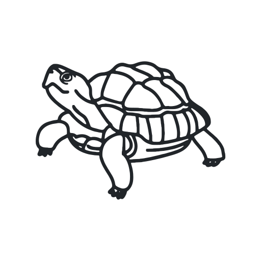</a><br><b><sub>Tortoise</sub></b><br><sub>ඉබ්බා</sub><br><sub><a href="src/icons/tortoise.svg">SVG</a> • <a href="dist/png/tortoise.png">PNG</a></sub></td>
  </tr>
  <tr>
    <td align="center" width="20%"><a href="src/icons/tractor.svg" title="Click for 512px SVG: Tractor"></a><br><b><sub>Tractor</sub></b><br><sub>ට්‍රැක්ටරය</sub><br><sub><a href="src/icons/tractor.svg">SVG</a> • <a href="dist/png/tractor.png">PNG</a></sub></td>
    <td align="center" width="20%"><a href="src/icons/tray.svg" title="Click for 512px SVG: Tray">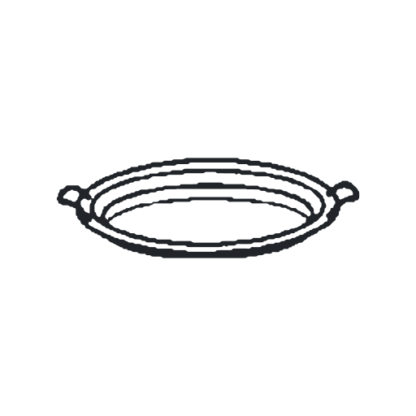</a><br><b><sub>Tray</sub></b><br><sub>තැටිය</sub><br><sub><a href="src/icons/tray.svg">SVG</a> • <a href="dist/png/tray.png">PNG</a></sub></td>
    <td align="center" width="20%"><a href="src/icons/tree.svg" title="Click for 512px SVG: Tree"></a><br><b><sub>Tree</sub></b><br><sub>ගස</sub><br><sub><a href="src/icons/tree.svg">SVG</a> • <a href="dist/png/tree.png">PNG</a></sub></td>
    <td align="center" width="20%"><a href="src/icons/tri-shaw.svg" title="Click for 512px SVG: Tri Shaw">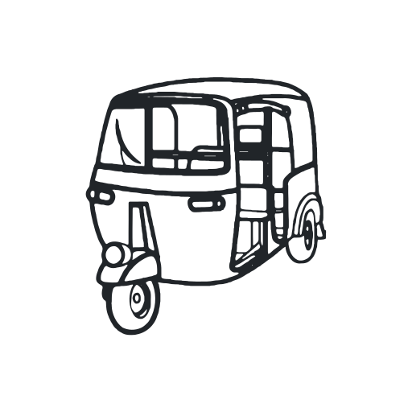</a><br><b><sub>Tri Shaw</sub></b><br><sub>ත්‍රිරෝද රථය</sub><br><sub><a href="src/icons/tri-shaw.svg">SVG</a> • <a href="dist/png/tri-shaw.png">PNG</a></sub></td>
    <td align="center" width="20%"><a href="src/icons/trophy.svg" title="Click for 512px SVG: Trophy"></a><br><b><sub>Trophy</sub></b><br><sub>කුසලානය</sub><br><sub><a href="src/icons/trophy.svg">SVG</a> • <a href="dist/png/trophy.png">PNG</a></sub></td>
  </tr>
  <tr>
    <td align="center" width="20%"><a href="src/icons/trowel.svg" title="Click for 512px SVG: Trowel">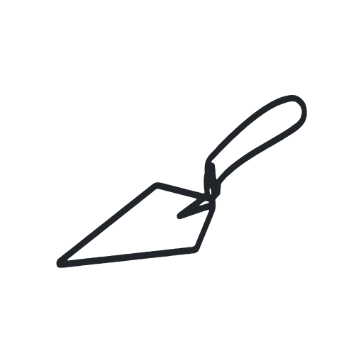</a><br><b><sub>Trowel</sub></b><br><sub>මේසන් හැන්ද</sub><br><sub><a href="src/icons/trowel.svg">SVG</a> • <a href="dist/png/trowel.png">PNG</a></sub></td>
    <td align="center" width="20%"><a href="src/icons/tumbler.svg" title="Click for 512px SVG: Tumbler">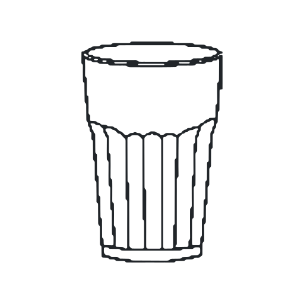</a><br><b><sub>Tumbler</sub></b><br><sub>වීදුරුව</sub><br><sub><a href="src/icons/tumbler.svg">SVG</a> • <a href="dist/png/tumbler.png">PNG</a></sub></td>
    <td align="center" width="20%"><a href="src/icons/two-leaves.svg" title="Click for 512px SVG: Two Leaves">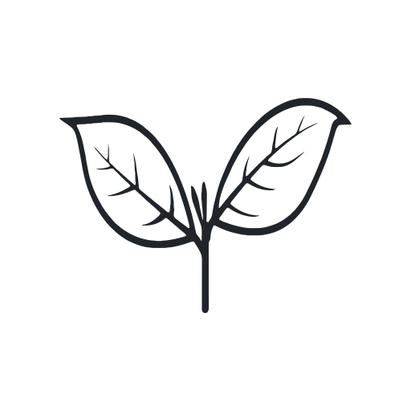</a><br><b><sub>Two Leaves</sub></b><br><sub>කොළ දෙක</sub><br><sub><a href="src/icons/two-leaves.svg">SVG</a> • <a href="dist/png/two-leaves.png">PNG</a></sub></td>
    <td align="center" width="20%"><a href="src/icons/typewriter.svg" title="Click for 512px SVG: Typewriter"></a><br><b><sub>Typewriter</sub></b><br><sub>යතුරු ලියනය</sub><br><sub><a href="src/icons/typewriter.svg">SVG</a> • <a href="dist/png/typewriter.png">PNG</a></sub></td>
    <td align="center" width="20%"><a href="src/icons/tyre.svg" title="Click for 512px SVG: Tyre">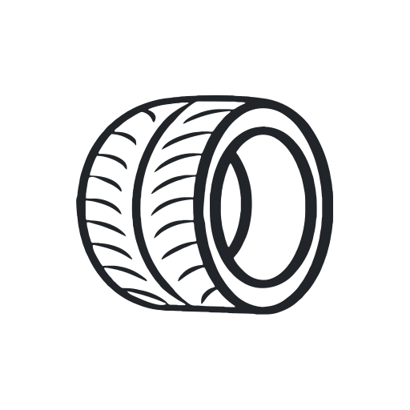</a><br><b><sub>Tyre</sub></b><br><sub>ටයරය</sub><br><sub><a href="src/icons/tyre.svg">SVG</a> • <a href="dist/png/tyre.png">PNG</a></sub></td>
  </tr>
  <tr>
    <td align="center" width="20%"><a href="src/icons/umbrella.svg" title="Click for 512px SVG: Umbrella">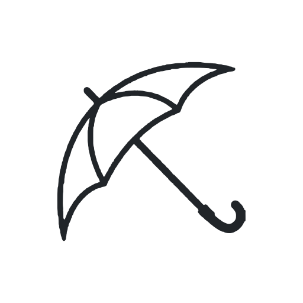</a><br><b><sub>Umbrella</sub></b><br><sub>කුඩය</sub><br><sub><a href="src/icons/umbrella.svg">SVG</a> • <a href="dist/png/umbrella.png">PNG</a></sub></td>
    <td align="center" width="20%"><a href="src/icons/veena.svg" title="Click for 512px SVG: Veena"></a><br><b><sub>Veena</sub></b><br><sub>වීණාව</sub><br><sub><a href="src/icons/veena.svg">SVG</a> • <a href="dist/png/veena.png">PNG</a></sub></td>
    <td align="center" width="20%"><a href="src/icons/violin.svg" title="Click for 512px SVG: Violin">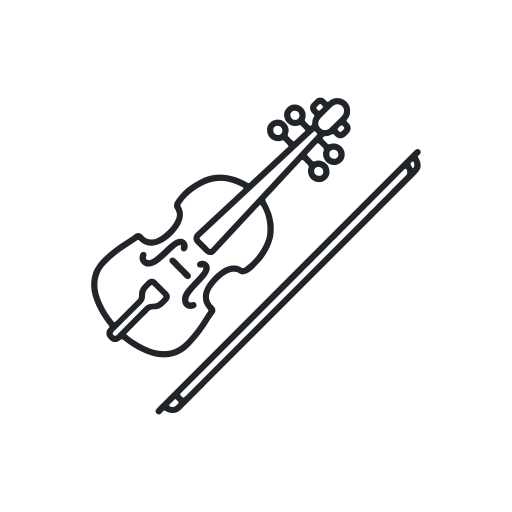</a><br><b><sub>Violin</sub></b><br><sub>වයලීනය</sub><br><sub><a href="src/icons/violin.svg">SVG</a> • <a href="dist/png/violin.png">PNG</a></sub></td>
    <td align="center" width="20%"><a href="src/icons/water-tap.svg" title="Click for 512px SVG: Water Tap">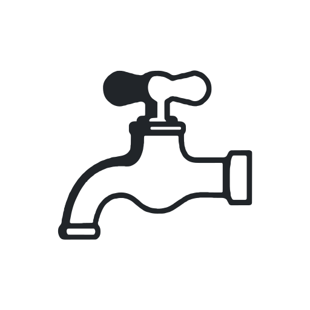</a><br><b><sub>Water Tap</sub></b><br><sub>ජල කරාමය</sub><br><sub><a href="src/icons/water-tap.svg">SVG</a> • <a href="dist/png/water-tap.png">PNG</a></sub></td>
    <td align="center" width="20%"><a href="src/icons/well.svg" title="Click for 512px SVG: Well">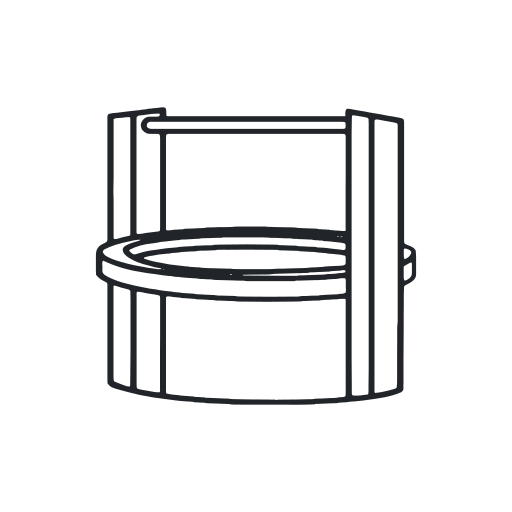</a><br><b><sub>Well</sub></b><br><sub>ළිඳ</sub><br><sub><a href="src/icons/well.svg">SVG</a> • <a href="dist/png/well.png">PNG</a></sub></td>
  </tr>
  <tr>
    <td align="center" width="20%"><a href="src/icons/wheel-barrow.svg" title="Click for 512px SVG: Wheel Barrow">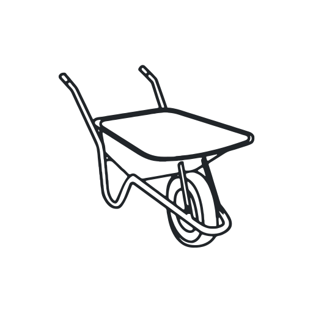</a><br><b><sub>Wheel Barrow</sub></b><br><sub>අත් කරත්තය</sub><br><sub><a href="src/icons/wheel-barrow.svg">SVG</a> • <a href="dist/png/wheel-barrow.png">PNG</a></sub></td>
    <td align="center" width="20%"><a href="src/icons/winnowing-fan.svg" title="Click for 512px SVG: Winnowing Fan">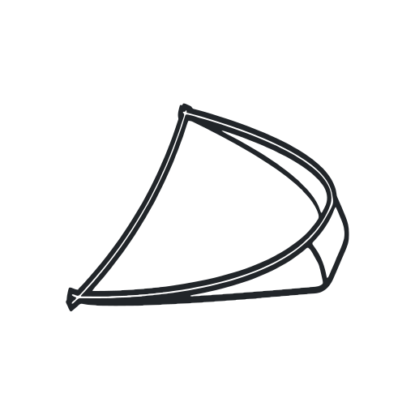</a><br><b><sub>Winnowing Fan</sub></b><br><sub>කුල්ල</sub><br><sub><a href="src/icons/winnowing-fan.svg">SVG</a> • <a href="dist/png/winnowing-fan.png">PNG</a></sub></td>
    <td align="center" width="20%"></td>
    <td align="center" width="20%"></td>
    <td align="center" width="20%"></td>
  </tr>
</table>

---

## ✨ Key Features

- 🏛️ **100% Gazette-Matched Proportions**: Vectorized directly from public Democratic Socialist Republic of Sri Lanka Gazette Extraordinaries (`No. 2315/06`, `No. 2263/24`, `No. 2165/45 & 2166/16`) with true un-distorted printed aspect ratios.
- 📦 **Modern Subpath Exports**: Modular import structure allowing `import { ... } from '@numberslk/icons/election-symbols'` as well as root `@numberslk/icons`, with built-in architectural support for upcoming sets (`@numberslk/icons/banks`).
- 💎 **High-Resolution & Silky Smooth**: Standardized **`512×512 viewBox`** with sub-pixel Gaussian level-set curve smoothing. Free of jagged edges, pixelation, and staircase cuts.
- ⭕ **Optical Keyline & Circular Mask Safe**: Calibrated optical sizing and centering with guaranteed &ge; 42px safe breathing clearance inside a circular boundary ($R=256$). Icons fit cleanly into circular avatars, round badges, and buttons without clipping.
- 🖼️ **Dual Format Exports (SVG + High-Res PNG)**: Includes 182 standalone 512px SVGs, plus 512×512px and 1024×1024px transparent PNGs in `dist/png/` and `dist/png-1024/`.
- 🎨 **Heroicons / Lucide Standard**: Standardized `viewBox="0 0 512 512"`, styled with `fill="currentColor"`. Scales smoothly (`24px`, `32px`, `48px`, `64px`, `128px`, `512px`) and inherits CSS or Tailwind text colors (`text-amber-500`, `text-rose-600`, `text-sky-500`).
- 🌓 **Automatic Dark / Light Mode**: Standalone SVGs include responsive media queries so they look crisp on both light and dark GitHub or markdown themes.
- ⚛️ **Multi-Framework**: Out-of-the-box components for **React**, **Next.js**, **Vue 3**, **Vanilla JS**, and **Raw SVG**.
- 🌐 **Multilingual Search**: Trilingual dictionary with English, Sinhala (සිංහල), and Tamil (தமிழ்) names.
- 📋 **Political Party Registry**: Linked with recognized Sri Lankan political parties (UNP, SJB, NPP, SLPP, SLFP, ITAK, ACMC, EPDP, CWC, etc.).
- 📜 **BSD-3-Clause Permissive Licensing**: Free for commercial, personal, and civic use with simple attribution.

---

## 🚀 Installation

```bash
# npm
npm install @numberslk/icons

# pnpm
pnpm add @numberslk/icons

# yarn
yarn add @numberslk/icons
```

---

## 📖 Quickstart & Usage

### 1. React / Next.js

Import components using the subpath `@numberslk/icons/election-symbols` (or umbrella `@numberslk/icons`):

```tsx
import React from 'react';
// Import from specific category subpath:
import { 
  ElephantIcon, 
  CompassIcon, 
  TelephoneIcon, 
  FlowerBudIcon 
} from '@numberslk/icons/election-symbols';

// Or from the root umbrella package:
// import { ElephantIcon } from '@numberslk/icons';

export default function ElectionDashboard() {
  return (
    <div className="flex items-center gap-6 p-4">
      {/* Default size (24px) */}
      <ElephantIcon className="text-amber-500" />

      {/* Larger smooth high-res sizes */}
      <CompassIcon size={48} className="text-rose-600" />

      {/* Tailwind hover animation */}
      <TelephoneIcon size={64} className="text-sky-500 hover:scale-110 transition-transform" />
      
      <FlowerBudIcon size={48} className="text-pink-600" />
    </div>
  );
}
```

#### Supported Props

| Prop | Type | Default | Description |
| :--- | :--- | :--- | :--- |
| `size` | `number | string` | `24` | Width and height in pixels (e.g. `24`, `32`, `48`, `64`, `128`, `512`) |
| `color` | `string` | `'currentColor'` | Fill color of the icon |
| `className` | `string` | `''` | CSS / Tailwind classes |
| `title` | `string` | Official symbol name | Accessible `<title>` element |
| `...props` | `React.SVGProps` | — | Native SVG attributes (`onClick`, `style`, `aria-*`) |

---

### 2. Vanilla JavaScript / HTML

Render any symbol as an SVG HTML string:

```javascript
import { getSymbolSvg, searchSymbols } from '@numberslk/icons/election-symbols';

// Render ultra-smooth SVG string with custom options
const svgHtml = getSymbolSvg('compass', {
  size: 64,
  color: '#e11d48',
  className: 'symbol-badge'
});

document.getElementById('symbol-box').innerHTML = svgHtml;
```

---

### 3. Direct SVG & PNG File Import

Every symbol is available in [`dist/svg/*.svg`](dist/svg/) and [`dist/png/*.png`](dist/png/):

```html
<!-- High-Res Vector SVG (512x512 viewBox) -->


<!-- Transparent High-Res PNG (512x512) -->

```

Or import raw SVG strings in JavaScript:

```javascript
import { elephantSvg, compassSvg } from '@numberslk/icons/election-symbols';
console.log(elephantSvg); // "<svg viewBox="0 0 512 512"..."
```

---

### 4. Search & Metadata API

Search symbols by English, Sinhala, Tamil, or Political Party abbreviation:

```javascript
import { searchSymbols, getSymbolById } from '@numberslk/icons/election-symbols';

// Search by political party
const npp = searchSymbols('NPP'); 
// => [{ id: 'compass', name: 'Compass', nameSi: 'මාලිමාව', ... }]

// Search by Sinhala
const phone = searchSymbols('දුරකථනය'); 
// => [{ id: 'telephone', name: 'Telephone', nameSi: 'දුරකථනය', ... }]

// Search by Tamil
const elephant = searchSymbols('யானை'); 
// => [{ id: 'elephant', name: 'Elephant', nameTa: 'யானை', ... }]
```

---

## 🏛️ Schedule A: Recognized Political Parties (78 Symbols)

Symbols designated for recognized political parties in Sri Lanka under the *Parliamentary Elections Act, No. 1 of 1981* and *Local Authorities Elections Ordinance*:

<details open>
<summary><b>Click to expand / collapse Schedule A Table (78 symbols)</b></summary>

| Icon (512px) | Symbol Name | Component | සිංහල | தமிழ் | Party / Allotment | Downloads |
| :---: | :--- | :--- | :--- | :--- | :--- | :---: |
| <a href="src/icons/aeroplane.svg"></a> | **Aeroplane** | `AeroplaneIcon` | ගුවන් යානය | விமானம் | Socialist Alliance, සමාජවාදී සන්ධානය | [`SVG`](src/icons/aeroplane.svg) • [`PNG`](dist/png/aeroplane.png) |
| <a href="src/icons/anchor.svg"></a> | **Anchor** | `AnchorIcon` | නැංගුරම | நங்கூரம் | United Socialist Party (USP), එක්සත් සමාජවාදී පක්ෂය | [`SVG`](src/icons/anchor.svg) • [`PNG`](dist/png/anchor.png) |
| <a href="src/icons/balloon.svg"></a> | **Balloon** | `BalloonIcon` | බැලුනය | பலூன் | Socialist People's Forum, සමාජවාදී ජනතා සංසදය | [`SVG`](src/icons/balloon.svg) • [`PNG`](dist/png/balloon.png) |
| <a href="src/icons/bell.svg"></a> | **Bell** | `BellIcon` | ඝණ්ඨාරය | மணி | JVP (Janatha Vimukthi Peramuna - Historic), ජනතා විමුක්ති පෙරමුණ, மக்கள் விடுதலை முன்னணி | [`SVG`](src/icons/bell.svg) • [`PNG`](dist/png/bell.png) |
| <a href="src/icons/betel-leaf.svg"></a> | **Betel Leaf** | `BetelLeafIcon` | බුලත් කොළය | வெற்றிலை | UPFA (United People's Freedom Alliance), එක්සත් ජනතා නිදහස් සන්ධානය, ஐக்கிய மக்கள் சுதந்திரக் கூட்டமைப்பு | [`SVG`](src/icons/betel-leaf.svg) • [`PNG`](dist/png/betel-leaf.png) |
| <a href="src/icons/bicycle.svg"></a> | **Bicycle** | `BicycleIcon` | බයිසිකලය | மிதிவண்டி | - | [`SVG`](src/icons/bicycle.svg) • [`PNG`](dist/png/bicycle.png) |
| <a href="src/icons/boat.svg"></a> | **Boat** | `BoatIcon` | බෝට්ටුව | படகு | National Unity Alliance, ජාතික සමගි පෙරමුණ | [`SVG`](src/icons/boat.svg) • [`PNG`](dist/png/boat.png) |
| <a href="src/icons/book.svg"></a> | **Book** | `BookIcon` | පොත | புத்தகம் | Democratic United National Front (DUNF), ප්‍රජාතන්ත්‍රවාදී එක්සත් ජාතික පෙරමුණ | [`SVG`](src/icons/book.svg) • [`PNG`](dist/png/book.png) |
| <a href="src/icons/bow-and-arrow.svg"></a> | **Bow and Arrow** | `BowAndArrowIcon` | දුන්න සහ ඊතලය | வில்லும் அம்பும் | All Ceylon Tamil Mahasabha, අඛිල ඉලංගෙයි දෙමළ මහාසභාව | [`SVG`](src/icons/bow-and-arrow.svg) • [`PNG`](dist/png/bow-and-arrow.png) |
| <a href="src/icons/brass-lamp.svg"></a> | **Brass Lamp** | `BrassLampIcon` | පිත්තල පහන | பித்தளை விளக்கு | Motherland People's Party, මව්බිම ජනතා පක්ෂය | [`SVG`](src/icons/brass-lamp.svg) • [`PNG`](dist/png/brass-lamp.png) |
| <a href="src/icons/butterfly.svg"></a> | **Butterfly** | `ButterflyIcon` | සමනලයා | வண்ணத்துப்பூச்சி | Eksath Podujana Pakshaya, එක්සත් පොදුජන පක්ෂය | [`SVG`](src/icons/butterfly.svg) • [`PNG`](dist/png/butterfly.png) |
| <a href="src/icons/canoe.svg"></a> | **Canoe** | `CanoeIcon` | ඔරුව | தோணி | United Left Front, එක්සත් වාමාංශික පෙරමුණ | [`SVG`](src/icons/canoe.svg) • [`PNG`](dist/png/canoe.png) |
| <a href="src/icons/cart-wheel.svg"></a> | **Cart Wheel** | `CartWheelIcon` | කරත්ත රෝදය | வண்டிச் சக்கரம் | National Freedom Front (NFF), ජාතික නිදහස් පෙරමුණ | [`SVG`](src/icons/cart-wheel.svg) • [`PNG`](dist/png/cart-wheel.png) |
| <a href="src/icons/chair.svg"></a> | **Chair** | `ChairIcon` | පුටුව | நாற்காலி | PA (People's Alliance), පොදුජන එක්සත් පෙරමුණ, மக்கள் கூட்டமைப்பு | [`SVG`](src/icons/chair.svg) • [`PNG`](dist/png/chair.png) |
| <a href="src/icons/clay-lamp.svg"></a> | **Clay Lamp** | `ClayLampIcon` | මැටි පහන | அகல் விளக்கு | Our Power of People Party (OPPP), අපේ ජනබල පක්ෂය | [`SVG`](src/icons/clay-lamp.svg) • [`PNG`](dist/png/clay-lamp.png) |
| <a href="src/icons/clock.svg"></a> | **Clock** | `ClockIcon` | ඔරලෝසුව | கடிகாரம் | Lanka Sama Samaja Party (LSSP), ලංකා සමසමාජ පක්ෂය | [`SVG`](src/icons/clock.svg) • [`PNG`](dist/png/clock.png) |
| <a href="src/icons/cobra.svg"></a> | **Cobra** | `CobraIcon` | නයා | நாகப்பாம்பு | National Democratic Front, ජාතික ප්‍රජාතන්ත්‍රවාදී පෙරමුණ | [`SVG`](src/icons/cobra.svg) • [`PNG`](dist/png/cobra.png) |
| <a href="src/icons/cockerel.svg"></a> | **Cockerel** | `CockerelIcon` | කුකුළා | சேவல் | CWC (Ceylon Workers' Congress), ලංකා කම්කරු කොංග්‍රසය, இலங்கை தொழிலாளர் காங்கிரஸ் | [`SVG`](src/icons/cockerel.svg) • [`PNG`](dist/png/cockerel.png) |
| <a href="src/icons/coconut.svg"></a> | **Coconut** | `CoconutIcon` | පොල් ගෙඩිය | தேங்காய் | United Peace Alliance, එක්සත් සාම සන්ධානය | [`SVG`](src/icons/coconut.svg) • [`PNG`](dist/png/coconut.png) |
| <a href="src/icons/comb-of-plantains.svg"></a> | **Comb of Plantains** | `CombOfPlantainsIcon` | කෙසෙල් ඇවරිය | வாழைச்சீப்பு | Democratic National Movement, ප්‍රජාතන්ත්‍රවාදී ජාතික ව්‍යාපාරය | [`SVG`](src/icons/comb-of-plantains.svg) • [`PNG`](dist/png/comb-of-plantains.png) |
| <a href="src/icons/compass.svg"></a> | **Compass** | `CompassIcon` | මාලිමාව | திசைகாட்டி | NPP / JVP (National People's Power), ජාතික ජන බලවේගය / ජවිපෙ, தேசிய மக்கள் சக்தி | [`SVG`](src/icons/compass.svg) • [`PNG`](dist/png/compass.png) |
| <a href="src/icons/conch-shell.svg"></a> | **Conch Shell** | `ConchShellIcon` | හක්ගෙඩිය | சங்கு | National Congress, ජාතික කොංග්‍රසය | [`SVG`](src/icons/conch-shell.svg) • [`PNG`](dist/png/conch-shell.png) |
| <a href="src/icons/cup.svg"></a> | **Cup** | `CupIcon` | කෝප්පය | கோப்பை | Muslim National Alliance, මුස්ලිම් ජාතික සන්ධානය | [`SVG`](src/icons/cup.svg) • [`PNG`](dist/png/cup.png) |
| <a href="src/icons/deer.svg"></a> | **Deer** | `DeerIcon` | මුවා | மான் | - | [`SVG`](src/icons/deer.svg) • [`PNG`](dist/png/deer.png) |
| <a href="src/icons/diamond.svg"></a> | **Diamond** | `DiamondIcon` | දියමන්තිය | வைரம் | - | [`SVG`](src/icons/diamond.svg) • [`PNG`](dist/png/diamond.png) |
| <a href="src/icons/double-flags.svg"></a> | **Double Flags** | `DoubleFlagsIcon` | ද්විත්ව කොඩි | இரட்டைக் கொடிகள் | Democratic Left Front, ප්‍රජාතන්ත්‍රවාදී වාමාංශික පෙරමුණ | [`SVG`](src/icons/double-flags.svg) • [`PNG`](dist/png/double-flags.png) |
| <a href="src/icons/eagle.svg"></a> | **Eagle** | `EagleIcon` | රාජාලියා | கழுகு | - | [`SVG`](src/icons/eagle.svg) • [`PNG`](dist/png/eagle.png) |
| <a href="src/icons/ear-of-paddy.svg"></a> | **Ear of Paddy** | `EarOfPaddyIcon` | වී කරල | நெற்கதிர் | Communist Party of Sri Lanka (CPSL), ශ්‍රී ලංකාවේ කොමියුනිස්ට් පක්ෂය | [`SVG`](src/icons/ear-of-paddy.svg) • [`PNG`](dist/png/ear-of-paddy.png) |
| <a href="src/icons/electric-bulb.svg"></a> | **Electric Bulb** | `ElectricBulbIcon` | විදුලි බුබුල | மின்சார குமிழ் | Citizen's Front, පුරවැසි පෙරමුණ | [`SVG`](src/icons/electric-bulb.svg) • [`PNG`](dist/png/electric-bulb.png) |
| <a href="src/icons/elephant.svg"></a> | **Elephant** | `ElephantIcon` | අලියා | யானை | UNP (United National Party), එක්සත් ජාතික පක්ෂය, ஐக்கிய தேசியக் கட்சி | [`SVG`](src/icons/elephant.svg) • [`PNG`](dist/png/elephant.png) |
| <a href="src/icons/envelope.svg"></a> | **Envelope** | `EnvelopeIcon` | ලියුම් කවරය | கடித உறை | - | [`SVG`](src/icons/envelope.svg) • [`PNG`](dist/png/envelope.png) |
| <a href="src/icons/eye.svg"></a> | **Eye** | `EyeIcon` | ඇස | கண் | SLMP (Sri Lanka Mahajana Pakshaya), ශ්‍රී ලංකා මහජන පක්ෂය, ஸ்ரீலங்கா மக்கள் கட்சி | [`SVG`](src/icons/eye.svg) • [`PNG`](dist/png/eye.png) |
| <a href="src/icons/fish.svg"></a> | **Fish** | `FishIcon` | මළුවා | மீன் | Tamil National People's Front (TNPF), දෙමළ ජාතික ජනතා පෙරමුණ, தமிழ் தேசிய மக்கள் முன்னணி | [`SVG`](src/icons/fish.svg) • [`PNG`](dist/png/fish.png) |
| <a href="src/icons/flag.svg"></a> | **Flag** | `FlagIcon` | කොඩිය | கொடி | - | [`SVG`](src/icons/flag.svg) • [`PNG`](dist/png/flag.png) |
| <a href="src/icons/flaming-torch.svg"></a> | **Flaming Torch** | `FlamingTorchIcon` | පන්දම | தீப்பந்தம் | Eelam People's Revolutionary Liberation Front (EPRLF), ඊ.පී.ආර්.එල්.එෆ් | [`SVG`](src/icons/flaming-torch.svg) • [`PNG`](dist/png/flaming-torch.png) |
| <a href="src/icons/flower.svg"></a> | **Flower** | `FlowerIcon` | මල | பூ | - | [`SVG`](src/icons/flower.svg) • [`PNG`](dist/png/flower.png) |
| <a href="src/icons/flower-bud.svg"></a> | **Flower Bud** | `FlowerBudIcon` | නෙළුම් පොහොට්ටුව | தாமரை மொட்டு | SLPP (Sri Lanka Podujana Peramuna), ශ්‍රී ලංකා පොදුජන පෙරමුණ, ஸ்ரீ லங்கா பொதுஜன பெரமுன | [`SVG`](src/icons/flower-bud.svg) • [`PNG`](dist/png/flower-bud.png) |
| <a href="src/icons/flower-vase.svg"></a> | **Flower Vase** | `FlowerVaseIcon` | මල් බඳුන | பூச்சாடி | - | [`SVG`](src/icons/flower-vase.svg) • [`PNG`](dist/png/flower-vase.png) |
| <a href="src/icons/guitar.svg"></a> | **Guitar** | `GuitarIcon` | ගිටාරය | கித்தார் | - | [`SVG`](src/icons/guitar.svg) • [`PNG`](dist/png/guitar.png) |
| <a href="src/icons/hand.svg"></a> | **Hand** | `HandIcon` | අත | கை | SLFP (Sri Lanka Freedom Party), ශ්‍රී ලංකා නිදහස් පක්ෂය, ஸ்ரீ லங்கா சுதந்திரக் கட்சி | [`SVG`](src/icons/hand.svg) • [`PNG`](dist/png/hand.png) |
| <a href="src/icons/horse.svg"></a> | **Horse** | `HorseIcon` | අශ්වයා | குதிரை | United National Alliance, එක්සත් ජාතික සන්ධානය | [`SVG`](src/icons/horse.svg) • [`PNG`](dist/png/horse.png) |
| <a href="src/icons/horse-shoe.svg"></a> | **Horse Shoe** | `HorseShoeIcon` | ලාඩම | குதிரை லாடம் | - | [`SVG`](src/icons/horse-shoe.svg) • [`PNG`](dist/png/horse-shoe.png) |
| <a href="src/icons/house.svg"></a> | **House** | `HouseIcon` | නිවස | வீடு | ITAK / TNA (Ilankai Tamil Arasu Kadchi), ඉලංගෙයි තමිළ් අරසු කච්චි, இலங்கைத் தமிழரசுக் கட்சி | [`SVG`](src/icons/house.svg) • [`PNG`](dist/png/house.png) |
| <a href="src/icons/kangaroo.svg"></a> | **Kangaroo** | `KangarooIcon` | කැන්ගරුවා | கங்காரு | - | [`SVG`](src/icons/kangaroo.svg) • [`PNG`](dist/png/kangaroo.png) |
| <a href="src/icons/kettle.svg"></a> | **Kettle** | `KettleIcon` | කේතලය | தேநீர் கெண்டி | - | [`SVG`](src/icons/kettle.svg) • [`PNG`](dist/png/kettle.png) |
| <a href="src/icons/key.svg"></a> | **Key** | `KeyIcon` | යතුර | சாவி | - | [`SVG`](src/icons/key.svg) • [`PNG`](dist/png/key.png) |
| <a href="src/icons/ladder.svg"></a> | **Ladder** | `LadderIcon` | ඉණිමඟ | ஏணி | - | [`SVG`](src/icons/ladder.svg) • [`PNG`](dist/png/ladder.png) |
| <a href="src/icons/light-house.svg"></a> | **Light House** | `LightHouseIcon` | ප්‍රදීපාගාරය | கலங்கரை விளக்கம் | - | [`SVG`](src/icons/light-house.svg) • [`PNG`](dist/png/light-house.png) |
| <a href="src/icons/mammoty.svg"></a> | **Mammoty** | `MammotyIcon` | උදැල්ල | மண்வெட்டி | Akila Ilankai Dravida Mahasabha, අඛිල ඉලංගෙයි ද්‍රවිඩ මහාසභාව | [`SVG`](src/icons/mammoty.svg) • [`PNG`](dist/png/mammoty.png) |
| <a href="src/icons/mobile-phone.svg"></a> | **Mobile Phone** | `MobilePhoneIcon` | ජංගම දුරකථනය | கைபேசி | Liberal Party, ලිබරල් පක්ෂය | [`SVG`](src/icons/mobile-phone.svg) • [`PNG`](dist/png/mobile-phone.png) |
| <a href="src/icons/motor-car.svg"></a> | **Motor Car** | `MotorCarIcon` | මෝටර් රථය | மகிழுந்து | - | [`SVG`](src/icons/motor-car.svg) • [`PNG`](dist/png/motor-car.png) |
| <a href="src/icons/omnibus.svg"></a> | **Omnibus** | `OmnibusIcon` | බස් රථය | பேருந்து | - | [`SVG`](src/icons/omnibus.svg) • [`PNG`](dist/png/omnibus.png) |
| <a href="src/icons/pair-of-scales.svg"></a> | **Pair of Scales** | `PairOfScalesIcon` | තරාදිය | தராசு | NDF (New Democratic Front - Swan/Scales), නව ප්‍රජාතන්ත්‍රවාදී පෙරමුණ, புதிய ஜனநாயக முன்னணி | [`SVG`](src/icons/pair-of-scales.svg) • [`PNG`](dist/png/pair-of-scales.png) |
| <a href="src/icons/pair-of-scissors.svg"></a> | **Pair of Scissors** | `PairOfScissorsIcon` | කතුර | கத்தரிக்கோல் | - | [`SVG`](src/icons/pair-of-scissors.svg) • [`PNG`](dist/png/pair-of-scissors.png) |
| <a href="src/icons/panchaudaya.svg"></a> | **Panchaudaya** | `PanchaudayaIcon` | පංචායුධය | பஞ்சாயுதம் | Nawa Sihala Urumaya, නව සිහල උරුමය | [`SVG`](src/icons/panchaudaya.svg) • [`PNG`](dist/png/panchaudaya.png) |
| <a href="src/icons/peacock.svg"></a> | **Peacock** | `PeacockIcon` | මොනරා | மயில் | ACMC (All Ceylon Makkal Congress), සමස්ත ලංකා මහජන කොංග්‍රසය, அகில இலங்கை மக்கள் காங்கிரஸ் | [`SVG`](src/icons/peacock.svg) • [`PNG`](dist/png/peacock.png) |
| <a href="src/icons/pigeon.svg"></a> | **Pigeon** | `PigeonIcon` | පරවියා | புறா | Socialist Equality Party, සමාජවාදී සමානතා පක්ෂය | [`SVG`](src/icons/pigeon.svg) • [`PNG`](dist/png/pigeon.png) |
| <a href="src/icons/plough.svg"></a> | **Plough** | `PloughIcon` | නගුල | கலப்பை | - | [`SVG`](src/icons/plough.svg) • [`PNG`](dist/png/plough.png) |
| <a href="src/icons/shield.svg"></a> | **Shield** | `ShieldIcon` | පලිහ | கேடயம் | - | [`SVG`](src/icons/shield.svg) • [`PNG`](dist/png/shield.png) |
| <a href="src/icons/ship.svg"></a> | **Ship** | `ShipIcon` | නැව | கப்பல் | - | [`SVG`](src/icons/ship.svg) • [`PNG`](dist/png/ship.png) |
| <a href="src/icons/sickle.svg"></a> | **Sickle** | `SickleIcon` | දැකැත්ත | அரிவாள் | Frontline Socialist Party / Left, පෙරටුගාමී සමාජවාදී පක්ෂය | [`SVG`](src/icons/sickle.svg) • [`PNG`](dist/png/sickle.png) |
| <a href="src/icons/sledge-hammer.svg"></a> | **Sledge Hammer** | `SledgeHammerIcon` | කුළුගෙඩිය | சுத்தியல் | - | [`SVG`](src/icons/sledge-hammer.svg) • [`PNG`](dist/png/sledge-hammer.png) |
| <a href="src/icons/star.svg"></a> | **Star** | `StarIcon` | තරුව | நட்சத்திரம் | Sri Lanka Vanguard Party, ශ්‍රී ලංකා පෙරටුගාමී පක්ෂය | [`SVG`](src/icons/star.svg) • [`PNG`](dist/png/star.png) |
| <a href="src/icons/sun.svg"></a> | **Sun** | `SunIcon` | හිරු / ඉර | சூரியன் | TULF (Tamil United Liberation Front), දෙමළ එක්සත් විමුක්ති පෙරමුණ, தமிழர் ஐக்கிய விடுதலை முன்னணி | [`SVG`](src/icons/sun.svg) • [`PNG`](dist/png/sun.png) |
| <a href="src/icons/swan.svg"></a> | **Swan** | `SwanIcon` | හංසයා | அன்னப்பறவை | NDF (New Democratic Front - Swan Alliance), නව ප්‍රජාතන්ත්‍රවාදී පෙරමුණ, புதிய ஜனநாயக முன்னணி | [`SVG`](src/icons/swan.svg) • [`PNG`](dist/png/swan.png) |
| <a href="src/icons/sword.svg"></a> | **Sword** | `SwordIcon` | කඩුව | வாள் | Jathika Sangwardhena Peramuna, ජාතික සංවර්ධන පෙරමුණ | [`SVG`](src/icons/sword.svg) • [`PNG`](dist/png/sword.png) |
| <a href="src/icons/table.svg"></a> | **Table** | `TableIcon` | මේසය | மேசை | - | [`SVG`](src/icons/table.svg) • [`PNG`](dist/png/table.png) |
| <a href="src/icons/telephone.svg"></a> | **Telephone** | `TelephoneIcon` | දුරකථනය | தொலைபேசி | SJB (Samagi Jana Balawegaya), සමගි ජන බලවේගය, ஐக்கிய மக்கள் சக்தி | [`SVG`](src/icons/telephone.svg) • [`PNG`](dist/png/telephone.png) |
| <a href="src/icons/till.svg"></a> | **Till** | `TillIcon` | කැටය | உண்டியல் | United Republican Front, එක්සත් ජනරජ පෙරමුණ | [`SVG`](src/icons/till.svg) • [`PNG`](dist/png/till.png) |
| <a href="src/icons/torch-light.svg"></a> | **Torch Light** | `TorchLightIcon` | විදුලි පන්දම | கைவிளக்கு | - | [`SVG`](src/icons/torch-light.svg) • [`PNG`](dist/png/torch-light.png) |
| <a href="src/icons/tractor.svg"></a> | **Tractor** | `TractorIcon` | ට්‍රැක්ටරය | உழவு இயந்திரம் | JSP (Jana Setha Peramuna), ජන සෙත පෙරමුණ, ஜன செத்த பெரமுன | [`SVG`](src/icons/tractor.svg) • [`PNG`](dist/png/tractor.png) |
| <a href="src/icons/tree.svg"></a> | **Tree** | `TreeIcon` | ගස | மரம் | SLMC (Sri Lanka Muslim Congress), ශ්‍රී ලංකා මුස්ලිම් කොංග්‍රසය, ஸ்ரீலங்கா முஸ்லிம் காங்கிரஸ் | [`SVG`](src/icons/tree.svg) • [`PNG`](dist/png/tree.png) |
| <a href="src/icons/tri-shaw.svg"></a> | **Tri Shaw** | `TriShawIcon` | ත්‍රිරෝද රථය | முச்சக்கரவண்டி | Sri Lanka Labour Party, ශ්‍රී ලංකා කම්කරු පක්ෂය | [`SVG`](src/icons/tri-shaw.svg) • [`PNG`](dist/png/tri-shaw.png) |
| <a href="src/icons/trophy.svg"></a> | **Trophy** | `TrophyIcon` | කුසලානය | கோப்பை / கேடயம் | Democratic Party, ප්‍රජාතන්ත්‍රවාදී පක්ෂය | [`SVG`](src/icons/trophy.svg) • [`PNG`](dist/png/trophy.png) |
| <a href="src/icons/two-leaves.svg"></a> | **Two Leaves** | `TwoLeavesIcon` | කොළ දෙක | இரட்டை இலை | Arunalu Peoples Alliance, අරුණළු ජනතා පෙරමුණ | [`SVG`](src/icons/two-leaves.svg) • [`PNG`](dist/png/two-leaves.png) |
| <a href="src/icons/umbrella.svg"></a> | **Umbrella** | `UmbrellaIcon` | කුඩය | குடை | Sinhalaye Mahasammatha Bhoomiputhra Pakshaya, සිංහලයේ මහාසම්මත භූමිපුත්‍ර පක්ෂය | [`SVG`](src/icons/umbrella.svg) • [`PNG`](dist/png/umbrella.png) |
| <a href="src/icons/veena.svg"></a> | **Veena** | `VeenaIcon` | වීණාව | வீணை | EPDP (Eelam People's Democratic Party), ඊළාම් ජනතා ප්‍රජාතන්ත්‍රවාදී පක්ෂය, ஈழ மக்கள் ஜனநாயகக் கட்சி | [`SVG`](src/icons/veena.svg) • [`PNG`](dist/png/veena.png) |
| <a href="src/icons/water-tap.svg"></a> | **Water Tap** | `WaterTapIcon` | ජල කරාමය | குழாய் | - | [`SVG`](src/icons/water-tap.svg) • [`PNG`](dist/png/water-tap.png) |

</details>

---

## 👥 Schedule B: Independent Groups & Alliances (104 Symbols)

Symbols designated for independent groups and non-party candidate lists:

<details open>
<summary><b>Click to expand / collapse Schedule B Table (104 symbols)</b></summary>

| Icon (512px) | Symbol Name | Component | සිංහල | தமிழ் | Party / Allotment | Downloads |
| :---: | :--- | :--- | :--- | :--- | :--- | :---: |
| <a href="src/icons/almirah.svg"></a> | **Almirah** | `AlmirahIcon` | අල්මාරිය | பீரோ | - | [`SVG`](src/icons/almirah.svg) • [`PNG`](dist/png/almirah.png) |
| <a href="src/icons/ant.svg"></a> | **Ant** | `AntIcon` | කූඹියා | எறும்பு | - | [`SVG`](src/icons/ant.svg) • [`PNG`](dist/png/ant.png) |
| <a href="src/icons/apple.svg"></a> | **Apple** | `AppleIcon` | ඇපල් | ஆப்பிள் | - | [`SVG`](src/icons/apple.svg) • [`PNG`](dist/png/apple.png) |
| <a href="src/icons/bat.svg"></a> | **Bat** | `BatIcon` | වවුලා | வௌவால் | - | [`SVG`](src/icons/bat.svg) • [`PNG`](dist/png/bat.png) |
| <a href="src/icons/battery.svg"></a> | **Battery** | `BatteryIcon` | බැටරිය | மின்கலம் | - | [`SVG`](src/icons/battery.svg) • [`PNG`](dist/png/battery.png) |
| <a href="src/icons/bed.svg"></a> | **Bed** | `BedIcon` | ඇඳ | கட்டில் | - | [`SVG`](src/icons/bed.svg) • [`PNG`](dist/png/bed.png) |
| <a href="src/icons/belt.svg"></a> | **Belt** | `BeltIcon` | පටිය | வார் / பெல்ட் | - | [`SVG`](src/icons/belt.svg) • [`PNG`](dist/png/belt.png) |
| <a href="src/icons/black-board.svg"></a> | **Black Board** | `BlackBoardIcon` | කළු ලෑල්ල | கரும்பலகை | - | [`SVG`](src/icons/black-board.svg) • [`PNG`](dist/png/black-board.png) |
| <a href="src/icons/bottle.svg"></a> | **Bottle** | `BottleIcon` | බෝතලය | போத்தல் | - | [`SVG`](src/icons/bottle.svg) • [`PNG`](dist/png/bottle.png) |
| <a href="src/icons/brush.svg"></a> | **Brush** | `BrushIcon` | බුරුසුව | தூரிகை | - | [`SVG`](src/icons/brush.svg) • [`PNG`](dist/png/brush.png) |
| <a href="src/icons/bucket.svg"></a> | **Bucket** | `BucketIcon` | බාල්දිය | வாளி | - | [`SVG`](src/icons/bucket.svg) • [`PNG`](dist/png/bucket.png) |
| <a href="src/icons/bunch-of-grapes.svg"></a> | **Bunch of Grapes** | `BunchOfGrapesIcon` | මිදි පොකුර | திராட்சை கொத்து | - | [`SVG`](src/icons/bunch-of-grapes.svg) • [`PNG`](dist/png/bunch-of-grapes.png) |
| <a href="src/icons/camel.svg"></a> | **Camel** | `CamelIcon` | ඔටුවා | ஒட்டகம் | - | [`SVG`](src/icons/camel.svg) • [`PNG`](dist/png/camel.png) |
| <a href="src/icons/camera.svg"></a> | **Camera** | `CameraIcon` | කැමරාව | புகைப்படக்கருவி | - | [`SVG`](src/icons/camera.svg) • [`PNG`](dist/png/camera.png) |
| <a href="src/icons/candle.svg"></a> | **Candle** | `CandleIcon` | ඉටිපන්දම | மெழுகுவர்த்தி | - | [`SVG`](src/icons/candle.svg) • [`PNG`](dist/png/candle.png) |
| <a href="src/icons/carrot.svg"></a> | **Carrot** | `CarrotIcon` | කැරට් | கேரட் | - | [`SVG`](src/icons/carrot.svg) • [`PNG`](dist/png/carrot.png) |
| <a href="src/icons/cart.svg"></a> | **Cart** | `CartIcon` | කරත්තය | மாட்டு வண்டி | - | [`SVG`](src/icons/cart.svg) • [`PNG`](dist/png/cart.png) |
| <a href="src/icons/cashew-apple.svg"></a> | **Cashew Apple** | `CashewAppleIcon` | කජු පුහුලම | முந்திரிப்பழம் | - | [`SVG`](src/icons/cashew-apple.svg) • [`PNG`](dist/png/cashew-apple.png) |
| <a href="src/icons/ceiling-fan.svg"></a> | **Ceiling Fan** | `CeilingFanIcon` | සිවිලිම් පංකාව | கூரை மின்விசிறி | - | [`SVG`](src/icons/ceiling-fan.svg) • [`PNG`](dist/png/ceiling-fan.png) |
| <a href="src/icons/coconut-scraper.svg"></a> | **Coconut Scraper** | `CoconutScraperIcon` | හිරමනය | துருவல் பலகை | - | [`SVG`](src/icons/coconut-scraper.svg) • [`PNG`](dist/png/coconut-scraper.png) |
| <a href="src/icons/comb.svg"></a> | **Comb** | `CombIcon` | පනාව | சீப்பு | - | [`SVG`](src/icons/comb.svg) • [`PNG`](dist/png/comb.png) |
| <a href="src/icons/corn.svg"></a> | **Corn** | `CornIcon` | ඉරිඟු | மக்காச்சோளம் | - | [`SVG`](src/icons/corn.svg) • [`PNG`](dist/png/corn.png) |
| <a href="src/icons/crane.svg"></a> | **Crane** | `CraneIcon` | ක්‍රේන් රථය | கிரேன் | - | [`SVG`](src/icons/crane.svg) • [`PNG`](dist/png/crane.png) |
| <a href="src/icons/cricket-bat.svg"></a> | **Cricket Bat** | `CricketBatIcon` | ක්‍රිකට් පිත්ත | மட்டை | - | [`SVG`](src/icons/cricket-bat.svg) • [`PNG`](dist/png/cricket-bat.png) |
| <a href="src/icons/crocodile.svg"></a> | **Crocodile** | `CrocodileIcon` | කිඹුලා | முதலை | - | [`SVG`](src/icons/crocodile.svg) • [`PNG`](dist/png/crocodile.png) |
| <a href="src/icons/crown.svg"></a> | **Crown** | `CrownIcon` | ඔටුන්න | கிரீடம் | - | [`SVG`](src/icons/crown.svg) • [`PNG`](dist/png/crown.png) |
| <a href="src/icons/dog.svg"></a> | **Dog** | `DogIcon` | බල්ලා | நாய் | - | [`SVG`](src/icons/dog.svg) • [`PNG`](dist/png/dog.png) |
| <a href="src/icons/drum.svg"></a> | **Drum** | `DrumIcon` | බෙරය | மேளம் | - | [`SVG`](src/icons/drum.svg) • [`PNG`](dist/png/drum.png) |
| <a href="src/icons/ear.svg"></a> | **Ear** | `EarIcon` | කන | காது | - | [`SVG`](src/icons/ear.svg) • [`PNG`](dist/png/ear.png) |
| <a href="src/icons/farmer.svg"></a> | **Farmer** | `FarmerIcon` | ගොවියා | விவசாயி | - | [`SVG`](src/icons/farmer.svg) • [`PNG`](dist/png/farmer.png) |
| <a href="src/icons/fly.svg"></a> | **Fly** | `FlyIcon` | මැස්සා | ஈ | - | [`SVG`](src/icons/fly.svg) • [`PNG`](dist/png/fly.png) |
| <a href="src/icons/foot-ball.svg"></a> | **Foot Ball** | `FootBallIcon` | පාපන්දුව | கால்பந்து | - | [`SVG`](src/icons/foot-ball.svg) • [`PNG`](dist/png/foot-ball.png) |
| <a href="src/icons/fork.svg"></a> | **Fork** | `ForkIcon` | ගෑරුප්පුව | முட்கரண்டி | - | [`SVG`](src/icons/fork.svg) • [`PNG`](dist/png/fork.png) |
| <a href="src/icons/fruit-basket.svg"></a> | **Fruit Basket** | `FruitBasketIcon` | පළතුරු කූඩය | பழக்கூடை | - | [`SVG`](src/icons/fruit-basket.svg) • [`PNG`](dist/png/fruit-basket.png) |
| <a href="src/icons/gas-cylinder.svg"></a> | **Gas Cylinder** | `GasCylinderIcon` | ගෑස් සිලින්ඩරය | எரிவாயு உருளை | - | [`SVG`](src/icons/gas-cylinder.svg) • [`PNG`](dist/png/gas-cylinder.png) |
| <a href="src/icons/giraffe.svg"></a> | **Giraffe** | `GiraffeIcon` | සිරාෆ් | ஒட்டகச்சிவிங்கி | - | [`SVG`](src/icons/giraffe.svg) • [`PNG`](dist/png/giraffe.png) |
| <a href="src/icons/goblet.svg"></a> | **Goblet** | `GobletIcon` | කූජාව | கூஜா | - | [`SVG`](src/icons/goblet.svg) • [`PNG`](dist/png/goblet.png) |
| <a href="src/icons/hand-axe.svg"></a> | **Hand Axe** | `HandAxeIcon` | පොරව | கோடரி | - | [`SVG`](src/icons/hand-axe.svg) • [`PNG`](dist/png/hand-axe.png) |
| <a href="src/icons/hand-bag.svg"></a> | **Hand Bag** | `HandBagIcon` | අත්බෑගය | கைப்பை | - | [`SVG`](src/icons/hand-bag.svg) • [`PNG`](dist/png/hand-bag.png) |
| <a href="src/icons/hand-lens.svg"></a> | **Hand Lens** | `HandLensIcon` | විශාලක වීදුරුව | பூதக்கண்ணாடி | - | [`SVG`](src/icons/hand-lens.svg) • [`PNG`](dist/png/hand-lens.png) |
| <a href="src/icons/hand-tractor.svg"></a> | **Hand Tractor** | `HandTractorIcon` | අත් ට්‍රැක්ටරය | கை உழவு இயந்திரம் | - | [`SVG`](src/icons/hand-tractor.svg) • [`PNG`](dist/png/hand-tractor.png) |
| <a href="src/icons/hat.svg"></a> | **Hat** | `HatIcon` | තොප්පිය | தொப்பி | - | [`SVG`](src/icons/hat.svg) • [`PNG`](dist/png/hat.png) |
| <a href="src/icons/helicopter.svg"></a> | **Helicopter** | `HelicopterIcon` | හෙලිකොප්ටරය | ஹெலிகாப்டர் | - | [`SVG`](src/icons/helicopter.svg) • [`PNG`](dist/png/helicopter.png) |
| <a href="src/icons/horn.svg"></a> | **Horn** | `HornIcon` | නලාව | ஊதுகுழல் | - | [`SVG`](src/icons/horn.svg) • [`PNG`](dist/png/horn.png) |
| <a href="src/icons/ice-cream.svg"></a> | **Ice Cream** | `IceCreamIcon` | අයිස්ක්‍රීම් | ஐஸ்கிரீம் | - | [`SVG`](src/icons/ice-cream.svg) • [`PNG`](dist/png/ice-cream.png) |
| <a href="src/icons/immersion-heater.svg"></a> | **Immersion Heater** | `ImmersionHeaterIcon` | හීටරය | ஹீட்டர் | - | [`SVG`](src/icons/immersion-heater.svg) • [`PNG`](dist/png/immersion-heater.png) |
| <a href="src/icons/iron.svg"></a> | **Iron** | `IronIcon` | ඉස්ත්‍රික්කය | இஸ்திரிப் பெட்டி | - | [`SVG`](src/icons/iron.svg) • [`PNG`](dist/png/iron.png) |
| <a href="src/icons/jak-fruit.svg"></a> | **Jak Fruit** | `JakFruitIcon` | කොස් ගෙඩිය | பலாப்பழம் | - | [`SVG`](src/icons/jak-fruit.svg) • [`PNG`](dist/png/jak-fruit.png) |
| <a href="src/icons/jeep.svg"></a> | **Jeep** | `JeepIcon` | ජීප් රථය | ஜீப் | - | [`SVG`](src/icons/jeep.svg) • [`PNG`](dist/png/jeep.png) |
| <a href="src/icons/jug.svg"></a> | **Jug** | `JugIcon` | ජෝගුව | ஜக் | - | [`SVG`](src/icons/jug.svg) • [`PNG`](dist/png/jug.png) |
| <a href="src/icons/kite.svg"></a> | **Kite** | `KiteIcon` | සරුංගලය | பட்டம் | - | [`SVG`](src/icons/kite.svg) • [`PNG`](dist/png/kite.png) |
| <a href="src/icons/light-pole.svg"></a> | **Light Pole** | `LightPoleIcon` | විදුලි කණුව | மின் கம்பம் | - | [`SVG`](src/icons/light-pole.svg) • [`PNG`](dist/png/light-pole.png) |
| <a href="src/icons/locomotive-engine.svg"></a> | **Locomotive Engine** | `LocomotiveEngineIcon` | දුම්රිය එන්ජිම | புகையிரத என்ஜின் | - | [`SVG`](src/icons/locomotive-engine.svg) • [`PNG`](dist/png/locomotive-engine.png) |
| <a href="src/icons/mango.svg"></a> | **Mango** | `MangoIcon` | අඹ | மாம்பழம் | - | [`SVG`](src/icons/mango.svg) • [`PNG`](dist/png/mango.png) |
| <a href="src/icons/mega-phone.svg"></a> | **Mega Phone** | `MegaPhoneIcon` | ශබ්ද විකාශන යන්ත්‍රය | ஒலிபெருக்கி | - | [`SVG`](src/icons/mega-phone.svg) • [`PNG`](dist/png/mega-phone.png) |
| <a href="src/icons/microphone.svg"></a> | **Microphone** | `MicrophoneIcon` | මයික්‍රෆෝනය | ஒலிவாங்கி | - | [`SVG`](src/icons/microphone.svg) • [`PNG`](dist/png/microphone.png) |
| <a href="src/icons/mortar.svg"></a> | **Mortar** | `MortarIcon` | වංගෙඩිය | உரல் | - | [`SVG`](src/icons/mortar.svg) • [`PNG`](dist/png/mortar.png) |
| <a href="src/icons/motor-bicycle.svg"></a> | **Motor Bicycle** | `MotorBicycleIcon` | යතුරුපැදිය | மோட்டார் சைக்கிள் | - | [`SVG`](src/icons/motor-bicycle.svg) • [`PNG`](dist/png/motor-bicycle.png) |
| <a href="src/icons/mouse.svg"></a> | **Mouse** | `MouseIcon` | මීයා | எலி | - | [`SVG`](src/icons/mouse.svg) • [`PNG`](dist/png/mouse.png) |
| <a href="src/icons/nut-cracker.svg"></a> | **Nut Cracker** | `NutCrackerIcon` | ගිරය | பாக்குவெட்டி | - | [`SVG`](src/icons/nut-cracker.svg) • [`PNG`](dist/png/nut-cracker.png) |
| <a href="src/icons/orange.svg"></a> | **Orange** | `OrangeIcon` | දොඩම් | ஆரஞ்சு | - | [`SVG`](src/icons/orange.svg) • [`PNG`](dist/png/orange.png) |
| <a href="src/icons/owl.svg"></a> | **Owl** | `OwlIcon` | බකමූණා | ஆந்தை | - | [`SVG`](src/icons/owl.svg) • [`PNG`](dist/png/owl.png) |
| <a href="src/icons/padlock.svg"></a> | **Padlock** | `PadlockIcon` | ඉබ්බා (අගුල) | பூட்டு | - | [`SVG`](src/icons/padlock.svg) • [`PNG`](dist/png/padlock.png) |
| <a href="src/icons/pair-of-slippers.svg"></a> | **Pair of Slippers** | `PairOfSlippersIcon` | සෙරෙප්පු යුගල | செருப்பு | - | [`SVG`](src/icons/pair-of-slippers.svg) • [`PNG`](dist/png/pair-of-slippers.png) |
| <a href="src/icons/pair-of-spectacles.svg"></a> | **Pair of Spectacles** | `PairOfSpectaclesIcon` | ඇස් කණ්ණාඩි | மூக்குக்கண்ணாடி | - | [`SVG`](src/icons/pair-of-spectacles.svg) • [`PNG`](dist/png/pair-of-spectacles.png) |
| <a href="src/icons/pen.svg"></a> | **Pen** | `PenIcon` | පෑන | பேனா | Devana Parapura, දෙවන පරපුර | [`SVG`](src/icons/pen.svg) • [`PNG`](dist/png/pen.png) |
| <a href="src/icons/pencil.svg"></a> | **Pencil** | `PencilIcon` | පැන්සල | பென்சில் | - | [`SVG`](src/icons/pencil.svg) • [`PNG`](dist/png/pencil.png) |
| <a href="src/icons/pillar-box.svg"></a> | **Pillar Box** | `PillarBoxIcon` | තැපැල් පෙට්ටිය | தபால் பெட்டி | - | [`SVG`](src/icons/pillar-box.svg) • [`PNG`](dist/png/pillar-box.png) |
| <a href="src/icons/pineapple.svg"></a> | **Pineapple** | `PineappleIcon` | අන්නාසි | அன்னாசி | - | [`SVG`](src/icons/pineapple.svg) • [`PNG`](dist/png/pineapple.png) |
| <a href="src/icons/plug-top.svg"></a> | **Plug Top** | `PlugTopIcon` | ප්ලග් ටොප් එක | செருகி | - | [`SVG`](src/icons/plug-top.svg) • [`PNG`](dist/png/plug-top.png) |
| <a href="src/icons/pumpkin.svg"></a> | **Pumpkin** | `PumpkinIcon` | වට්ටක්කා | பூசணிக்காய் | - | [`SVG`](src/icons/pumpkin.svg) • [`PNG`](dist/png/pumpkin.png) |
| <a href="src/icons/rabbit.svg"></a> | **Rabbit** | `RabbitIcon` | හාාවා | முயல் | - | [`SVG`](src/icons/rabbit.svg) • [`PNG`](dist/png/rabbit.png) |
| <a href="src/icons/radio-set.svg"></a> | **Radio Set** | `RadioSetIcon` | ගුවන් විදුලි යන්ත්‍රය | வானொலிப்பெட்டி | - | [`SVG`](src/icons/radio-set.svg) • [`PNG`](dist/png/radio-set.png) |
| <a href="src/icons/rhinoceros.svg"></a> | **Rhinoceros** | `RhinocerosIcon` | කණ්ඩDisplayStyle | காண்டாமிருகம் | - | [`SVG`](src/icons/rhinoceros.svg) • [`PNG`](dist/png/rhinoceros.png) |
| <a href="src/icons/rick-shaw.svg"></a> | **Rick Shaw** | `RickShawIcon` | රික්ෂෝව | ரிக்சா | - | [`SVG`](src/icons/rick-shaw.svg) • [`PNG`](dist/png/rick-shaw.png) |
| <a href="src/icons/rocket.svg"></a> | **Rocket** | `RocketIcon` | රොකට්ටුව | ராக்கெட் | - | [`SVG`](src/icons/rocket.svg) • [`PNG`](dist/png/rocket.png) |
| <a href="src/icons/rose-apple.svg"></a> | **Rose Apple** | `RoseAppleIcon` | ජම්බු | ஜாம்பழம் | - | [`SVG`](src/icons/rose-apple.svg) • [`PNG`](dist/png/rose-apple.png) |
| <a href="src/icons/safety-pin.svg"></a> | **Safety Pin** | `SafetyPinIcon` | අල්පෙනෙත්ත / ආරක්ෂක කටුව | ஊக்கு | - | [`SVG`](src/icons/safety-pin.svg) • [`PNG`](dist/png/safety-pin.png) |
| <a href="src/icons/saw.svg"></a> | **Saw** | `SawIcon` | කියත | வாள் / ரம்பம் | - | [`SVG`](src/icons/saw.svg) • [`PNG`](dist/png/saw.png) |
| <a href="src/icons/see-saw.svg"></a> | **See Saw** | `SeeSawIcon` | ඔන්චිල්ලා ලෑල්ල | சீசா | - | [`SVG`](src/icons/see-saw.svg) • [`PNG`](dist/png/see-saw.png) |
| <a href="src/icons/sewing-machine.svg"></a> | **Sewing Machine** | `SewingMachineIcon` | මහන මැෂිම | தையல் இயந்திரம் | - | [`SVG`](src/icons/sewing-machine.svg) • [`PNG`](dist/png/sewing-machine.png) |
| <a href="src/icons/shirt.svg"></a> | **Shirt** | `ShirtIcon` | කමිසය | சட்டை | - | [`SVG`](src/icons/shirt.svg) • [`PNG`](dist/png/shirt.png) |
| <a href="src/icons/shoe.svg"></a> | **Shoe** | `ShoeIcon` | සපත්තුව | காலணி | - | [`SVG`](src/icons/shoe.svg) • [`PNG`](dist/png/shoe.png) |
| <a href="src/icons/slingshot.svg"></a> | **Slingshot** | `SlingshotIcon` | කැටපෝලය | கவண் | - | [`SVG`](src/icons/slingshot.svg) • [`PNG`](dist/png/slingshot.png) |
| <a href="src/icons/snail.svg"></a> | **Snail** | `SnailIcon` | ගොළුබෙල්ලා | நத்தை | - | [`SVG`](src/icons/snail.svg) • [`PNG`](dist/png/snail.png) |
| <a href="src/icons/spider.svg"></a> | **Spider** | `SpiderIcon` | මකුළුවා | சிலந்தி | - | [`SVG`](src/icons/spider.svg) • [`PNG`](dist/png/spider.png) |
| <a href="src/icons/spiral.svg"></a> | **Spiral** | `SpiralIcon` | දුන්න / ස්පයිරල් | சுருள் | - | [`SVG`](src/icons/spiral.svg) • [`PNG`](dist/png/spiral.png) |
| <a href="src/icons/spoon.svg"></a> | **Spoon** | `SpoonIcon` | හැන්ද | கரண்டி | - | [`SVG`](src/icons/spoon.svg) • [`PNG`](dist/png/spoon.png) |
| <a href="src/icons/squirrel.svg"></a> | **Squirrel** | `SquirrelIcon` | ලේනා | அணில் | - | [`SVG`](src/icons/squirrel.svg) • [`PNG`](dist/png/squirrel.png) |
| <a href="src/icons/swing.svg"></a> | **Swing** | `SwingIcon` | ඔන්චිල්ලාව | ஊஞ்சல் | - | [`SVG`](src/icons/swing.svg) • [`PNG`](dist/png/swing.png) |
| <a href="src/icons/tabla.svg"></a> | **Tabla** | `TablaIcon` | තබ්ලාව | தபேலா | - | [`SVG`](src/icons/tabla.svg) • [`PNG`](dist/png/tabla.png) |
| <a href="src/icons/table-fan.svg"></a> | **Table Fan** | `TableFanIcon` | මේස පංකාව | மேசை மின்விசிறி | - | [`SVG`](src/icons/table-fan.svg) • [`PNG`](dist/png/table-fan.png) |
| <a href="src/icons/teapoy.svg"></a> | **Teapoy** | `TeapoyIcon` | ටීපෝව | டீப்பாய் | - | [`SVG`](src/icons/teapoy.svg) • [`PNG`](dist/png/teapoy.png) |
| <a href="src/icons/television.svg"></a> | **Television** | `TelevisionIcon` | රූපවාහිනිය | தொலைக்காட்சி | - | [`SVG`](src/icons/television.svg) • [`PNG`](dist/png/television.png) |
| <a href="src/icons/tortoise.svg"></a> | **Tortoise** | `TortoiseIcon` | ඉබ්බා | ஆமை | - | [`SVG`](src/icons/tortoise.svg) • [`PNG`](dist/png/tortoise.png) |
| <a href="src/icons/tray.svg"></a> | **Tray** | `TrayIcon` | තැටිය | தட்டு | - | [`SVG`](src/icons/tray.svg) • [`PNG`](dist/png/tray.png) |
| <a href="src/icons/trowel.svg"></a> | **Trowel** | `TrowelIcon` | මේසන් හැන්ද | கரண்டி | - | [`SVG`](src/icons/trowel.svg) • [`PNG`](dist/png/trowel.png) |
| <a href="src/icons/tumbler.svg"></a> | **Tumbler** | `TumblerIcon` | වීදුරුව | டம்ப்ளர் | - | [`SVG`](src/icons/tumbler.svg) • [`PNG`](dist/png/tumbler.png) |
| <a href="src/icons/typewriter.svg"></a> | **Typewriter** | `TypewriterIcon` | යතුරු ලියනය | தட்டச்சுப்பொறி | - | [`SVG`](src/icons/typewriter.svg) • [`PNG`](dist/png/typewriter.png) |
| <a href="src/icons/tyre.svg"></a> | **Tyre** | `TyreIcon` | ටයරය | டயர் | - | [`SVG`](src/icons/tyre.svg) • [`PNG`](dist/png/tyre.png) |
| <a href="src/icons/violin.svg"></a> | **Violin** | `ViolinIcon` | වයලීනය | வயலின் | - | [`SVG`](src/icons/violin.svg) • [`PNG`](dist/png/violin.png) |
| <a href="src/icons/well.svg"></a> | **Well** | `WellIcon` | ළිඳ | கிணறு | - | [`SVG`](src/icons/well.svg) • [`PNG`](dist/png/well.png) |
| <a href="src/icons/wheel-barrow.svg"></a> | **Wheel Barrow** | `WheelBarrowIcon` | අත් කරත්තය | கைவண்டி | - | [`SVG`](src/icons/wheel-barrow.svg) • [`PNG`](dist/png/wheel-barrow.png) |
| <a href="src/icons/winnowing-fan.svg"></a> | **Winnowing Fan** | `WinnowingFanIcon` | කුල්ල | சுளகு | - | [`SVG`](src/icons/winnowing-fan.svg) • [`PNG`](dist/png/winnowing-fan.png) |

</details>

---

## 📜 Public Gazette Records & Sources

Election symbols in this library are derived from public gazette records published by the Government of Sri Lanka:
- **Gazette Extraordinary No. 2315/06** (16 January 2023) — *Local Authorities Elections Ordinance (Chapter 262) / Parliamentary Elections Act*: Schedules (A) and (B).
- **Gazette Extraordinary No. 2263/24** (21 January 2022) — *Parliamentary Elections Act, No. 1 of 1981*: Schedule (A) and Schedule (B).
- **Gazette Extraordinary No. 2165/45 & 2166/16** (March 2020) — Approved Parliamentary Election Symbols.
- **Recognized Political Parties Register** — Public notices of the Election Commission of Sri Lanka.

---

## ⚠️ Terms of Use, Legal Disclaimer & Limitation of Liability

Please review the complete, legally binding **[Terms of Use & Legal Disclaimer (TERMS.md)](TERMS.md)** before accessing, installing, or deploying this library.

1. **Independent Project / Not Official**: This is an **unofficial, community open-source project by numbers.lk**. It is **not** affiliated with, authorized, certified, maintained, or endorsed by the **Election Commission of Sri Lanka (ECSL)**, the Department of Elections, or the Government of Sri Lanka.
2. **Strictly for UI, Journalism, and Research**: Symbols and metadata are provided solely for user interfaces, data visualization, journalistic reporting, education, and civic-tech software. They must **never** be used as official ballot printing artwork or authoritative legal determination materials.
3. **Disclaimer of Warranties ("AS IS")**: All software, vectors, and metadata are provided on an **"AS IS"** basis without warranties of any kind (express, implied, or statutory), including merchantability, fitness for a particular purpose, or accuracy.
4. **Total Limitation of Liability**: In no event shall numbers.lk, its founders, authors, contributors, or copyright holders be liable for any direct, indirect, incidental, special, exemplary, punitive, or consequential damages, or any electoral, political, legal, or commercial claims resulting from the use or distribution of these assets.
5. **No Endorsement**: Inclusion of any political party emblem or candidate symbol does not imply endorsement by numbers.lk of any party or candidate, nor does it imply endorsement of numbers.lk by any entity.

---

## ⚖️ License & Attribution

This project is licensed under the **[BSD 3-Clause License](LICENSE)**.

### Permitted Uses
- ✅ **Free for Personal, Civic, and Commercial Software**: You can freely use, modify, embed, and distribute these icons in web apps, mobile apps, print publications, dashboards, and research.
- ✅ **Modification Allowed**: You may adapt, resize, recolor, and vectorize the assets.

### Attribution Requirement
Under the BSD 3-Clause License, redistribution in source or binary/visual form must reproduce the copyright notice and attribution to **numbers.lk**:

```markdown
<!-- Attribution snippet for credits or footer: -->
Icons provided by [numbers.lk](https://numbers.lk) (@numberslk/icons) under BSD-3-Clause License.
```

